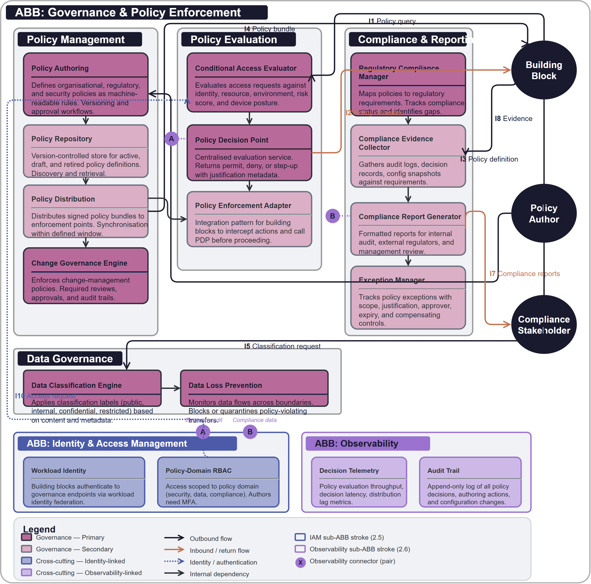

# Governance & Policy Enforcement

## Document Control

| Property | Value | Notes |
|----------|-------|-------|
| **ABB ID** | `AB-003` | Unique identifier. Sequential numbering, zero-padded to 3 digits. |
| **ABB Name** | Governance & Policy Enforcement | Human-readable name of the building block. |
| **Short Name** | GOV | Used in diagrams and cross-references. |
| **Version** | `1.0.0` | Semantic versioning. |
| **Status** | `DRAFT` | Current lifecycle status. |
| **Category** | `Governance` | Logical grouping. |

Defines the technology-agnostic capabilities, interfaces, and functional requirements for authoring, evaluating, and enforcing organisational policies across all building blocks, and for producing the compliance evidence that demonstrates adherence to regulatory and internal obligations.

## 1  Purpose

An architecture without governance is an architecture without guardrails. This building block exists to provide a unified policy-authoring, policy-evaluation, and compliance-reporting capability that every other building block consults before making access, data-handling, and operational decisions. It covers policy definition, conditional access evaluation, data classification, data loss prevention, regulatory compliance mapping, change governance, and audit & compliance reporting. By centralising these concerns, the architecture achieves consistent policy enforcement, auditable compliance evidence, and regulatory readiness across all dependent building blocks.

## 2  Building block

### 2.1  Component Diagram

The diagram below shows the full scope boundary of the Governance & Policy Enforcement ABB. The Policy Management group handles authoring, versioning, and distribution of policies. The Policy Evaluation group makes real-time enforcement decisions. The Data Governance group classifies and protects data assets. The Compliance & Reporting group produces evidence and reports for internal and external stakeholders. Two cross-cutting sub-ABBs (Identity & Access Management and Observability) span the bottom of the diagram.

### 2.2  Fundamental functionality

- **Policy Authoring.** Provides a structured environment for defining organisational, regulatory, and security policies as machine-readable rules. Supports policy versioning, review workflows, and approval gates before activation.
- **Policy Repository.** Stores all active, draft, and retired policy definitions in a version-controlled repository. Provides policy discovery and retrieval for evaluation engines and human reviewers.
- **Policy Distribution.** Distributes evaluated policy bundles to enforcement points across the architecture. Ensures all building blocks operate against the same policy version within a defined synchronisation window.
- **Conditional Access Evaluator.** Evaluates access requests against contextual policies that consider identity attributes, resource classification, environment, time, location, risk score, and device posture. Returns permit, deny, or step-up decisions.
- **Policy Decision Point.** Provides a centralised evaluation service that building blocks call to obtain policy decisions at runtime. Accepts structured policy queries and returns decisions with justification metadata.
- **Policy Enforcement Adapter.** Defines the integration pattern that each building block implements to intercept actions and call the Policy Decision Point before proceeding. The adapter pattern ensures consistent enforcement without embedding policy logic in each building block.
- **Data Classification Engine.** Applies classification labels (public, internal, confidential, restricted) to data assets based on content inspection, metadata rules, and producer-declared sensitivity. Labels govern downstream handling, storage, and access decisions.
- **Data Loss Prevention.** Monitors data flows across building block boundaries and enforces policies that prevent classified data from leaving approved channels. Detects and blocks or quarantines policy-violating transfers.
- **Regulatory Compliance Manager.** Maps organisational policies to regulatory requirements (GDPR, EU AI Act, industry-specific regulations). Tracks compliance status per requirement and identifies gaps.
- **Compliance Evidence Collector.** Gathers evidence artefacts from across the architecture (audit logs, policy decision records, configuration snapshots, access reviews) and organises them against compliance requirements.
- **Compliance Report Generator.** Produces formatted compliance reports for internal audit, external regulators, and management review. Supports scheduled and on-demand report generation.
- **Change Governance Engine.** Enforces change-management policies across the architecture. Validates that changes to building block configurations, policies, and infrastructure follow approved workflows with required reviews and approvals.
- **Exception Manager.** Records, tracks, and governs policy exceptions. Ensures exceptions have defined scope, justification, approver, expiry date, and compensating controls. Alerts when exceptions approach or exceed expiry.

### 2.3  Attributes

- **Consistency.** All building blocks consult the same policy decision service, ensuring uniform enforcement of organisational rules regardless of which building block processes a request.
- **Auditability.** Every policy decision, exception grant, and compliance assessment is recorded with full context, enabling forensic review and regulatory evidence production.
- **Adaptability.** New policies, regulatory requirements, and classification rules can be added without modifying the core evaluation engine or dependent building blocks.
- **Timeliness.** Policy decisions are evaluated in real time with latency budgets that do not degrade the calling building block's responsiveness. Policy distribution propagates updates within a defined synchronisation window.
- **Separation of Concerns.** Policy definition is separated from policy enforcement. Subject-matter experts author policies; the platform evaluates and enforces them.

### 2.4  Semantic

"Governance & Policy Enforcement" is the architectural capability that translates organisational rules, regulatory requirements, and security policies into machine-evaluable decisions enforced consistently across all building blocks. The building block boundary encompasses all components required to author, store, distribute, evaluate, and report on policies. It excludes the business logic within individual building blocks that generates the actions subject to policy evaluation, and it excludes the incident-response process that acts on policy violations — those are operational processes that consume governance outputs.

### 2.5  Identity & Access Management

- **Authentication model.** All policy consumers (building blocks requesting policy decisions) authenticate to governance endpoints using workload identity. Human policy authors authenticate via federated identity with multi-factor authentication.
- **Authorisation approach.** Policy authoring requires role-based access scoped to policy domain (security, data, compliance, operational). Policy decision queries are authorised per building block identity. Compliance reports are access-controlled by audience classification.
- **Non-human identity.** The governance platform's own components (policy decision points, distribution services, compliance collectors) authenticate to each other and to dependent infrastructure using workload identity federation.
- **Credential management.** API credentials for policy decision endpoints are short-lived tokens issued via federated credential exchange. Signing keys for policy bundles are managed in hardware security modules or platform key vaults.

### 2.6  Observability

- **Signals emitted.** The governance platform emits telemetry covering policy evaluation throughput, decision latency, policy distribution lag, classification engine processing rates, and compliance evidence collection status.
- **Audit trail.** All policy decisions (permit, deny, step-up) are recorded with request context, policy version evaluated, and decision justification. Policy authoring actions (create, update, activate, retire) are recorded in an append-only audit log.
- **Health and liveness.** Each component (policy decision point, distribution service, classification engine, compliance collector) exposes health and liveness probes.
- **Compliance data feeds.** The platform produces compliance artefacts attesting to its own policy-evaluation accuracy, decision-logging completeness, and policy-distribution timeliness.

### 2.7  Governance & Policy Enforcement

As the Governance & Policy Enforcement ABB itself, this section describes the platform's own governance posture:

- **Self-governance.** Changes to the governance platform's own policies, evaluation rules, and compliance report templates are subject to the same change-governance workflows that the platform enforces on other building blocks.
- **Meta-policy.** A meta-policy defines which roles can author policies, which approval workflows apply to policy changes, and which escalation paths handle policy conflicts.
- **Regulatory self-alignment.** The governance platform maps its own operations to regulatory requirements and produces self-assessment evidence alongside the evidence it collects from other building blocks.
- **Conflict resolution.** When multiple policies apply to a single decision, the platform applies a defined conflict-resolution strategy (most restrictive wins, explicit priority ordering, or escalation to human review).

## 3  Interfaces

### 3.1  Overview

| ID | Direction | Type | Description |
|----|-----------|------|-------------|
| **I1** | Building Block → Governance | Policy query | A building block requests a policy decision before performing an action. |
| **I2** | Governance → Building Block | Policy decision | The governance platform returns a permit, deny, or step-up decision with justification. |
| **I3** | Author → Governance | Policy definition | A policy author submits a new or updated policy definition for review and activation. |
| **I4** | Governance → Building Block | Policy bundle | The governance platform distributes updated policy bundles to enforcement points. |
| **I5** | Building Block → Governance | Classification request | A building block requests data classification for a data asset. |
| **I6** | Governance → Building Block | Classification label | The governance platform returns a classification label for the data asset. |
| **I7** | Governance → Compliance | Compliance report | Regulatory and governance reports generated from compliance evidence. |
| **I8** | Building Block → Governance | Compliance evidence | Building blocks submit compliance evidence artefacts (audit logs, configuration snapshots). |
| **I9** | Governance → Observability | Governance telemetry | Telemetry signals emitted by the governance platform for operational monitoring. |
| **I10** | Governance → IAM | Access request | Authentication and authorisation requests for policy authors and governance consumers. |

### 3.2  Interoperability

The policy query interface (I1/I2) uses a structured request-response model with mandatory fields (actor, action, resource, context) enabling any building block to request policy decisions without bespoke integration. The policy distribution interface (I4) delivers signed policy bundles that enforcement points validate before activation. The compliance evidence interface (I8) defines a normalised evidence schema with mandatory fields (requirement ID, evidence type, timestamp, source building block, artefact reference) that all producer building blocks must populate.

### 3.3  Dependent building blocks

| ABB | Required functionality | Named interface |
|-----|----------------------|-----------------|
| Any Building Block → Governance | Policy decision requests and compliance evidence submission | I1, I8 |
| Governance → Any Building Block | Policy decisions and policy bundle distribution | I2, I4 |
| Author → Governance | Policy authoring and lifecycle management | I3 |
| Any Building Block → Governance | Data classification requests | I5, I6 |
| Governance → Compliance Stakeholders | Compliance reports for internal and external audit | I7 |
| Governance → Observability | Telemetry signals for operational monitoring | I9 |
| Governance → IAM | Authentication and authorisation for governance actors | I10 |

## 4  Mapping

### 4.1  Mapping to business/organisational entities

- **Policy Authoring / Policy Repository** → Enterprise policy office, chief information security officer (CISO), data protection officer (DPO).
- **Conditional Access Evaluator / Policy Decision Point** → Security operations, platform engineering, and application teams.
- **Data Classification Engine / Data Loss Prevention** → Data governance team, information security, and data protection office.
- **Regulatory Compliance Manager / Compliance Evidence Collector / Compliance Report Generator** → Internal audit, regulatory compliance team, external auditors, and board-level risk committees.
- **Change Governance Engine** → Change advisory board (CAB), platform engineering, and release management.
- **Exception Manager** → Risk management, CISO office, and business unit risk owners.

### 4.2  Mapping to business/organisational policies

- **Information Security Policy.** All building block actions subject to security policies are evaluated by the governance platform before execution. Policy decisions are logged for forensic review.
- **Data Protection Policy.** Data classification labels applied by the governance platform govern storage, access, retention, and cross-border transfer decisions across all building blocks.
- **Regulatory Compliance Policy.** The governance platform maintains a live mapping between organisational policies and regulatory requirements, enabling continuous compliance monitoring and gap identification.
- **Change Management Policy.** All changes to building block configurations, policies, and infrastructure are validated against change-governance workflows enforced by the governance platform.
- **Risk Management Policy.** Policy exceptions are tracked with compensating controls, expiry dates, and risk-owner accountability. Exception reports feed into enterprise risk registers.
- **AI Transparency Policy.** AI agent decision policies, human-oversight requirements, and model governance rules are authored, evaluated, and reported through the governance platform.

### 4.3  Mapping to capabilities

| Capability ID | Capability Name | Relationship |
|---------------|-----------------|-------------|
| [CAP-007](../../../capabilities/CAP-007/) | Compliance Evidence & Reporting | `primary` |
| [CAP-005](../../../capabilities/CAP-005/) | Policy-Based Access Control | `supporting` |
| [CAP-004](../../../capabilities/CAP-004/) | Identity Lifecycle Management | `cross-cutting` |
| [CAP-006](../../../capabilities/CAP-006/) | Operational Monitoring & Alerting | `cross-cutting` |

## 5. Solution Building Block (SBB) Guidance

### 5.1  Structural Pattern for Governance SBBs

Each Governance & Policy Enforcement SBB maps the technology-agnostic components defined here to specific products and services from a cloud provider or governance platform. The SBB should include:

**Policy Management Services**
Maps AB-003's policy authoring, repository, and distribution components to the target platform's policy engines, rule editors, and distribution mechanisms.

**Policy Evaluation Services**
Maps AB-003's conditional access evaluator and policy decision point to the platform's real-time policy evaluation engines and decision APIs.

**Data Governance Services**
Maps AB-003's data classification engine and data loss prevention components to the platform's data governance, classification, and DLP capabilities.

**Compliance Services**
Maps AB-003's regulatory compliance manager, evidence collector, and report generator to the platform's compliance dashboards, evidence stores, and reporting tools.

### 5.2  Shared Patterns

The following patterns and capabilities are inherited directly from AB-003; do not replicate them in the SBB:

- **Policy-as-Code Model.** Policies are machine-readable, version-controlled, and subject to review workflows. The SBB specifies *which language or format* carries the policies, not *whether* to codify them.
- **Decision Logging.** All policy decisions are logged with full context. The SBB specifies *where* decisions are stored, not *whether* to log them.
- **Conflict Resolution Strategy.** Multiple overlapping policies are resolved deterministically. The SBB specifies *which resolution engine* is used, not *whether* to handle conflicts.

### 5.3  Platform-Specific Constraints

Each Governance & Policy Enforcement SBB should document:

- **Policy Language** — Which policy definition language or format the platform supports (OPA/Rego, Cedar, custom DSL, JSON/YAML rules).
- **Evaluation Model** — Whether policy decisions are made centrally, at the edge, or via a hybrid model. Evaluation latency guarantees.
- **Classification Capabilities** — Supported classification taxonomies, automated content inspection features, and label propagation behaviour.
- **DLP Capabilities** — Supported data channels monitored, detection methods (pattern matching, ML-based), and enforcement actions (block, quarantine, alert).
- **Compliance Frameworks** — Pre-built regulatory framework mappings (GDPR, AI Act, SOC 2, ISO 27001) and custom framework support.
- **Integration Model** — How building blocks integrate with the policy decision point (SDK, sidecar, API gateway plugin, inline agent).

## 6. Revision History

| Version | Date | Change Type | Description |
|---------|------|-------------|-------------|
| 1.0 | 2026-03-07 | Initial Draft | AB-003 Governance & Policy Enforcement ABB created. |
