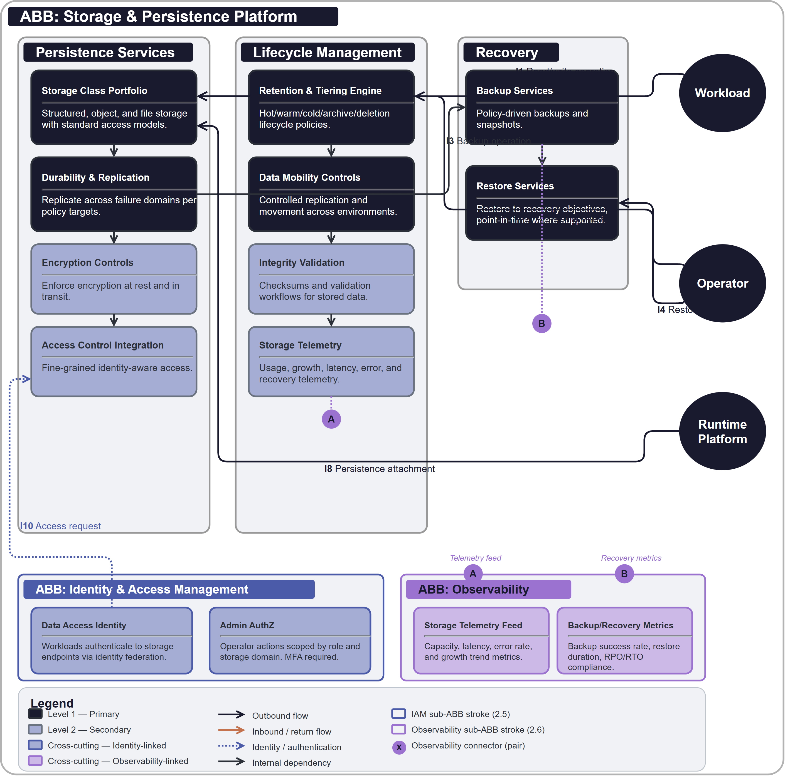

# Storage & Persistence Platform

## Document Control

| Property | Value | Notes |
|----------|-------|-------|
| **ABB ID** | `AB-007` | Unique identifier. Sequential numbering, zero-padded to 3 digits. |
| **ABB Name** | Storage & Persistence Platform | Human-readable name of the building block. |
| **Short Name** | SPP | Used in diagrams and cross-references. |
| **Version** | `1.0.0` | Semantic versioning. |
| **Status** | `draft`| Current lifecycle status. |
| **Category** | `Infrastructure` | Logical grouping. |
| **Parent Bounded Context** | [Infrastructure Bounded Context](../../../contexts/infrastructure-context.md) | Domain boundary for persistence infrastructure concerns. |
| **Parent Capability** | [CAP-013 Data Storage & Lifecycle Management](../../../capabilities/CAP-013/) | Primary capability realised by this ABB. |

Defines the technology-agnostic capabilities, interfaces, and functional requirements for structured and unstructured data persistence, lifecycle policy enforcement, durability, and recovery.

## 1  Purpose

This ABB provides shared storage capabilities so workloads can persist and recover data consistently under policy control. It standardises storage classes, retention, backup, archival, and restore patterns to reduce data risk and operational inconsistency across teams.

## 2  Building block

### 2.1  Component Diagram

The diagram below shows the storage and persistence boundary across persistence services, lifecycle management, and recovery responsibilities. Workload and operator actors are external to the ABB boundary, with IAM, observability, and governance controls represented as mandatory cross-cutting sub-ABBs.

### 2.2  Fundamental functionality

- **Storage Class Portfolio.** Provide structured, object, and file storage patterns with standard access models.
- **Durability and Replication Controls.** Replicate data across failure domains according to policy-defined durability targets.
- **Retention and Tiering Engine.** Apply lifecycle policies for hot, warm, cold, archive, and deletion transitions.
- **Backup Services.** Create policy-driven backups and snapshots for workload recovery.
- **Restore Services.** Restore data to defined recovery objectives, including point-in-time where supported.
- **Integrity Validation.** Verify stored and recovered data integrity through checksums and validation workflows.
- **Encryption Controls.** Enforce encryption at rest and in transit for protected data classes.
- **Access Control Integration.** Enforce fine-grained access controls through identity-aware interfaces.
- **Data Mobility Controls.** Support controlled replication and movement across environments and regions.
- **Storage Telemetry.** Provide usage, growth, latency, error, and recovery telemetry for operations and governance.

### 2.3  Attributes

- **Durability.** Protect against data loss through replication and recovery controls.
- **Scalability.** Scale storage and throughput to support variable platform demand.
- **Compliance.** Enforce retention, deletion, and protection controls for regulated data.
- **Cost Efficiency.** Optimise storage cost through policy-based tiering and lifecycle automation.

### 2.4  Semantic

"Storage & Persistence Platform" is the enterprise persistence substrate. It does not define domain data models; it provides reliable, governed persistence services and lifecycle controls for those models.

### 2.5  Identity & Access Management

- Access to storage resources is authenticated and authorised per workload identity and role.
- Administrative storage operations are restricted to least-privilege roles with audit traceability.
- Credential-less workload access patterns are preferred over stored static credentials.

### 2.6  Observability

- Emit storage latency, throughput, capacity growth, backup success, and restore telemetry.
- Record lifecycle transitions and policy-evaluation outcomes for audit and operations.
- Expose recovery and data-protection dashboards for resilience monitoring.

### 2.7  Governance & Policy Enforcement

- Enforce data classification and retention policy across storage classes.
- Govern backup frequency, recovery objectives, and archival/deletion workflows.
- Apply change governance to high-risk storage configuration changes.

## 3  Interfaces

### 3.1  Overview

| ID | Direction | Type | Description |
|----|-----------|------|-------------|
| **I1** | Workload -> Storage Platform | Read/write operation | Application-level data read/write interaction via managed interfaces. |
| **I2** | Operator -> Storage Platform | Provisioning request | Storage resource provisioning and configuration operations. |
| **I3** | Storage Platform -> Backup Service | Backup operation | Policy-driven backup and snapshot execution. |
| **I4** | Operator -> Storage Platform | Restore request | Recovery operation request for defined recovery scenarios. |
| **I5** | Storage Platform -> IAM | Identity verification | Access-control validation for data and administration operations. |
| **I6** | Storage Platform -> Observability | Telemetry stream | Storage health, usage, lifecycle, and recovery telemetry. |
| **I7** | Storage Platform -> Governance | Policy query | Retention, classification, and lifecycle policy enforcement checks. |
| **I8** | Runtime Platform -> Storage Platform | Persistence attachment | Compute runtime integration for stateful workloads. |

### 3.2  Interoperability

Storage services are exposed through standardised interfaces and lifecycle contracts so workloads can adopt approved persistence patterns without bespoke infrastructure controls.

### 3.3  Dependent building blocks

| ABB | Required functionality | Named interface |
|-----|----------------------|-----------------|
| Service ABBs -> Storage Platform | Persist and recover workload data | I1, I4 |
| AB-006 Runtime Platform -> Storage Platform | Stateful workload integration | I8 |
| Storage Platform -> AB-001 IAM | Access identity and authorisation controls | I5 |
| Storage Platform -> AB-002 Observability | Storage and recovery telemetry | I6 |
| Storage Platform -> AB-003 Governance | Lifecycle and retention policy enforcement | I7 |

## 4  Mapping

### 4.1  Mapping to business/organisational entities

- **Storage Operations** -> Platform infrastructure and data platform operations.
- **Backup and Recovery** -> Business continuity and disaster recovery teams.
- **Lifecycle and Retention** -> Data governance and compliance teams.
- **Capacity and Cost Optimisation** -> Platform finance and operations governance.

### 4.2  Mapping to business/organisational policies

- **Data Protection Policy.** Protected data is encrypted and access-controlled.
- **Retention Policy.** Data lifecycle transitions and deletion comply with approved retention rules.
- **Business Continuity Policy.** Backups and restore capabilities meet recovery objectives.
- **Compliance Policy.** Storage controls provide auditable evidence for regulated data handling.

### 4.3  Mapping to capabilities

| Capability ID | Capability Name | Relationship |
|---------------|-----------------|-------------|
| [CAP-013](../../../capabilities/CAP-013/) | Data Storage & Lifecycle Management | `primary` |
| [CAP-012](../../../capabilities/CAP-012/) | Compute Runtime & Scheduling | `supporting` |

## 5. Solution Building Block (SBB) Guidance

### 5.1  Structural Pattern for Storage Platform SBBs

Each storage platform SBB should map this ABB to concrete storage technologies and include:

- Storage-class taxonomy and usage guidance.
- Backup, restore, replication, and lifecycle policy implementation model.
- Identity, access, and encryption integration model.
- Operational telemetry and compliance evidence model.

### 5.2  Shared Patterns

- Policy-driven lifecycle transitions and retention controls.
- Standard backup and restore operational patterns.
- Identity-based access controls with auditable administration.

### 5.3  Platform-Specific Constraints

Each SBB should define storage performance limits, retention ceilings, replication scope, recovery capabilities, and cost constraints by storage class.

## 6. Revision History

| Version | Date | Change Type | Description |
|---------|------|-------------|-------------|
| 1.0 | 2026-03-07 | Initial Draft | AB-007 Storage & Persistence Platform ABB created. |
