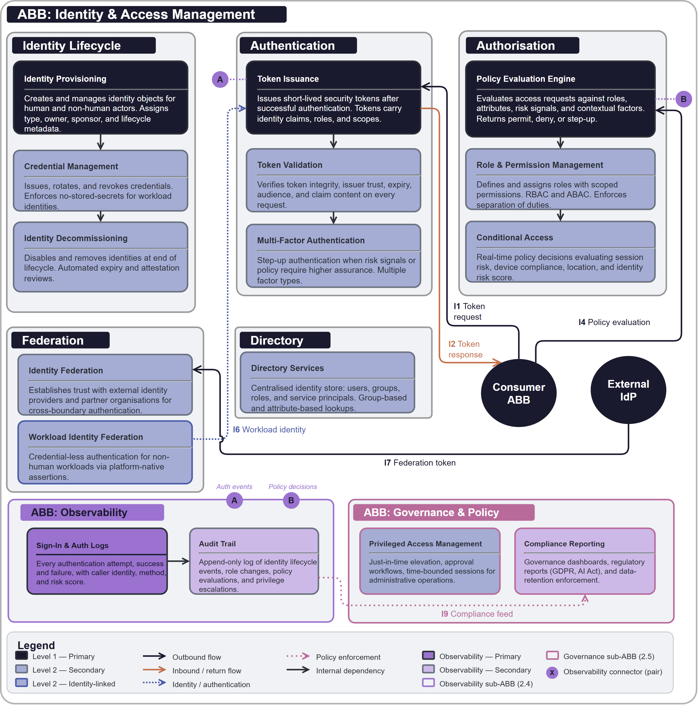

# ABB-001 Identity & Access Management

## Document Control

| Property | Value | Notes |
|----------|-------|-------|
| **ABB ID** | `ABB-001` | Unique identifier. |
| **ABB Name** | Identity & Access Management | Human-readable name. |
| **Short Name** | IAM | Used in diagrams. |
| **Bounded Context**| [Identity & Access](../../../contexts/identity-context.md) | Owning technical boundary. |
| **Realizes Capability**| [CAP-004 Identity Lifecycle Management](../../../capabilities/CAP-004/) | Primary business ability. |
| **Version** | `1.0.0` | Semantic versioning. |
| **Status** | `draft`| Current lifecycle status. |
| **Category** | `Security` | Logical grouping. |

## 1  Purpose

Every building block in the architecture requires a trustworthy answer to two questions: *who is making this request?* and *are they allowed to do it?* This ABB exists to provide those answers as a shared, reusable capability rather than leaving each building block to solve identity and access independently. It covers the full lifecycle of identity (provisioning, authentication, authorisation, federation, credential management, and decommissioning) for both human users and non-human workloads such as AI agents, services, and automation pipelines. 

## 2  Building block

### 2.1  Component Diagram

The diagram below shows the full scope boundary of the Identity & Access Management ABB. The central Identity Lifecycle group contains provisioning, credential management, and decommissioning. The Authentication group handles token issuance and validation. The Authorisation group evaluates access policies. The Federation group enables trust across organisational and cloud boundaries. Two cross-cutting sub-ABBs (Observability and Governance & Policy) span the bottom and right of the diagram.

### 2.2  Fundamental functionality

- **Identity Provisioning.** Creates and manages identity objects for human users, non-human workloads, and service principals. Assigns identity type, owner, sponsor, and lifecycle metadata.
- **Credential Management.** Issues, rotates, and revokes credentials. Supports certificate-based, token-based, and credential-less (federated) authentication flows. Enforces no-stored-secrets policies for workload identities.
- **Identity Decommissioning.** Disables and removes identities at end of lifecycle. Ensures orphaned identities are detected and revoked through automated expiry and attestation reviews.
- **Token Issuance.** Issues short-lived security tokens after successful authentication. Tokens carry claims (identity, roles, scopes) consumed by downstream authorisation decisions.
- **Token Validation.** Verifies token integrity, issuer trust, expiry, audience, and claim content on every request. Rejects expired, tampered, or improperly scoped tokens.
- **Multi-Factor Authentication.** Provides step-up authentication when risk signals or policy require a higher assurance level. Supports multiple factor types (possession, biometric, knowledge).
- **Policy Evaluation Engine.** Evaluates access requests against a policy set combining role assignments, attribute conditions, risk signals, and contextual factors (location, device, time). Returns permit, deny, or step-up decisions.
- **Role & Permission Management.** Defines and assigns roles with scoped permissions. Supports role-based access control (RBAC) and attribute-based access control (ABAC). Enforces separation of duties and least privilege.
- **Conditional Access.** Applies real-time policy decisions that evaluate session risk, device compliance, location, and identity risk score. Can block, allow, or require step-up authentication.
- **Identity Federation.** Establishes trust relationships with external identity providers, partner organisations, and cloud platform identity services. Enables cross-boundary authentication without credential sharing.
- **Workload Identity Federation.** Enables non-human workloads to obtain tokens from a trusted identity provider using platform-native assertions (e.g. compute metadata, signed runtime claims) without stored secrets.
- **Directory Services.** Provides a centralised identity store (users, groups, roles, service principals) that all authentication and authorisation components query. Supports group-based and attribute-based lookups.

## 3  Interfaces

### 3.1  Overview

| ID | Direction | Type | Description |
|----|-----------|------|-------------|
| **I1** | Consumer → IAM | Token request | Authentication request from a building block's identity (human or non-human) to obtain a security token. |
| **I2** | IAM → Consumer | Token response | Issued security token carrying identity claims, roles, and scopes. |
| **I3** | Consumer → IAM | Token validation | Request to verify a presented token's integrity, expiry, audience, and claims. |
| **I4** | Consumer → IAM | Policy evaluation | Request to evaluate whether an identity may perform a specific action on a specific resource. |
| **I5** | IAM → Consumer | Policy decision | Permit, deny, or step-up decision returned to the requesting building block. |
| **I6** | Workload → IAM | Workload identity assertion | Platform-native assertion (compute metadata, signed claim) exchanged for a security token without stored secrets. |
| **I7** | External IdP → IAM | Federation token | Inbound federated authentication from an external identity provider or partner organisation. |
| **I8** | IAM → Observability | Event stream | Authentication events, policy decisions, identity lifecycle events, and privilege-escalation alerts. |
| **I9** | IAM → Governance | Compliance feed | Sign-in logs, conditional access logs, and governance data for regulatory reporting. |
| **I10** | Admin → IAM | Administrative operation | Identity creation, role assignment, policy modification, and federation trust configuration. |

## 4  Mapping

### 4.1  Mapping to business/organisational entities

- **Identity Provisioning** → Enterprise HR onboarding and offboarding processes.
- **Authentication** → Enterprise single sign-on and multi-factor authentication services.
- **Authorisation** → Enterprise role and permission governance.

### 4.2  Mapping to business/organisational policies

- **Zero Trust Policy.** Every request is verified regardless of network location. No implicit trust is granted based on network perimeter or previous authentication.

## 6. Revision History

| Version | Date | Change Type | Description |
|---------|------|-------------|-------------|
| 1.0 | 2026-03-07 | Initial Draft | ABB-001 Identity & Access Management ABB created. |

