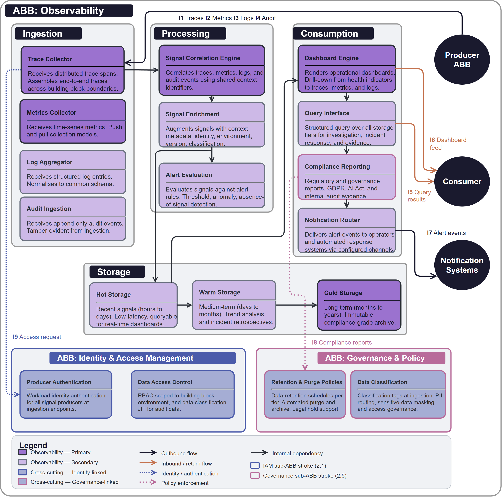

# ABB-002 Observability

## Document Control

| Property | Value | Notes |
|----------|-------|-------|
| **ABB ID** | `ABB-002` | Unique identifier. |
| **ABB Name** | Observability | Human-readable name. |
| **Short Name** | Obs | Used in diagrams. |
| **Bounded Context**| [Observability](../../../contexts/observability-context.md) | Owning technical boundary. |
| **Realizes Capability**| [CAP-006 Operational Monitoring & Alerting](../../../capabilities/CAP-006/) | Primary business ability. |
| **Version** | `1.0.0` | Semantic versioning. |
| **Status** | `draft`| Current lifecycle status. |
| **Category** | `Operations` | Logical grouping. |

## 1  Purpose

The **Observability ABB** provides the logical blueprint for capturing, normalizing, and analyzing telemetry (logs, metrics, and traces) across all building blocks. It enables real-time operational visibility and automated alerting to minimise time-to-detect (MTTD) and ensure system reliability.

## 2  Building block

### 2.1  Component Diagram

The diagram below shows the logical structure of the Observability ABB, including signal collection, normalisation, correlation, and storage layers.

### 2.2  Fundamental functionality

- **Trace Collector.** Receives distributed tracing data from instrumented services.
- **Metrics Collector.** Aggregates numeric time-series data for system performance and health.
- **Log Aggregator.** Collects structured and unstructured log data from containers and platforms.
- **Signal Correlation.** Links disparate signals (e.g., a log entry to a specific trace span) via shared context IDs.
- **Alert Evaluation.** Evaluates incoming signals against predefined rules to trigger notifications.

## 3  Interfaces

| ID | Direction | Type | Description |
|----|-----------|------|-------------|
| **I1** | Consumer → Obs | Signal Stream | Admission of logs, metrics, and traces into the observability engine. |
| **I5** | Operator → Obs | Query | Request to analyse and visualise telemetry data. |
| **I7** | Obs → Notification| Alert | External notification of a triggered alert rule. |

## 6. Revision History

| Version | Date | Change Type | Description |
|---------|------|-------------|-------------|
| 1.0 | 2026-03-07 | Initial Draft | ABB-002 Observability ABB created. |
