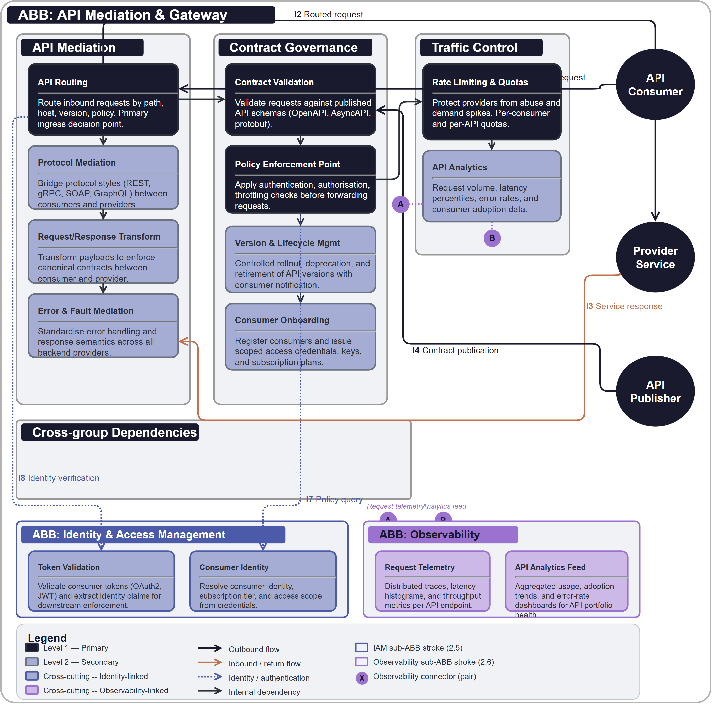

# API Mediation & Gateway

## Document Control

| Property | Value | Notes |
|----------|-------|-------|
| **ABB ID** | `ABB-004` | Unique identifier. Sequential numbering, zero-padded to 3 digits. |
| **ABB Name** | API Mediation & Gateway | Human-readable name of the building block. |
| **Short Name** | APIGW | Used in diagrams and cross-references. |
| **Version** | `1.0.0` | Semantic versioning. |
| **Status** | `draft`| Current lifecycle status. |
| **Category** | `Integration` | Logical grouping. |
| **Parent Bounded Context** | [Integration Bounded Context](../../../contexts/integration-context.md) | Domain boundary for integration concerns. |
| **Parent Capability** | [CAP-010 API Mediation & Contract Enforcement](../../../capabilities/CAP-010/) | Primary capability realised by this ABB. |

Defines the technology-agnostic capabilities, interfaces, and functional requirements for exposing and governing synchronous APIs through shared mediation, contract enforcement, and traffic-control controls.

## 1  Purpose

This ABB provides a shared integration edge for synchronous service communication. It centralises routing, contract validation, security policy application, and request transformation so producer and consumer teams can evolve independently while still conforming to common interface standards.

## 2  Building block

### 2.1  Component Diagram

The diagram below shows the API mediation boundary, grouped by mediation, contract governance, and traffic control responsibilities. External producer and consumer actors are positioned on the right boundary, while IAM, observability, and governance controls are shown as mandatory cross-cutting sub-ABBs at the bottom.

### 2.2  Fundamental functionality

- **API Routing.** Route inbound requests to the correct backend service based on path, host, version, and policy context.
- **Protocol Mediation.** Bridge between compatible protocol styles where required by consumers and providers.
- **Request and Response Transformation.** Transform payloads and headers to enforce canonical interface contracts.
- **Contract Validation.** Validate requests and responses against published API schemas.
- **Policy Enforcement Point.** Apply policy checks for authentication, authorisation, throttling, and data-handling constraints.
- **Rate Limiting and Quotas.** Protect provider services from abuse and unbounded demand.
- **Version and Lifecycle Management.** Support controlled version rollout, deprecation, and retirement.
- **Consumer Onboarding.** Provide a consistent process for registering new API consumers and issuing scoped access.
- **Error and Fault Mediation.** Standardise error handling and response semantics across providers.
- **API Analytics.** Capture request volume, latency, error rates, and adoption data for operational and product insight.

### 2.3  Attributes

- **Scalability.** Horizontal scaling for high-throughput API traffic without becoming a bottleneck.
- **Resilience.** Built-in retry, circuit-breaking, and health-aware routing controls.
- **Consistency.** Uniform enforcement of API policies and interface standards across all mediated services.
- **Extensibility.** New policies and transformations can be added without redesigning consumer integrations.

### 2.4  Semantic

"API Mediation & Gateway" is the architectural integration boundary for synchronous interfaces. It does not own business logic; it standardises and governs how business services are exposed, consumed, and protected.

### 2.5  Identity & Access Management

- All API consumers and publishers authenticate using federated identities or workload identities.
- Administrative operations on gateway policies require least-privilege role assignment and audited approvals.
- Tokens and claims are validated at the gateway before backend dispatch.

### 2.6  Observability

- Emit request traces, latency metrics, traffic distribution, and failure telemetry for each API route.
- Record schema-validation and policy-enforcement outcomes for contract and security diagnostics.
- Provide route-level and contract-version-level dashboards for operations teams.

### 2.7  Governance & Policy Enforcement

- Enforce API lifecycle policy gates for publish, deprecate, and retire actions.
- Enforce data-handling policy for sensitive fields at mediation boundaries.
- Govern contract version compatibility and exception workflows.

## 3  Interfaces

### 3.1  Overview

| ID | Direction | Type | Description |
|----|-----------|------|-------------|
| **I1** | Consumer -> API Gateway | API request | Inbound synchronous request from a consuming service or channel. |
| **I2** | API Gateway -> Provider Service | Routed request | Routed and transformed request forwarded to provider service. |
| **I3** | Provider Service -> API Gateway | Service response | Response returned for transformation and policy checks before consumer return. |
| **I4** | API Publisher -> API Gateway | Contract publication | API contract metadata and lifecycle status updates. |
| **I5** | API Gateway -> Contract Registry | Contract lookup | Schema and policy metadata retrieval for runtime validation. |
| **I6** | API Gateway -> Observability | Telemetry stream | Request traces, metrics, errors, and policy-evaluation telemetry. |
| **I7** | API Gateway -> Governance | Policy query | Runtime policy decision requests for interface and data controls. |
| **I8** | API Gateway -> IAM | Identity verification | Token and claims verification for publishers, consumers, and operators. |
| **I9** | Administrator -> API Gateway | Configuration | Route, policy, transformation, and lifecycle configuration operations. |

### 3.2  Interoperability

Interface contracts are schema-driven and versioned, enabling consumers and providers to evolve without bespoke coupling. Runtime mediation preserves canonical contract semantics across internal differences in service implementation.

### 3.3  Dependent building blocks

| ABB | Required functionality | Named interface |
|-----|----------------------|-----------------|
| Consumer ABBs -> API Gateway | Synchronous service consumption | I1, I3 |
| API Gateway -> Provider ABBs | Routed and governed service invocation | I2 |
| API Gateway -> ABB-001 IAM | Identity and claims validation | I8 |
| API Gateway -> ABB-002 Observability | Operational telemetry and trace emission | I6 |
| API Gateway -> ABB-003 Governance | Runtime policy checks and compliance controls | I7 |

## 4  Mapping

### 4.1  Mapping to business/organisational entities

- **API Routing and Mediation** -> Platform integration operations.
- **Contract Validation and Versioning** -> API design authority and architecture review.
- **Traffic and Quota Management** -> Reliability engineering and platform operations.
- **Consumer Onboarding** -> Domain delivery teams and platform service enablement.

### 4.2  Mapping to business/organisational policies

- **API Governance Policy.** Every public or internal API is published with versioned contract metadata.
- **Information Security Policy.** API access is authenticated, authorised, and auditable.
- **Change Control Policy.** Breaking contract changes require controlled approval and migration planning.
- **Operational Risk Policy.** API traffic limits and reliability controls prevent uncontrolled service degradation.

### 4.3  Mapping to capabilities

| Capability ID | Capability Name | Relationship |
|---------------|-----------------|-------------|
| [CAP-010](../../../capabilities/CAP-010/) | API Mediation & Contract Enforcement | `primary` |
| [CAP-011](../../../capabilities/CAP-011/) | Event Streaming & Asynchronous Integration | `supporting` |

## 5. Solution Building Block (SBB) Guidance

### 5.1  Structural Pattern for API Gateway SBBs

Each API gateway SBB should map this ABB to concrete gateway products and include:

- Runtime routing and transformation configuration model.
- Contract registry integration model.
- Policy enforcement model for authentication, authorisation, and traffic shaping.
- Operational telemetry and alerting integration.

### 5.2  Shared Patterns

- Contract-first API lifecycle with explicit versioning and deprecation.
- Policy-driven mediation rather than custom inline code in each service.
- Standard traffic controls for throttling, quotas, and abuse protection.

### 5.3  Platform-Specific Constraints

Each SBB should define protocol support, policy engine limits, transformation capabilities, throughput bounds, and operational cost model.

## 6. Revision History

| Version | Date | Change Type | Description |
|---------|------|-------------|-------------|
| 1.0 | 2026-03-07 | Initial Draft | ABB-004 API Mediation & Gateway ABB created. |
