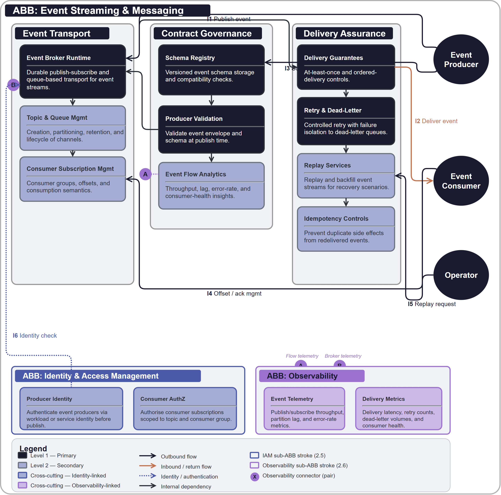

# Event Streaming & Messaging

## Document Control

| Property | Value | Notes |
|----------|-------|-------|
| **ABB ID** | `ABB-005` | Unique identifier. Sequential numbering, zero-padded to 3 digits. |
| **ABB Name** | Event Streaming & Messaging | Human-readable name of the building block. |
| **Short Name** | ESM | Used in diagrams and cross-references. |
| **Version** | `1.0.0` | Semantic versioning. |
| **Status** | `draft`| Current lifecycle status. |
| **Category** | `Integration` | Logical grouping. |
| **Parent Bounded Context** | [Integration Bounded Context](../../../contexts/integration-context.md) | Domain boundary for integration concerns. |
| **Parent Capability** | [CAP-011 Event Streaming & Asynchronous Integration](../../../capabilities/CAP-011/) | Primary capability realised by this ABB. |

Defines the technology-agnostic capabilities, interfaces, and functional requirements for asynchronous event transport, event contract governance, and delivery-assurance controls across platform services.

## 1  Purpose

This ABB provides the shared asynchronous integration backbone for decoupled communication across services. It standardises event publishing, subscription, schema governance, replay, and dead-letter handling so producer and consumer teams can evolve independently with predictable delivery behaviour.

## 2  Building block

### 2.1  Component Diagram

The diagram below shows the asynchronous integration boundary across event transport, contract governance, and delivery assurance responsibilities. Producer and consumer actors are shown outside the ABB boundary, with IAM, observability, and governance controls represented as mandatory cross-cutting sub-ABBs.

### 2.2  Fundamental functionality

- **Event Broker Runtime.** Durable transport for publish-subscribe and queue-based integration patterns.
- **Topic and Queue Management.** Controlled creation, partitioning, retention, and lifecycle management of event channels.
- **Schema Registry.** Versioned event schema storage and compatibility checks.
- **Producer Validation.** Validate event envelope and schema compliance at publish time.
- **Consumer Subscription Management.** Register and manage consumer groups, offsets, and consumption semantics.
- **Delivery Guarantees.** At-least-once and ordered-delivery controls where required by workload policy.
- **Retry and Dead-Letter Handling.** Controlled retry orchestration with failure isolation.
- **Replay Services.** Replay and backfill event streams for recovery and reprocessing use cases.
- **Idempotency Controls.** Patterns and metadata support to prevent duplicate side effects in consumer processing.
- **Event Flow Analytics.** Throughput, lag, error-rate, and consumer-health insights for operations.

### 2.3  Attributes

- **Throughput.** Support high-volume asynchronous workloads with elastic broker scaling.
- **Durability.** Persist events according to retention and replay policy requirements.
- **Resilience.** Isolate consumer failures without collapsing producer throughput.
- **Governability.** Enforce schema, classification, and retention policy controls consistently.

### 2.4  Semantic

"Event Streaming & Messaging" is the asynchronous integration fabric for enterprise services. It does not encode business workflows; it provides the reliable, governed transport and contract controls those workflows depend on.

### 2.5  Identity & Access Management

- Producer and consumer workloads authenticate using workload identities.
- Access to topics, queues, and schema operations is controlled by least-privilege role assignment.
- Administrative messaging operations are audited and restricted to privileged roles.

### 2.6  Observability

- Emit broker throughput, partition lag, publish/consume latency, and dead-letter metrics.
- Capture correlation identifiers for event traceability across asynchronous boundaries.
- Surface consumer-health and backlog dashboards for proactive reliability management.

### 2.7  Governance & Policy Enforcement

- Enforce schema compatibility and event versioning policy.
- Apply data classification and retention rules to topics and payload classes.
- Govern replay and exception operations with controlled approval workflows.

## 3  Interfaces

### 3.1  Overview

| ID | Direction | Type | Description |
|----|-----------|------|-------------|
| **I1** | Producer -> Event Platform | Publish event | Event publication request to topic or queue endpoint. |
| **I2** | Event Platform -> Consumer | Deliver event | Asynchronous delivery to subscribed consumers. |
| **I3** | Producer -> Schema Registry | Schema validation | Contract validation against registered schema versions. |
| **I4** | Consumer -> Event Platform | Offset/ack management | Consumer acknowledgement and offset progression. |
| **I5** | Operator -> Event Platform | Replay request | Controlled replay or backfill operation request. |
| **I6** | Event Platform -> Observability | Telemetry stream | Event throughput, lag, failures, and delivery telemetry. |
| **I7** | Event Platform -> Governance | Policy query | Runtime checks for retention, classification, and handling rules. |
| **I8** | Event Platform -> IAM | Identity verification | Producer/consumer authentication and authorisation checks. |

### 3.2  Interoperability

Asynchronous contracts are schema versioned and compatibility-checked so consumers can evolve independently from producers. Delivery semantics and metadata are standardised to reduce custom integration behaviour.

### 3.3  Dependent building blocks

| ABB | Required functionality | Named interface |
|-----|----------------------|-----------------|
| Producer ABBs -> Event Platform | Publish asynchronous events | I1, I3 |
| Consumer ABBs -> Event Platform | Consume events with managed offsets and retries | I2, I4 |
| Event Platform -> ABB-001 IAM | Identity controls for producers and consumers | I8 |
| Event Platform -> ABB-002 Observability | Streaming telemetry and diagnostics | I6 |
| Event Platform -> ABB-003 Governance | Policy controls for retention and classification | I7 |

## 4  Mapping

### 4.1  Mapping to business/organisational entities

- **Event Broker Operations** -> Platform integration operations.
- **Schema Governance** -> Domain architecture and API/event review governance.
- **Delivery Assurance** -> Reliability engineering and incident response teams.
- **Replay and Recovery** -> Data operations and business continuity teams.

### 4.2  Mapping to business/organisational policies

- **Integration Policy.** Asynchronous integrations use governed event channels and schema contracts.
- **Data Governance Policy.** Event payloads inherit classification and retention controls.
- **Operational Resilience Policy.** Messaging flows implement retry, dead-letter, and recovery mechanisms.
- **Security Policy.** Producer and consumer access is identity-authenticated and role-authorised.

### 4.3  Mapping to capabilities

| Capability ID | Capability Name | Relationship |
|---------------|-----------------|-------------|
| [CAP-011](../../../capabilities/CAP-011/) | Event Streaming & Asynchronous Integration | `primary` |
| [CAP-010](../../../capabilities/CAP-010/) | API Mediation & Contract Enforcement | `supporting` |

## 5. Solution Building Block (SBB) Guidance

### 5.1  Structural Pattern for Event Platform SBBs

Each event platform SBB should map this ABB to concrete broker and schema tooling and include:

- Topic and queue provisioning model.
- Schema versioning and compatibility control model.
- Retry, dead-letter, replay, and offset-management model.
- Event observability and policy-enforcement integration model.

### 5.2  Shared Patterns

- Contract-first event modelling with explicit schema compatibility.
- Standard delivery-assurance lifecycle (retry, dead-letter, replay).
- Correlation metadata in every event envelope for end-to-end traceability.

### 5.3  Platform-Specific Constraints

Each SBB should define delivery semantics, throughput bounds, retention ceilings, replay limitations, and regional durability controls.

## 6. Revision History

| Version | Date | Change Type | Description |
|---------|------|-------------|-------------|
| 1.0 | 2026-03-07 | Initial Draft | ABB-005 Event Streaming & Messaging ABB created. |
