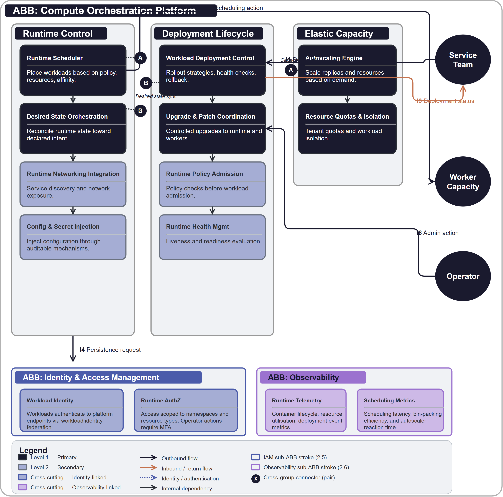

# Compute Orchestration Platform

## Document Control

| Property | Value | Notes |
|----------|-------|-------|
| **ABB ID** | `ABB-006` | Unique identifier. Sequential numbering, zero-padded to 3 digits. |
| **ABB Name** | Compute Orchestration Platform | Human-readable name of the building block. |
| **Short Name** | COP | Used in diagrams and cross-references. |
| **Version** | `1.0.0` | Semantic versioning. |
| **Status** | `draft`| Current lifecycle status. |
| **Category** | `Infrastructure` | Logical grouping. |
| **Parent Bounded Context** | [Infrastructure Bounded Context](../../../contexts/BC-011/) | Domain boundary for runtime infrastructure concerns. |
| **Parent Capability** | [CAP-012 Compute Runtime & Scheduling](../../../capabilities/CAP-012/) | Primary capability realised by this ABB. |

Defines the technology-agnostic capabilities, interfaces, and functional requirements for workload runtime scheduling, orchestration, autoscaling, and deployment lifecycle control.

## 1  Purpose

This ABB provides the shared runtime and control plane that executes platform workloads consistently. It standardises scheduling, deployment, scaling, and runtime health controls so teams can deliver services on a common operational substrate with predictable reliability and governance posture.

## 2  Building block

### 2.1  Component Diagram

The diagram below shows the compute orchestration boundary across runtime control, deployment lifecycle, and elastic capacity responsibilities. Service and operations actors are external to the ABB boundary, while IAM, observability, and governance are modelled as mandatory cross-cutting sub-ABBs.

### 2.2  Fundamental functionality

- **Runtime Scheduler.** Place workloads onto suitable execution capacity based on policy, resources, and affinity constraints.
- **Desired State Orchestration.** Continuously reconcile runtime state toward declared workload intent.
- **Workload Deployment Control.** Manage rollout strategies, health checks, and rollback paths.
- **Autoscaling Engine.** Scale workload replicas and compute resources based on demand and policy thresholds.
- **Resource Quotas and Isolation.** Enforce tenant quotas and workload isolation boundaries.
- **Runtime Networking Integration.** Provide service discovery and controlled network exposure patterns.
- **Configuration and Secret Injection.** Inject runtime configuration through controlled, auditable mechanisms.
- **Runtime Health Management.** Evaluate liveness and readiness to protect service availability.
- **Upgrade and Patch Coordination.** Apply controlled upgrades to runtime components and worker capacity.
- **Runtime Policy Admission.** Enforce deployment policy checks before workload admission.

### 2.3  Attributes

- **Elasticity.** Dynamically scale with workload demand.
- **Resilience.** Recover from workload and node failures with minimal disruption.
- **Governability.** Apply consistent runtime policy controls across all workloads.
- **Portability.** Provide standard runtime abstractions independent of specific product choices.

### 2.4  Semantic

"Compute Orchestration Platform" is the shared execution substrate for service workloads. It governs where and how workloads run, but does not define service business logic.

### 2.5  Identity & Access Management

- Workload identities are issued per runtime workload and scoped to least privilege.
- Administrative runtime operations require strong authentication and role-based authorisation.
- Runtime components authenticate to dependent services without stored secrets.

### 2.6  Observability

- Emit workload health, scheduling decisions, scaling events, and deployment outcomes.
- Provide runtime trace and metric signals for capacity and incident management.
- Record control-plane actions for operational and compliance audit.

### 2.7  Governance & Policy Enforcement

- Enforce admission controls for runtime configuration, image provenance, and policy compliance.
- Govern rollout approvals and high-risk runtime changes through change-management controls.
- Apply runtime baseline policies for security hardening and network restrictions.

## 3  Interfaces

### 3.1  Overview

| ID | Direction | Type | Description |
|----|-----------|------|-------------|
| **I1** | Service Team -> Runtime Platform | Deployment request | Request to deploy or update workload definitions. |
| **I2** | Runtime Platform -> Worker Capacity | Scheduling action | Placement and execution instruction for workload instances. |
| **I3** | Runtime Platform -> Service Team | Deployment status | Rollout progress, health status, and failure notifications. |
| **I4** | Runtime Platform -> Storage Platform | Persistence request | Attach and manage workload persistence resources as required. |
| **I5** | Runtime Platform -> IAM | Identity request | Workload identity issuance and runtime authorisation checks. |
| **I6** | Runtime Platform -> Observability | Telemetry stream | Runtime health, scheduling, scaling, and deployment telemetry. |
| **I7** | Runtime Platform -> Governance | Policy query | Admission and runtime policy enforcement requests. |
| **I8** | Operator -> Runtime Platform | Administrative action | Scaling, maintenance, and runtime policy configuration operations. |

### 3.2  Interoperability

Workloads integrate through standard runtime descriptors and lifecycle interfaces, allowing multiple service teams to deploy consistently without custom control-plane logic.

### 3.3  Dependent building blocks

| ABB | Required functionality | Named interface |
|-----|----------------------|-----------------|
| Service ABBs -> Runtime Platform | Deploy and run workloads | I1, I3 |
| Runtime Platform -> ABB-007 Storage | Stateful workload persistence | I4 |
| Runtime Platform -> ABB-001 IAM | Workload identity and access controls | I5 |
| Runtime Platform -> ABB-002 Observability | Runtime telemetry and incident diagnostics | I6 |
| Runtime Platform -> ABB-003 Governance | Admission and configuration policy enforcement | I7 |

## 4  Mapping

### 4.1  Mapping to business/organisational entities

- **Runtime Scheduling and Operations** -> Platform infrastructure and runtime operations.
- **Deployment Lifecycle** -> Service delivery teams and platform release management.
- **Autoscaling and Capacity** -> Reliability engineering and capacity management.
- **Runtime Governance** -> Security architecture and change advisory governance.

### 4.2  Mapping to business/organisational policies

- **Operational Resilience Policy.** Runtime platform must meet availability and recovery objectives.
- **Security Baseline Policy.** Runtime workloads comply with identity, isolation, and hardening controls.
- **Change Governance Policy.** Runtime upgrades and risky deployment changes follow controlled approval workflows.
- **Capacity Management Policy.** Runtime scaling and quota rules prevent uncontrolled resource growth.

### 4.3  Mapping to capabilities

| Capability ID | Capability Name | Relationship |
|---------------|-----------------|-------------|
| [CAP-012](../../../capabilities/CAP-012/) | Compute Runtime & Scheduling | `primary` |
| [CAP-013](../../../capabilities/CAP-013/) | Data Storage & Lifecycle Management | `supporting` |

## 5. Solution Building Block (SBB) Guidance

### 5.1  Structural Pattern for Compute Platform SBBs

Each compute platform SBB should map this ABB to concrete runtime and orchestration products and include:

- Workload descriptor and deployment model.
- Scheduling, scaling, and quota policy model.
- Runtime identity and policy admission integration.
- Operational telemetry and upgrade lifecycle model.

### 5.2  Shared Patterns

- Declarative workload lifecycle and desired-state reconciliation.
- Policy-gated admission before runtime deployment.
- Standard health and rollout controls for reliability.

### 5.3  Platform-Specific Constraints

Each SBB should define scaling ceilings, scheduling limitations, tenancy model, regional deployment constraints, and upgrade support model.

## 6. Revision History

| Version | Date | Change Type | Description |
|---------|------|-------------|-------------|
| 1.0 | 2026-03-07 | Initial Draft | ABB-006 Compute Orchestration Platform ABB created. |

