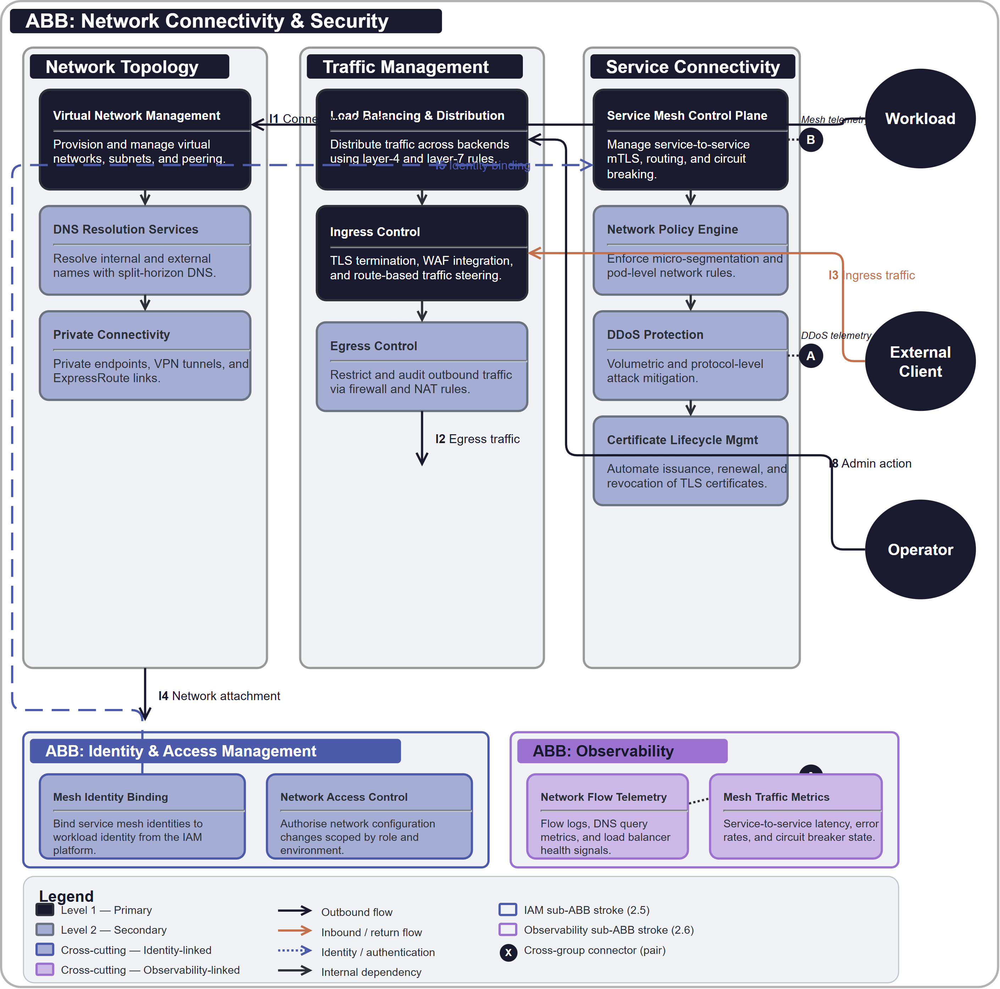

# Network Connectivity & Security

## Document Control

| Property | Value | Notes |
|----------|-------|-------|
| **ABB ID** | `ABB-008` | Unique identifier. Sequential numbering, zero-padded to 3 digits. |
| **ABB Name** | Network Connectivity & Security | Human-readable name of the building block. |
| **Short Name** | NCS | Used in diagrams and cross-references. |
| **Version** | `1.0.0` | Semantic versioning. |
| **Status** | `draft`| Current lifecycle status. |
| **Category** | `Infrastructure` | Logical grouping. |
| **Parent Bounded Context** | [Infrastructure Bounded Context](../../../contexts/infrastructure-context.md) | Domain boundary for runtime infrastructure concerns. |
| **Parent Capability** | [CAP-014 Network Connectivity & Security](../../../capabilities/CAP-014/) | Primary capability realised by this ABB. |

Defines the technology-agnostic capabilities, interfaces, and functional requirements for virtual network topology, traffic routing, DNS resolution, ingress/egress security, and service-to-service connectivity.

## 1  Purpose

This ABB provides the shared network fabric that connects platform workloads securely across trust boundaries. It standardises virtual network topology, traffic routing, DNS resolution, ingress/egress security, and service-to-service connectivity so teams can communicate reliably without managing bespoke network configurations.

## 2  Building block

### 2.1  Component Diagram

The diagram below shows the network connectivity boundary across network topology, traffic management, and service connectivity responsibilities. Service and operations actors are external to the ABB boundary, while IAM, observability, and governance are modelled as mandatory cross-cutting sub-ABBs.

### 2.2  Fundamental functionality

**Network Topology**

- **Virtual Network Management.** Provision and manage virtual networks, subnets, and peering relationships across environments.
- **DNS Resolution Services.** Provide internal and external name resolution with private DNS zone management.
- **Private Connectivity.** Establish secure private links to platform services, eliminating public internet exposure.

**Traffic Management**

- **Load Balancing & Distribution.** Distribute traffic across backends at L4/L7 with health-aware routing.
- **Ingress Control.** Manage inbound traffic entry points with TLS termination, path routing, and WAF integration.
- **Egress Control.** Govern outbound traffic with NAT, firewall rules, and destination filtering.

**Service Connectivity**

- **Service Mesh Control Plane.** Provide mutual TLS, traffic shaping, circuit breaking, and observability for east-west service communication.
- **Network Policy Engine.** Define and enforce microsegmentation rules between workloads and namespaces.
- **DDoS Protection.** Detect and mitigate volumetric and protocol-layer denial-of-service attacks.
- **Certificate Lifecycle Management.** Automate issuance, renewal, and rotation of TLS certificates for platform endpoints.

### 2.3  Attributes

- **Resilience.** Provide redundant network paths and failover for continuous connectivity.
- **Security.** Enforce traffic encryption, segmentation, and access control at every layer.
- **Scalability.** Scale network capacity and policy evaluation with workload growth.
- **Transparency.** Expose network flow, health, and security signals for operational visibility.

### 2.4  Semantic

"Network Connectivity & Security" is the shared network substrate for platform communication. It governs how workloads connect and how traffic is secured, but does not define application routing logic.

### 2.5  Identity & Access Management

- Network configuration changes require strong authentication and role-based authorisation.
- Service mesh identities are bound to workload identity from ABB-001.
- Private endpoint access is scoped by identity policy.

### 2.6  Observability

- Emit network flow logs, DNS query metrics, load balancer health, and mesh traffic telemetry.
- Record firewall rule evaluations and DDoS mitigation events.
- Provide network latency and error signals for capacity management.

### 2.7  Governance & Policy Enforcement

- Enforce network segmentation policies and firewall rules through policy-as-code.
- Govern private connectivity approvals and peering relationships.
- Apply TLS minimum version and cipher suite compliance controls.

## 3  Interfaces

### 3.1  Overview

| ID | Direction | Type | Description |
|----|-----------|------|-------------|
| **I1** | Workload -> Network Platform | Connectivity request | Service discovery, DNS resolution, and endpoint connectivity. |
| **I2** | Network Platform -> External Network | Egress traffic | Controlled outbound traffic through NAT and firewall rules. |
| **I3** | External Client -> Network Platform | Ingress traffic | Inbound traffic through load balancers and WAF. |
| **I4** | Network Platform -> Compute Platform | Network attachment | Network interface and policy injection for workload runtimes. |
| **I5** | Network Platform -> IAM | Identity binding | Service mesh identity issuance and network access control. |
| **I6** | Network Platform -> Observability | Telemetry stream | Network flow, DNS, load balancer, and mesh telemetry. |
| **I7** | Network Platform -> Governance | Policy query | Network segmentation and firewall policy enforcement. |
| **I8** | Operator -> Network Platform | Administrative action | Topology changes, peering, and security rule management. |

### 3.2  Interoperability

Workloads integrate through standard network abstractions and connectivity interfaces, allowing multiple service teams to communicate securely without custom network configurations.

### 3.3  Dependent building blocks

| ABB | Required functionality | Named interface |
|-----|----------------------|-----------------|
| Service ABBs -> Network Platform | Service connectivity and DNS resolution | I1, I3 |
| Network Platform -> ABB-006 Compute | Network attachment for workload runtimes | I4 |
| Network Platform -> ABB-001 IAM | Service mesh identity and access control | I5 |
| Network Platform -> ABB-002 Observability | Network telemetry and flow diagnostics | I6 |
| Network Platform -> ABB-003 Governance | Network segmentation policy enforcement | I7 |

## 4  Mapping

### 4.1  Mapping to business/organisational entities

- **Network Topology and Operations** -> Platform infrastructure and network operations.
- **Traffic Management** -> Service delivery teams and reliability engineering.
- **Service Connectivity** -> Application platform teams and service mesh operations.
- **Network Security** -> Security architecture and network security governance.

### 4.2  Mapping to business/organisational policies

- **Network Security Policy.** Segmentation, firewall, and encryption requirements.
- **Connectivity Policy.** Peering, private link, and egress governance.
- **Resilience Policy.** Redundant paths and failover objectives.
- **Compliance Policy.** TLS standards and certificate rotation requirements.

### 4.3  Mapping to capabilities

| Capability ID | Capability Name | Relationship |
|---------------|-----------------|-------------|
| [CAP-014](../../../capabilities/CAP-014/) | Network Connectivity & Security | `primary` |
| [CAP-012](../../../capabilities/CAP-012/) | Compute Runtime & Scheduling | `supporting` |

## 5. Solution Building Block (SBB) Guidance

### 5.1  Structural Pattern for Network Platform SBBs

Each network SBB should map this ABB to concrete networking products (VNets, load balancers, DNS services, service mesh, WAF) and include:

- Network topology and addressing model.
- DNS architecture.
- Load balancing and ingress model.
- Service mesh configuration.
- Network security and segmentation model.

### 5.2  Shared Patterns

- Policy-driven network segmentation and firewall rule management.
- Automated certificate lifecycle for all platform endpoints.
- Standard ingress and egress controls for consistent security posture.

### 5.3  Platform-Specific Constraints

Each SBB should define network address space allocation, peering and connectivity limits, DNS resolution boundaries, load balancer capacity limits, and service mesh scale constraints.

## 6. Revision History

| Version | Date | Change Type | Description |
|---------|------|-------------|-------------|
| 1.0 | 2026-03-08 | Initial Draft | ABB-008 Network Connectivity & Security ABB created. |
