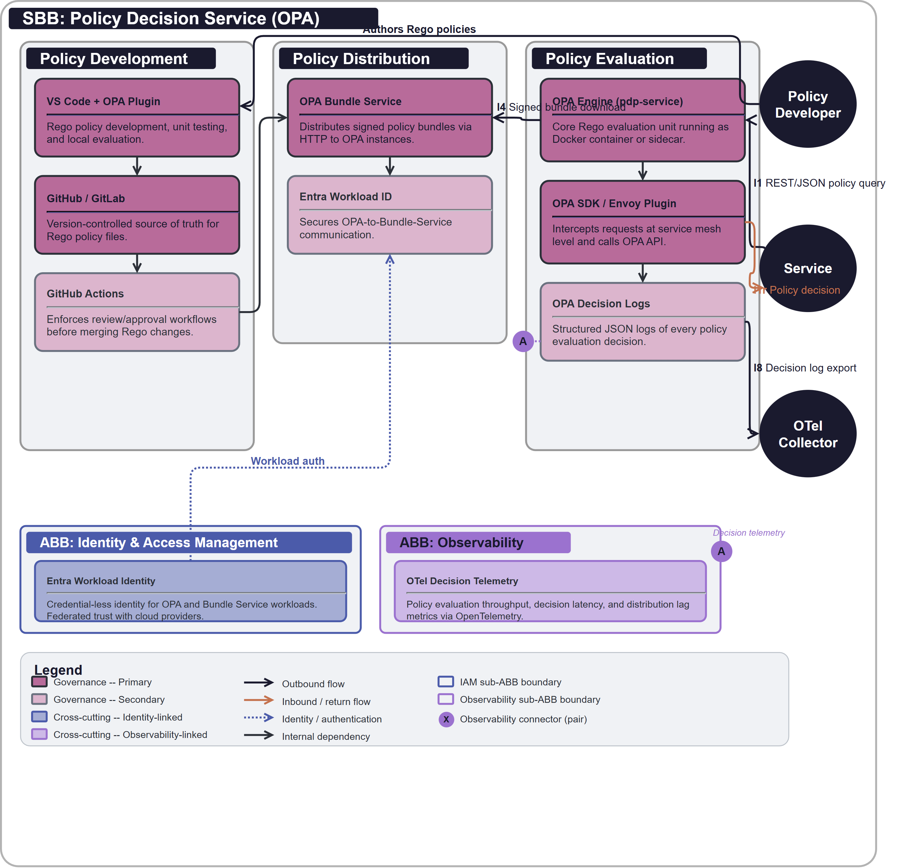

# SB-003 Policy Decision Service (OPA)

## Document Control

| Property | Value | Notes |
|----------|-------|-------|
| **SBB ID** | `SB-003` | Unique identifier. |
| **SBB Name** | Policy Decision Service (OPA) | Human-readable name. |
| **Short Name** | OPA Service | Used in diagrams. |
| **Version** | `1.0.0` | Semantic versioning. |
| **Status** | `APPROVED` | Current lifecycle status. |
| **Category** | `Governance` | Logical grouping. |

---

## 1  Purpose

This SBB realises the logical [AB-003 Governance & Policy Enforcement](../../architecture-building-blocks/AB-003/) using **Open Policy Agent (OPA)**. It provides a high-performance, decoupled policy evaluation service that allows building blocks to offload authorization and operational decisions to a centralized, version-controlled engine using the **Rego** policy language.

---

## 2  Building block

### 2.1  Component Diagram

The diagram below shows the physical realisation of the Governance ABB. OPA is deployed as a central Policy Decision Service or as a local sidecar to consuming building blocks. Policies are authored in Rego and distributed via signed bundles. Decision logs are streamed to the Observability context for audit and compliance.

### 2.2  Product mapping (ABB → SBB)

| ABB Component | SBB Product / Service | Notes |
|---------------|----------------------|-------|
| Policy Authoring | VS Code with OPA Plugin | Rego policy development and unit testing. |
| Policy Repository | GitHub / GitLab | Version-controlled source of truth for Rego files. |
| Policy Distribution | OPA Bundle Service | Distributes signed policy bundles via HTTP. |
| Policy Decision Point | OPA Engine (pdp-service) | Core Rego evaluation unit (Docker/Sidecar). |
| Policy Enforcement Adapter | OPA SDK / Envoy Plugin | Intercepts requests and calls the OPA API. |
| Compliance Evidence Collector | OPA Decision Logs | Structured JSON logs of every evaluation. |
| Change Governance Engine | GitHub Actions | Enforces review/approval before merging Rego changes. |
| **Identity (cross-cutting)** | Entra Workload ID | Secures the OPA-to-Bundle-Service communication. |
| **Observability (cross-cutting)** | OTel Collector | Exports OPA decision logs to Log Analytics. |

### 2.3  Key design decisions

- **Decoupled Logic**. Policies MUST be written in Rego and stored outside of application code.
- **Bundle-Based Distribution**. Evaluation points pull signed, compiled policy bundles rather than querying a central database for rules.
- **Fail-Closed**. If the Policy Decision Point is unreachable, the enforcement adapter MUST return a `Deny` decision by default.

### 2.4  Message Flow

1. **Query**. A service sends a JSON request (Input) to the OPA `v1/data` endpoint.
2. **Evaluation**. OPA evaluates the input against the local cached policy bundle and data.
3. **Decision**. OPA returns a JSON response (Result) with the permit/deny decision.
4. **Logging**. OPA generates a decision log entry containing the input, result, and policy version.
5. **Ingestion**. The OTel collector picks up the decision log and exports it for audit.

### 2.5  Identity & Access Management

- **Client Certificates**. Mutual TLS (mTLS) ensures that only authorised services can query the OPA API.
- **Workload Identity**. OPA instances use federated credentials to authenticate to the policy distribution service.

### 2.6  Observability

- **Decision Logs**. Every single policy decision is captured in a structured format.
- **Prometheus Metrics**. OPA exposes `/metrics` for evaluation latency and bundle sync status.

### 2.7  Governance & Policy Enforcement

- **Rego Unit Tests**. Every policy MUST have a corresponding test suite that is validated in CI/CD.
- **Policy Signing**. Only bundles signed by the Governance CI pipeline are accepted by OPA engines.

### 2.8  Technical Constraints

- **Evaluation Latency**. Centralized PDP calls should target < 10ms p99 overhead.
- **Memory Limits**. OPA memory usage scales with the size of the data/rules loaded in the bundle.

---

## 3  Interfaces

### 3.1  Overview

| ID | Direction | Type | Description (SBB-specific) |
|----|-----------|------|---------------------------|
| **I1** | Service → OPA API | REST/JSON | Policy decision request. |
| **I4** | OPA → Bundle Server | HTTP/S | Signed policy bundle download. |
| **I8** | OPA → OTel Collector | JSON/Log | Decision log export for evidence. |

---

## 4  Mapping

### 4.1  Entity mapping

- **Policy Engine** → Open Policy Agent (OPA) container.
- **Policy Store** → Version-controlled Git repository.

### 4.2  Policy mapping

- **Separation of Duties** → Achieved by separating policy authoring from application logic.

---

## 5. ABB Traceability

This SBB realizes [AB-003 Governance & Policy Enforcement](../../architecture-building-blocks/AB-003/) using Open Policy Agent. Every logical component defined in the ABB is mapped to an OPA-related product or workflow.

| ABB Capability | SBB Realisation |
|----------------|-----------------|
| Policy Decision Point | OPA Engine running as a service or sidecar. |
| Policy Distribution | Signed OPA Bundles. |
| Evidence Collection | OPA Decision Logs via OTel. |

---

## 6. Revision History

| Version | Date | Change Type | Description |
|---------|------|-------------|-------------|
| 1.0 | 2026-03-07 | Initial Draft | Retrospective standardisation of SB-003. |
