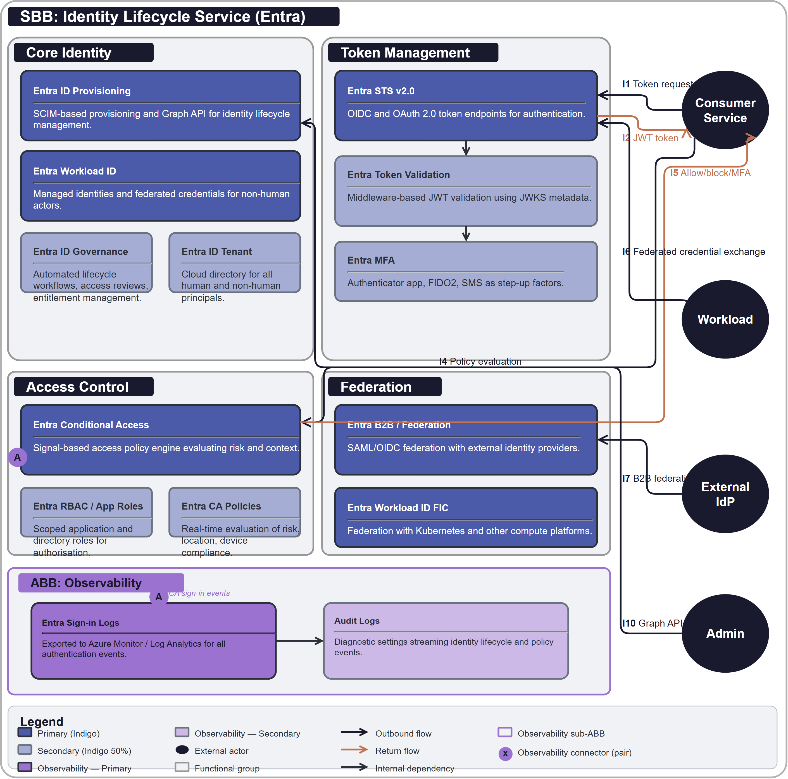

# SBB-001 Identity Lifecycle Service (Entra)

## Document Control

| Property | Value | Notes |
|----------|-------|-------|
| **SBB ID** | `SBB-001` | Unique identifier. |
| **SBB Name** | Identity Lifecycle Service (Entra) | Human-readable name. |
| **Short Name** | Entra IAM | Used in diagrams. |
| **Realizes ABB**| [ABB-001 Identity & Access Management](../../architecture-building-blocks/ABB-001/) | Parent logical model. |
| **Version** | `1.0.0` | Semantic versioning. |
| **Status** | `draft`| Current lifecycle status. |
| **Category** | `Security` | Logical grouping. |

---

## 1  Purpose

This SBB realises the logical [ABB-001 Identity & Access Management](../../architecture-building-blocks/ABB-001/) using **Microsoft Entra ID**. It provides the core mechanism for assigning and managing identities for AI agents, services, and human users within the cloud-native ecosystem. 

---

## 2  Building block

### 2.1  Component Diagram

The diagram below shows the physical realisation of the IAM ABB using Entra ID services. The Entra ID Tenant serves as the central directory store. Workload identities are managed via Entra Workload ID using Federated Credential Exchange (FIC). Administrative access is governed by Entra PIM.

### 2.2  Product mapping (ABB → SBB)

| ABB Component | SBB Product / Service | Notes |
|---------------|----------------------|-------|
| Identity Provisioning | Entra ID Provisioning | SCIM-based provisioning and Graph API. |
| Credential Management | Entra Workload ID | Managed identities and federated credentials. |
| Identity Decommissioning | Entra ID Governance | Automated lifecycle workflows and access reviews. |
| Token Issuance | Entra STS (v2.0) | OIDC and OAuth 2.0 endpoints. |
| Token Validation | Entra Token Validation | Middleware-based validation of JWTs. |
| Multi-Factor Authentication | Entra MFA | Authenticator app, FIDO2, and SMS. |
| Policy Evaluation Engine | Entra Conditional Access | Signal-based access policy engine. |
| Role & Permission Management | Entra RBAC / App Roles | Scoped application and directory roles. |
| Conditional Access | Entra CA Policies | Real-time evaluation of risk and context. |
| Identity Federation | Entra B2B / Federation | SAML/OIDC federation with external IdPs. |
| Workload Identity Federation | Entra Workload ID FIC | Federation with K8s and other compute platforms. |
| Directory Services | Entra ID Tenant | Cloud directory for all principals. |
| **Observability (cross-cutting)** | Entra Sign-in Logs | Exported to Azure Monitor/Log Analytics. |
| **Governance (cross-cutting)** | Entra ID Governance | Privileged Identity Management (PIM). |

### 2.3  Key design decisions

- **Federated Credentials Only**. No static secrets (client secrets or passwords) are permitted for workload-to-workload communication.
- **Just-In-Time (JIT) Admin**. Administrative roles are not permanently assigned; they require Entra PIM elevation with approval.
- **Modern Auth Only**. Legacy protocols (NTLM, Basic Auth) are disabled at the tenant level.

### 2.4  Message Flow

1. **Assertion**. A workload (e.g., K8s pod) generates a platform-native identity assertion.
2. **Exchange**. The workload sends the assertion to the Entra STS endpoint.
3. **Verification**. Entra STS verifies the assertion against the configured trust relationship.
4. **Issuance**. Entra STS issues a short-lived OIDC/OAuth JWT token.
5. **Consumption**. The workload presents the token to a target building block.

---

## 3  Interfaces

### 3.1  Overview

| ID | Direction | Type | Description (SBB-specific realisation) |
|----|-----------|------|-----------------------------------------|
| **I1** | Consumer → STS | HTTPS | OIDC/OAuth 2.0 token request to Entra STS v2.0 endpoint. |
| **I2** | STS → Consumer | HTTPS | Issued JWT token containing claims (tid, oid, sub, scp, roles). |
| **I3** | Consumer → STS | HTTPS | Token validation via Entra OpenID Connect metadata and JWKS. |
| **I4** | Consumer → CA | Internal | Request evaluation against Entra Conditional Access policy set. |
| **I5** | CA → Consumer | Decision | Real-time allow/block/MFA-step-up signal returned to consumer. |
| **I6** | Workload → STS | HTTPS | Federated Credential Exchange (FIC) using signed platform assertions. |
| **I7** | Ext IdP → Entra | OIDC/SAML | B2B/Federated trust with external identity providers. |
| **I8** | Entra → Log Analytics | Diagnostic | Real-time streaming of sign-in and audit logs via Diagnostic Settings. |
| **I9** | Entra → Workbooks | Compliance | Structured data feeds into Azure Monitor compliance dashboards. |
| **I10**| Admin → Entra | Graph API | Programmatic or portal-based directory and policy management. |

---

## 4  Mapping

### 4.1  Entity mapping

- **Workload** → Azure Container Apps / AKS Service Account.
- **Identity Provider** → Microsoft Entra ID Tenant.

### 4.2  Policy mapping

- **Zero Trust Policy** → Enforced via Entra CA and FIC.

---

## 6. Revision History

| Version | Date | Change Type | Description |
|---------|------|-------------|-------------|
| 1.0 | 2026-03-07 | Initial Draft | Retrospective standardisation of SBB-001. |

