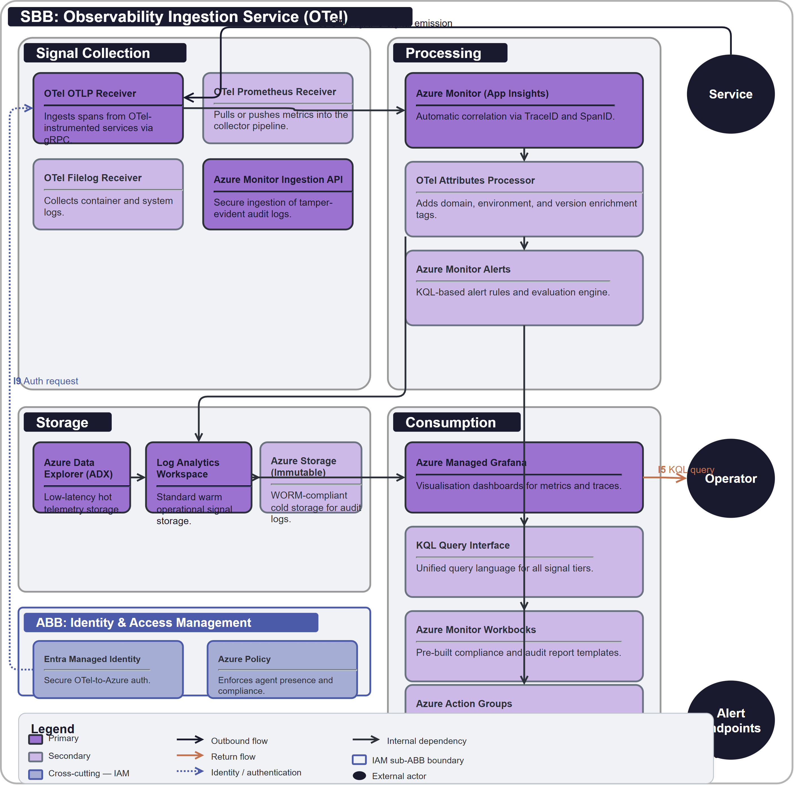

# SBB-002 Observability Ingestion Service (OTel)

## 1  Purpose

This SBB realises the logical [ABB-002 Observability](../../architecture-building-blocks/ABB-002/) using the OpenTelemetry (OTel) Collector and Azure Monitor. It provides a unified, vendor-agnostic ingestion point for all operational and compliance signals (traces, metrics, logs, and audit events) emitted by building blocks in the architecture.

## 2  Building block

### 2.1  Component Diagram

The diagram below shows the physical realisation of the Observability ABB. The OTel Collector serves as the ingestion and processing hub. Signals are processed through transformation pipelines and exported to Azure Monitor (Application Insights and Log Analytics) for storage and visualisation.

### 2.2  Product mapping (ABB → SBB)

| ABB Component | SBB Product / Service | Notes |
|---------------|----------------------|-------|
| Trace Collector | OTel OTLP Receiver | Ingests spans from OTel-instrumented services. |
| Metrics Collector | OTel Prometheus Receiver | Pulls or pushes metrics into the collector. |
| Log Aggregator | OTel Filelog Receiver | Collects container and system logs. |
| Audit Ingestion | Azure Monitor Ingestion API | Secure ingestion of tamper-evident audit logs. |
| Signal Correlation Engine | Azure Monitor (App Insights) | Automatic correlation via TraceID and SpanID. |
| Signal Enrichment | OTel Attributes Processor | Adds domain, environment, and version tags. |
| Alert Evaluation | Azure Monitor Alerts | KQL-based alert rules and evaluation. |
| Hot Storage | Azure Data Explorer (ADX) | Low-latency telemetry storage. |
| Warm Storage | Log Analytics Workspace | Standard operational signal storage. |
| Cold Storage | Azure Storage (Immutable) | WORM-compliant storage for audit logs. |
| Dashboard Engine | Azure Managed Grafana | Visualisation of metrics and traces. |
| Query Interface | Kusto Query Language (KQL) | Unified query language for all signals. |
| Compliance Reporting | Azure Monitor Workbooks | Pre-built compliance and audit report templates. |
| Notification Router | Azure Action Groups | Routes alerts to email, SMS, and Logic Apps. |
| **Identity (cross-cutting)** | Entra Managed Identity | Used for secure OTel-to-Azure communication. |
| **Governance (cross-cutting)** | Azure Policy (Guest Config) | Enforces agent presence and compliance. |

### 2.3  Key design decisions

- **Standard-first ingestion.** Every building block emits signals using the OpenTelemetry Protocol (OTLP). No vendor-specific SDKs are permitted in application code.
- **Unified processing.** All signals pass through a centralised OTel Collector cluster to ensure consistent enrichment and classification before storage.
- **KQL as the query language.** Kusto is the standard query language for all operational and compliance investigations.

### 2.4  Message flow

1. **Emission.** A service emits an OTLP trace span to the local OTel Collector agent.
2. **Enrichment.** The collector adds resource attributes (e.g. `service.name`, `deployment.environment`).
3. **Routing.** The collector routes operational signals to Log Analytics and audit signals to immutable storage.
4. **Correlation.** Azure Monitor links the trace span to related logs and metrics.
5. **Surfacing.** An operator queries the span via Grafana or an automated alert is triggered.

### 2.5  Identity & Access Management

- **Entra Managed Identity.** The OTel Collector authenticates to Azure Monitor and storage using managed identities, with no stored secrets.
- **Least-privilege ingestion roles.** Collector identities are scoped to the specific Log Analytics, ADX, and storage targets they write to.
- **Token-based OTLP.** Inbound OTLP connections from building blocks are authenticated and authorised before signals are accepted.

### 2.6  Observability

- **Self-monitoring.** The collector emits its own health metrics (queue depth, drop rate, export latency) into Azure Monitor so the observability pipeline is itself observable.
- **Azure Monitor (Application Insights) correlation.** Traces, logs, and metrics are correlated via TraceID/SpanID for end-to-end diagnostics.
- **Azure Managed Grafana and Workbooks.** Dashboards and compliance report templates over all stored signals.

### 2.7  Governance & Policy Enforcement

- **Azure Policy (Guest Configuration).** Enforces presence and configuration of the telemetry agent across the estate.
- **Immutable (WORM) audit storage.** Audit signals are written to tamper-evident storage to meet retention and integrity requirements.
- **Data retention policy enforcement.** Log Analytics and storage lifecycle rules enforce per-signal retention and disposal.

## 3  Interfaces

### 3.1  Overview

| ID | Direction | Type | Description (SBB-specific realisation) |
|----|-----------|------|-----------------------------------------|
| **I1** | Service → OTel | OTLP/gRPC | Unified signal emission from instrumented building blocks. |
| **I5** | Grafana → Monitor | KQL | Data visualisation queries using the Kusto Query Language. |
| **I7** | Monitor → Action | Webhook | Alert notification delivery to operational endpoints. |

### 3.2  Dependent building blocks

| SBB Dependency | Product / Service | Interface |
|----------------|------------------|-----------|
| All instrumented SBBs → SBB-002 | OTLP signal emission to the OTel Collector | I1 |
| SBB-002 → [SBB-001](../SBB-001/) Identity | Entra Managed Identity for secure export | — |
| SBB-002 → [SBB-003](../SBB-003/) Policy Decision | Telemetry feed for decision-log evidence | I7 |

## 4  Mapping

### 4.1  Entity mapping

- **Signal Producer** → Containerized Microservice.
- **Signal Hub** → OpenTelemetry Collector cluster.

### 4.2  Policy mapping

- **Data Retention Policy.** Implemented via Azure Log Analytics retention settings and immutable storage lifecycle rules.

## 5. ABB Traceability

This SBB realises [ABB-002 Observability](../../architecture-building-blocks/ABB-002/). Every component in the parent ABB's Section 2.2, including the mandatory cross-cutting concerns, is accounted for by an OpenTelemetry or Azure Monitor product or service.

| ABB Capability | SBB Realisation |
|----------------|-----------------|
| Trace Collector | OTel OTLP Receiver (ingests spans from instrumented services). |
| Metrics Collector | OTel Prometheus Receiver (pull/push metrics into the collector). |
| Log Aggregator | OTel Filelog Receiver (container and system logs). |
| Audit Ingestion | Azure Monitor Ingestion API (tamper-evident audit logs). |
| Signal Correlation Engine | Azure Monitor / Application Insights (TraceID/SpanID correlation). |
| Signal Enrichment | OTel Attributes Processor (domain, environment, version tags). |
| Alert Evaluation | Azure Monitor Alerts (KQL-based alert rules). |
| Hot Storage | Azure Data Explorer (low-latency telemetry storage). |
| Warm Storage | Log Analytics Workspace (operational signal storage). |
| Cold Storage | Azure Storage Immutable (WORM-compliant audit storage). |
| Dashboard Engine | Azure Managed Grafana (metrics and trace visualisation). |
| Query Interface | Kusto Query Language (unified query over all signals). |
| Compliance Reporting | Azure Monitor Workbooks (compliance and audit report templates). |
| Notification Router | Azure Action Groups (email, SMS, Logic Apps routing). |
| Identity (cross-cutting) | Entra Managed Identity for secure OTel-to-Azure communication. |
| Governance (cross-cutting) | Azure Policy (Guest Configuration) enforcing agent presence and compliance. |

## 6. Revision History

| Version | Date | Change Type | Description |
|---------|------|-------------|-------------|
| 1.0 | 2026-03-07 | Initial Draft | Retrospective standardisation of SBB-002. |
| 1.1 | 2026-06-08 | Guidance | Conformed to the SBB document standard: removed the Document Control table and horizontal rules, added §2.5–2.7 cross-cutting sections, §3.2 dependent building blocks, and §5 ABB traceability. |

