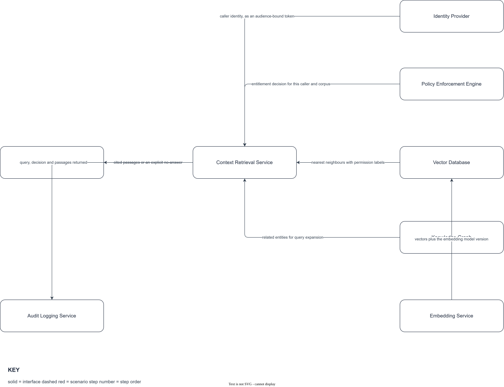
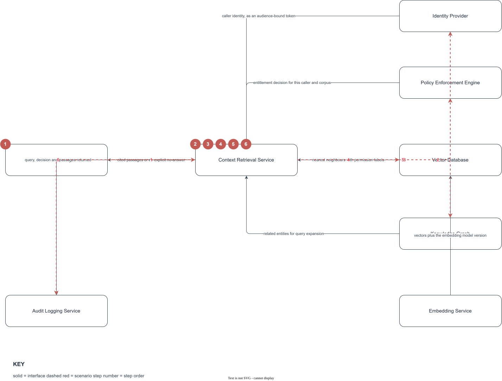
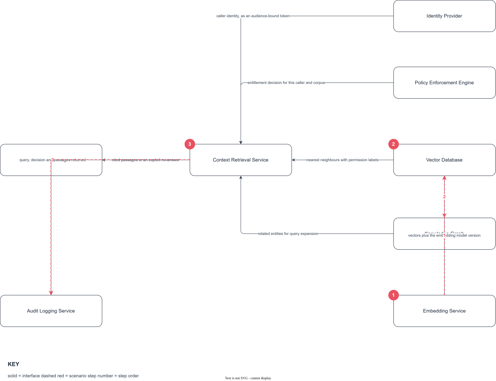

# REF-002 Knowledge Retrieval

<!-- deck:cover subtitle="Grounded, permission-aware answers through one retrieval contract" date="25 September 2026" footnote="Worked example. Illustrative only, not an approved architecture." -->

An illustrative reference architecture used to exercise the authoring toolchain end to end. The building block identifiers are real; the composition is an example, not an approved design.

<!-- deck:slide label="Context" -->

## Context

Every question answered from enterprise information passes through retrieval. Without grounding, a model produces text that is plausible rather than correct, and a reader has no way to check where an answer came from. Grounding is the largest single lever on answer accuracy.

This reference architecture covers the path from a question to a cited answer: how a query is expressed, how the caller's identity reaches the index so retrieval can respect source permissions, what a result carries by way of citation and confidence, and how staleness is signalled. The audience is any team building an agent or an assistant that answers from internal content.

Done, for this domain, means a second consumer can integrate against the retrieval contract without knowing what sits behind it.

### Non-Goals

- Not a search product. It defines the contract and the composition, not a user-facing search experience.
- Not a data platform. Source systems keep their own storage, lifecycle and permissions; nothing here replicates a system of record.
- Not model selection. Which model consumes the grounded context is out of scope and deliberately replaceable.
- Not unstructured-to-structured extraction. Turning documents into records is a different problem with different failure modes.

### Quality Attributes

| Quality attribute | Scenario | Response measure |
|---|---|---|
| Correctness | A caller asks a question with no supporting content in the corpus | The service returns an explicit no-answer rather than an unsupported one, in every case |
| Confidentiality | A caller queries a corpus containing documents they cannot open in the source system | No excerpt, title or citation from those documents appears in the result |
| Latency | A single-turn question against the live index, at the 95th percentile | First result within 800ms |
| Freshness | A source document changes | The change is reflected or flagged stale within 24 hours |
| Availability | The vector index is unavailable | A degraded, clearly labelled answer is returned within 2s rather than an error |

<!-- deck:slide label="Component view" -->

## Diagram

The structure. Retrieval sits behind one contract at ABB-017 Context Retrieval Service, so everything behind that seam is replaceable and everything in front of it is reusable.

<!-- deck:skip -->
The draw.io source is `components.drawio`. The structure lives on the base layer and each scenario is its own layer, so an overlay arrow references the real component shapes rather than a copy of them. Identifiers sit on the object wrapper as `abb_id`, not on the cell id, because draw.io regenerates cell ids on copy and paste.
<!-- /deck:skip -->

## Applicability

Adopt this where an agent or assistant answers questions from internal content that has per-user access restrictions in its source system, and where the answer must be traceable to a source.

## Not Applicable

Do not adopt it for content that is open to everyone in the organisation and needs no citation, where a simple index is cheaper and simpler. Do not adopt it for structured question answering over a database, where a query interface is the right tool and retrieval adds a failure mode for nothing.

<!-- deck:slide label="Patterns applied" -->

## Patterns Applied

| Pattern | Role in this reference architecture |
|---|---|
| PAT-017 Data source onboarding | How a source class is connected, and what the connector guarantees about permissions and change events |
| PAT-018 Retrieval and grounding | The query path, the citation contract and the no-answer case |
| PAT-019 Embedding and vector lifecycle | How content becomes vectors, and how they are versioned and retired |

<!-- deck:slide label="Building blocks" -->

## Building Blocks

| Building Block | Role in this reference architecture | Source |
|---|---|---|
| ABB-017 Context Retrieval Service | The seam. Accepts a query plus caller identity, returns cited passages or an explicit no-answer | PAT-018 |
| ABB-094 Embedding Service | Turns chunks into vectors, and holds the embedding model version | PAT-019 |
| ABB-028 Vector Database | Stores vectors with their permission labels and source references | PAT-019 |
| ABB-104 Knowledge Graph | Holds relationships between entities that vector similarity alone cannot express | PAT-018 |
| ABB-026 Policy Enforcement Engine | Evaluates the caller's entitlements at query time, inside the retrieval boundary | loose |
| ABB-024 Identity Provider | Establishes who is asking, and issues the token retrieval evaluates | loose |
| ABB-036 Audit Logging Service | Records every query, every decision and every passage returned | loose |
| ABB-050 LLM Gateway | The consumer. Composes the grounded context into a prompt and routes the call | loose |

<!-- deck:slide label="Interfaces" -->

## Interfaces

| Interface | Provider | Consumer | Purpose | Protocol | Payload | Sync | Errors and retry | NFRs |
|---|---|---|---|---|---|---|---|---|
| IF-01 | ABB-017 | ABB-050 | cited passages or an explicit no-answer | HTTPS | RetrievalResult v1 | Sync | Timeout 2s, retry twice on 503, never on 4xx | p95 800ms, 99.9% |
| IF-02 | ABB-024 | ABB-017 | caller identity, as an audience-bound token | HTTPS | JWT | Sync | Non-retryable; fail closed | p95 50ms |
| IF-03 | ABB-026 | ABB-017 | entitlement decision for this caller and corpus | HTTPS | PolicyDecision v1 | Sync | Fail closed on timeout, no cached allow | p95 80ms, 99.95% |
| IF-04 | ABB-028 | ABB-017 | nearest neighbours with permission labels | gRPC | VectorQuery v1 | Sync | Timeout 500ms, one retry, then degrade | p95 200ms |
| IF-05 | ABB-104 | ABB-017 | related entities for query expansion | HTTPS | GraphQuery v1 | Sync | Optional path; on failure retrieval proceeds without it | p95 150ms |
| IF-06 | ABB-094 | ABB-028 | vectors plus the embedding model version | Batch | EmbeddingBatch v1 | Async | At-least-once; idempotent on chunk id | 10k chunks/min |
| IF-07 | ABB-017 | ABB-036 | query, decision and passages returned | Async | AuditEvent v1 | Async | Buffered; retrieval fails if the buffer is full | no loss |

<!-- deck:skip -->
IF-03 and IF-07 are the two that must not be softened. Failing open on the entitlement decision turns the service into a way to read documents you cannot otherwise open, and dropping audit events removes the only evidence that retrieval respected permissions at all. Everything else can degrade.
<!-- /deck:skip -->

## Scenarios

<!-- deck:slide label="S1 Grounded answer" -->

### S1 Grounded answer

A staff member asks a question and receives an answer grounded in content they are entitled to see. This is the path that exercises confidentiality and latency together.

| Step | Actor | Target | Action | Interface |
|---|---|---|---|---|
| 1 | ABB-050 | ABB-017 | forward the question with the caller's token | IF-01 |
| 2 | ABB-017 | ABB-024 | validate the token and resolve the caller | IF-02 |
| 3 | ABB-017 | ABB-026 | ask whether this caller may query this corpus | IF-03 |
| 4 | ABB-017 | ABB-028 | retrieve nearest neighbours, filtered by entitlement | IF-04 |
| 5 | ABB-017 | ABB-104 | expand with related entities where the graph has them | IF-05 |
| 6 | ABB-017 | ABB-036 | record the query, the decision and what was returned | IF-07 |

<!-- deck:skip -->
Step 4 does the filtering inside the retrieval boundary rather than afterwards. Filtering after the fact means the content has already been read into the context window, which is the failure this scenario exists to prevent.

The no-answer case is not drawn. A communication diagram has no combined fragments, so the branch where entitlement is denied or no passage clears the confidence threshold belongs in a sequence diagram rather than an overlay.
<!-- /deck:skip -->

<!-- deck:slide label="S2 Ingestion" -->

### S2 Source onboarding

A new source class is connected and its content becomes retrievable, carrying the permissions it had at source.

| Step | Actor | Target | Action | Interface |
|---|---|---|---|---|
| 1 | ABB-094 | ABB-028 | write vectors with permission labels and the model version | IF-06 |
| 2 | ABB-028 | ABB-104 | register entities and relationships found in the batch | IF-05 |
| 3 | ABB-017 | ABB-036 | record the corpus version now serving queries | IF-07 |

<!-- deck:slide label="Controls" -->

## Controls and Guardrails

| Control | Source Standard/Policy | Enforcement Point |
|---|---|---|
| Retrieval evaluates entitlement at query time and fails closed | Access control standard | Runtime |
| Every result carries a source reference resolvable by the caller | Grounding standard | Runtime |
| No-answer is an explicit response, never an unsupported answer | Grounding standard | Runtime |
| Permission labels are written at ingestion and never inferred later | Access control standard | Build |
| Every query and decision is recorded before the result is returned | Audit standard | Runtime |

### Cross-Cutting Concerns

| Concern | How it is discharged here |
|---|---|
| Identity | ABB-024 Identity Provider issues an audience-bound token; retrieval validates it per query and never caches a principal |
| Authorisation | ABB-026 Policy Enforcement Engine decides per query and corpus, inside the retrieval boundary |
| Observability | ABB-036 Audit Logging Service records query, decision and passages; latency and no-answer rate are the two headline signals |
| Data handling | Permission labels travel with the vector; source content is referenced, not copied, wherever the source can serve it |
| Error and retry | Timeouts and retry policy are stated per interface. Entitlement and audit fail closed; everything else degrades |
| Lifecycle | Embedding model version is carried on every vector, so a model change is a re-index rather than a silent behaviour change |

### Variation Points

| Element | Mandatory or guidance | Permitted deviation and route |
|---|---|---|
| The retrieval contract at IF-01 | Mandatory | None. It is the reusable part |
| Entitlement evaluated at query time | Mandatory | None |
| ABB-104 Knowledge Graph | Guidance | Omit where the corpus has no useful entity structure; record the decision |
| Vector store product | Guidance | Any store meeting IF-04 and carrying permission labels; raise a decision record |
| Chunking strategy | Guidance | Per source class, set in the onboarding pattern |

## Decisions

| Decision | What was chosen, and what was rejected |
|---|---|
| ADR-0007 | Entitlement is evaluated inside retrieval, not by the consumer, because a consumer-side check cannot prevent content entering the context window |
| ADR-0008 | Vectors carry permission labels, rejecting a post-filter design that leaks through result counts and ranking |
| ADR-0009 | The graph is an optional expansion path, rejecting a graph-first design that would make the whole flow fail when the graph is unavailable |

## Risks and Trade-offs

| Risk/Trade-off | Mitigation |
|---|---|
| Permission labels drift from the source system after a change at source | Change events from the connector, plus a freshness SLA with staleness flagged in the result |
| Failing closed on entitlement reduces availability | Entitlement is the one dependency held to 99.95%, and the failure is explicit rather than an incorrect answer |
| Re-indexing on an embedding model change is expensive | Model version is carried per vector, so re-indexing can be incremental per corpus |
| The graph adds a component that is often not needed | It is a variation point, omitted by default and justified per corpus |
| Audit buffering couples retrieval availability to the logging path | Bounded buffer with explicit failure, chosen deliberately over losing evidence |
