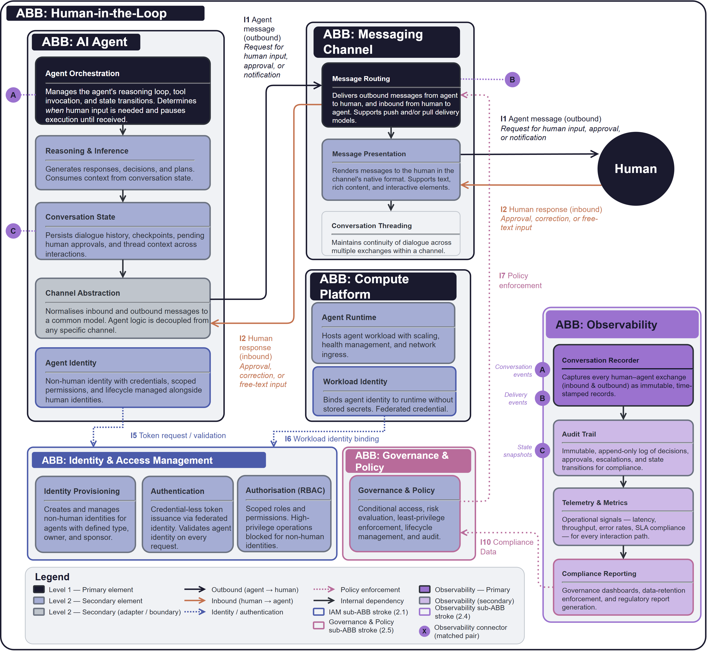

# Human-in-the-Loop

## Document Control

| Property | Value |
|----------|-------|
| **ABB ID** | `AB-004` |
| **ABB Name** | Human-in-the-Loop |
| **Short Name** | HITL |
| **Version** | `1.0.0` |
| **Status** | `draft`|
| **Category** | `Messaging & Integration` |

# Human-in-the-Loop

Defines the technology-agnostic capabilities, interfaces, and functional requirements for bidirectional human–agent interaction.

## 1  Purpose

This building block captures the architecture requirements for bidirectional interaction between an AI agent and a human participant. The agent requests human judgement (approvals, corrections, inputs, or decisions) at defined points in its reasoning loop, and resumes execution once a response is received.

## 2  Building block

### 2.1  Component Diagram

The diagram below shows the full scope boundary of the Human-in-the-Loop ABB. The central AI Agent group contains the orchestration, reasoning, and state components. The Messaging Channel group handles message routing and presentation to the human participant. Compute Platform hosts the agent runtime and workload identity. Three cross-cutting sub-ABBs (Identity & Access Management, Observability, and Governance & Policy) span the bottom and right of the diagram. Connector pairs (A, B, C) link agent components to the observability stack.

### 2.2  Fundamental functionality

- **Agent Orchestration.** Controls the reasoning loop and state transitions. Determines *when* human input is required and pauses until received.
- **Reasoning & Inference.** Generates responses, decisions, and plans from conversation state context.
- **Conversation State.** Persists dialogue history, checkpoints, pending approvals, and thread context.
- **Channel Abstraction.** Normalises messages to a common model; agent logic is decoupled from any channel.
- **Agent Identity.** Non-human identity with scoped permissions and managed lifecycle.
- **Message Routing.** Delivers messages between agent and human via push and/or pull models.
- **Message Presentation.** Renders in the channel's native format; supports text, rich content, interactive elements.
- **Conversation Threading.** Maintains dialogue continuity across multiple exchanges within a channel.
- **Agent Runtime.** Hosts the agent workload with scaling, health management, and network ingress.
- **Workload Identity.** Binds agent identity to runtime without stored secrets via federated credentials.
- **Conversation Recorder.** Captures every human–agent exchange as immutable, time-stamped records for replay and audit.
- **Audit Trail.** Append-only log of all decisions, approvals, escalations, and state transitions.
- **Telemetry & Metrics.** Operational signals (latency, throughput, error rates, SLA adherence) for every interaction path.
- **Compliance Reporting.** Governance dashboards, data-retention enforcement, and regulatory report generation.

### 2.3  Attributes

- **Scalability.** Runtime scales agent instances horizontally; channel routing supports fan-out to multiple concurrent human conversations.
- **Localisability.** Message presentation is channel-native; content localisation is a responsibility of the reasoning layer, not the channel.

### 2.4  Semantic

"Human-in-the-Loop" is the architectural pattern in which an autonomous AI agent *pauses its execution graph* to solicit and incorporate human judgement before proceeding. The building block boundary encompasses all capabilities required to make this interaction happen (the agent's orchestration, the messaging channel, the compute hosting, and the identity layer) but excludes the specific products or services that realise them.

### 2.5  Identity & Access Management

- **Authentication model.** Non-human agent identity with credential-less authentication via federated workload identity. All agent-to-human message flows are authenticated end-to-end.
- **Authorisation approach.** Least-privilege authorisation enforced at the identity layer; high-privilege operations are blocked for non-human identities by default. Conditional access policies evaluate risk in real time and can deny or step-up authentication on any agent request.
- **Non-human identity.** Agent identity is established as a managed non-human identity with scoped permissions, sponsor assignment, and a defined lifecycle (provisioning, expiry, decommissioning).
- **Credential management.** No stored secrets; short-lived tokens issued via federated credential exchange. Key material is never persisted in the agent runtime.

### 2.6  Observability

- **Signals emitted.** Operational telemetry (latency, error rates, throughput) for every interaction path. Distributed traces capture the full reasoning loop, channel hops, and identity exchanges.
- **Audit trail.** Append-only log of all decisions, approvals, escalations, and state transitions. Every human–agent conversation is recorded end-to-end in an immutable store for forensic review.
- **Health and liveness.** Runtime health, scaling metrics, and ingress availability are continuously measured and reported via dashboards and alerting.
- **Compliance data feeds.** Compliance reporting generates governance artefacts aligned with organisational data-retention and regulatory policies (GDPR, AI Act Article 14). All observability data is tamper-evident and subject to the same access-control policies as the conversation payloads.

### 2.7  Governance & Policy Enforcement

- **Policy enforcement.** Conditional access policies evaluate risk signals and enforce deny, allow, or step-up authentication decisions on every agent request. The channel abstraction allows new channels to be added or retired without modifying governance controls.
- **Regulatory alignment.** The building block supports human oversight obligations under the EU AI Act (Article 14), GDPR data-subject rights, and organisational AI transparency requirements.
- **Data classification.** Conversation payloads may contain PII and sensitive business decisions; the protection posture requires encryption in transit and at rest, with tamper-evident audit trails.
- **Change governance.** Agent identity lifecycle and configuration changes are managed centrally through defined approval workflows. Conversation state checkpointing enables replay, audit, and recovery.

## 3  Interfaces

### 3.1  Overview

| ID | Direction | Type | Description |
|----|-----------|------|-------------|
| **I1** | Agent → Channel | Message payload | Normalised outbound message requesting human input, approval, or notification |
| **I2** | Channel → Agent | Message payload | Normalised inbound human response (approval, correction, or free-text input) |
| **I3** | Channel → Human | Rendered message | Message rendered in channel native format (Teams card, email MIME, etc.) |
| **I4** | Human → Channel | User action | Text, selection, or approval action from the human participant |
| **I5** | Agent → IAM | Token exchange | Token request and validation for agent identity |
| **I6** | Compute → IAM | Identity binding | Credential-less workload identity binding (federated identity credential) |
| **I7** | IAM → Channel | Policy enforcement | Conditional access policy enforcement on message delivery |
| **I8** | Agent → Observability | Event stream | Conversation events, decision points, and reasoning traces |
| **I9** | Channel → Observability | Event stream | Message delivery receipts, channel-level metadata |
| **I10** | Observability → IAM | Data feed | Compliance data feed to governance & policy engine |
| **I11** | State → Observability | Snapshot | Conversation state snapshots for audit checkpointing |

### 3.2  Interoperability

The Channel Abstraction (I1/I2) defines a normalised message model that decouples agent logic from channel-specific formats. Any building block conforming to this interface can interoperate without modification to the agent. The IAM interfaces (I5/I6/I7) use standard token-based authentication; any identity provider supporting federated workload identity can participate.

### 3.3  Dependent building blocks

| ABB | Required functionality | Named interface |
|-----|----------------------|-----------------|
| AI Agent → Messaging Channel | Message delivery and receipt for human interactions | I1, I2 |
| AI Agent → IAM | Authentication and authorisation for agent identity | I5 |
| Messaging Channel → IAM | Policy enforcement on message delivery | I7 |
| Compute Platform → IAM | Workload identity binding for credential-less authentication | I6 |
| AI Agent → Observability | Conversation event streaming for recording and audit | I8, I11 |
| Messaging Channel → Observability | Message delivery event streaming | I11 |
| Observability → IAM | Compliance data feed to governance engine | I10 |

## 4  Mapping

### 4.1  Mapping to business/organisational entities

- **AI Agent** → Autonomous software agents deployed by any business unit.
- **Human** → Any organisational role requiring oversight of agent actions (approvers, reviewers, subject-matter experts).
- **Messaging Channel** → Enterprise-approved communication platforms.
- **IAM** → Enterprise identity and access management function.
- **Observability & Audit** → Enterprise observability, SIEM, and compliance-reporting functions. Conversation records feed regulatory reporting (e.g. GDPR, AI Act Article 14) and internal audit programmes.

### 4.2  Mapping to business/organisational policies

- **AI Governance Policy.** Agents cannot bypass human approval for high-impact actions.
- **Information Security Policy.** All agent-to-human interactions are authenticated and auditable; non-human identities operate under least privilege.
- **Operational Risk Policy.** Human participants interact through approved channels; the pattern scales across agent types without bespoke integration.
- **Data Retention & Record-Keeping Policy.** All human–agent conversations are recorded, tamper-evident, and retained in accordance with regulatory and organisational data-retention schedules.
- **AI Transparency Policy.** Observability data supports human oversight obligations under the EU AI Act and organisational transparency requirements.

## 5. Solution Building Block (SBB) Guidance

This ABB provides the technology-agnostic foundation for human–agent interaction. Channel-specific Solution Building Blocks (e.g. Email, Teams) inherit the architecture patterns defined here and layer channel-specific bindings, constraints, and interaction models on top.

### 5.1  Structural Pattern for Channel SBBs

Each channel-specific SBB should include:

**Channel Adapter**  
Maps AB-008's normalised interfaces (I1/I2/I3/I4) to the target channel's native APIs and protocols (e.g., SMTP/IMAP for Email or Teams Bot Framework for Teams). The adapter is the only part that varies per channel; all upstream agent logic and downstream audit/compliance logic remain uniform.

**Rendered Message Schemas**  
Defines what the human sees and how they interact:
- Email: MIME structure, plain-text and HTML rendering, inline vs. attachment approvals
- Teams: Adaptive Cards, button actions, form inputs, message threading

**User Action Mappings**  
Specifies how human input (approval clicks, form submissions, text replies) flows back to the agent via normalised I2 payloads. Ensures the agent receives consistent input regardless of channel.

**Dwell & Escalation Policies**  
Channel-specific timing and fallback behaviour:
- Email: May have hours/days dwell time; define timeout windows and escalation recipients
- Teams: Typically synchronous; define conversation expiry and re-engagement patterns

**Integration Points**  
Explicit mapping of channel APIs back to AB-008:
- I1 (Agent → Channel): How does the channel receive normalised payloads?
- I2 (Channel → Agent): How are human responses serialised back to the agent?
- I3/I4 (Channel ↔ Human): How does the channel render and capture user actions?
- I6/I7 (IAM): How is channel-native authentication/authorisation aligned with agent workload identity?
- I8/I9/I11 (Observability): How are channel-level delivery events and audit traces captured?

### 5.2  Shared Patterns

The following patterns and capabilities are **inherited directly** from AB-008; do not replicate them in the SBB:

- **Conversation State Management.** Leverage AB-008's state checkpoint model; do not implement channel-specific state stores
- **Agent Workload Identity.** Use federated credentials as defined in AB-008; do not introduce channel-specific service accounts
- **Audit & Compliance.** All channel interactions must feed the same immutable audit trail (I10/I11); use AB-008's compliance reporting
- **Observability & Telemetry.** Channel SBBs produce events conforming to AB-008's telemetry schema (I8/I9) for unified dashboards and alerting

### 5.3  Channel-Specific Constraints

Each channel SBB should document:

- **Message Payload Limits**: Max message size, character encoding, media attachment types
- **Interaction Latency**: Expected response times (e.g., email may have minutes/hours delay; Teams bot expects sub-second latency)
- **User Lifecycle**: How are channel identities provisioned, revoked, and linked to the IAM layer?
- **Rate Limiting & Throttling**: Inbound message frequency, outbound notification burst limits
- **Fallback & Retry Logic**: How are failed message deliveries handled? When should the agent escalate?
- **Rich Content Support**: What interactive elements (buttons, forms, attachments) does the channel natively support vs. require workarounds?

## 6. Revision History

| Version | Date | Change Type | Description |
|---------|------|-------------|-------------|
| 1.0 | 2025-11-01 | Initial Draft | Placeholder definition created. |

