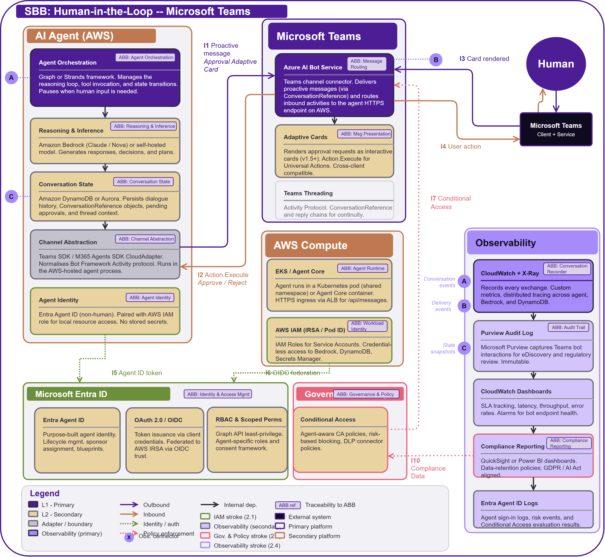

# SB-011 Human-in-the-Loop via Microsoft Teams

## Document Control

| Property | Value |
|----------|-------|
| **SBB ID** | `SB-011` |
| **SBB Name** | Human-in-the-Loop via Microsoft Teams |
| **Short Name** | HITL Teams |
| **Version** | `0.1` |
| **Status** | `DRAFT` - AI assisted |
| **Category** | `Messaging & Integration` |

## 1.  Purpose

This solution building block (SBB) realises the Human-in-the-Loop ABB ([AB-008](../../architecture-building-blocks/AB-008/)) using Microsoft Teams as the human-facing channel and AWS as the agent compute platform. The human interacts with the Teams client (desktop/mobile/web), which routes messages through the Teams backend service to Azure AI Bot Service. The Bot Service relays activities to the agent running on AWS (EKS or Agent Core). The agent uses Graph or Strands for orchestration, Amazon Bedrock for inference, and Entra Agent ID for its non-human identity.

This SBB is the Teams channel variant; the Outlook variant is [SB-010 Human-in-the-Loop via Microsoft Outlook](../SB-010/). Both share identical agent runtime, IAM, and observability layers; only the channel abstraction differs.

---

## 2.  Building block

### 2.1  Component Diagram

### 2.2  Product mapping (ABB → SBB)

| ABB Component | SBB Product / Service | Notes |
|---------------|----------------------|-------|
| Agent Orchestration | Graph / Strands (AWS) | Manages reasoning loop, tool invocation, state transitions. |
| Reasoning & Inference | Amazon Bedrock | Claude / Nova or self-hosted model. |
| Conversation State | AB-008 state store pattern (e.g., DynamoDB / Aurora) | ConversationReference + history. |
| Channel Abstraction | CloudAdapter (Teams SDK) | Runs in AWS agent process. |
| Agent Identity | Entra Agent ID | Non-human; OIDC to AWS. |
| Message Routing | Azure AI Bot Service | Teams channel connector. |
| Message Presentation | Adaptive Cards v1.5+ | Action.Execute (Universal). |
| Conv. Threading | Teams Activity Protocol | ConversationReference. |
| Agent Runtime | EKS pod / Agent Core | Shared namespace; ALB ingress. |
| Workload Identity | AWS IAM (IRSA / Pod ID) | Bedrock, DDB, Secrets Mgr. |
| IAM (Teams side) | Entra Agent ID + CA | Agent-aware policies. |
| IAM (AWS side) | AWS IAM + OIDC federation | Entra as OIDC provider. |
| Conversation Recorder | CloudWatch + X-Ray | Custom metrics, traces. |
| Audit Trail | Purview Audit + CloudTrail | eDiscovery + AWS audit. |
| Telemetry | CloudWatch Dashboards | SLA tracking, alarms. |
| Compliance Reporting | QuickSight / Power BI | GDPR, AI Act aligned. |

### 2.3  Key design decisions

- **Cross-cloud pattern**. Agent runs on AWS; human interaction via Microsoft Teams. Azure AI Bot Service bridges the two: it receives activities from Teams and POSTs them to the agent HTTPS endpoint on AWS (ALB or API Gateway).

- **Identity bridge**. Entra Agent ID authenticates the bot to Azure Bot Service. AWS IRSA provides credential-less access to AWS resources. OIDC federation links Entra to AWS IAM.

- **Bot Framework SDK retired Dec 2025**. New builds use Teams SDK v2 or M365 Agents SDK.

- **Proactive messaging**. ConversationReference objects persisted in DynamoDB.

### 2.4  Message flow

1. Agent constructs an Adaptive Card and calls Azure Bot Service via the Activity Protocol.
2. Bot Service delivers the card to the Teams backend service.
3. Teams backend pushes the card to the Teams client (desktop/mobile/web).
4. Human views the card and taps Approve/Reject.
5. Teams client sends the action to the Teams backend, which routes it to Bot Service.
6. Bot Service POSTs an Action.Execute activity to the agent endpoint on AWS.
7. Agent resumes its orchestration loop with the human decision.

Neither the human nor the Teams client ever contacts the agent directly.

### 2.5  Identity & Access Management

- **Entra Agent ID**. Purpose-built non-human identity with lifecycle management, sponsor assignment, and agent-specific Conditional Access policies (including risk-based blocking).

- **AWS IRSA**. Credential-less IAM roles bound to Kubernetes service accounts; no secrets stored.

- **OIDC federation**. Entra issues tokens that AWS STS exchanges for temporary IAM credentials.

- **Encryption**. All Bot Service traffic TLS 1.2+; DynamoDB encryption at rest.

### 2.6  Observability

- **CloudWatch + X-Ray**. Distributed tracing across the AWS agent stack.

- **Microsoft Purview Audit**. Immutable Teams bot interaction logs for eDiscovery and regulatory review.

- **Entra Agent ID sign-in logs**. Capture every token issuance, CA evaluation, and risk event.

- **Compliance dashboards**. QuickSight / Power BI aligned with GDPR, EU AI Act Art. 14.

### 2.7  Governance & Policy Enforcement

- **Conditional Access policies**. Agent-aware policies evaluate risk signals in real time and enforce deny, allow, or step-up authentication on every agent request.

- **Teams Admin Center scope control**. Controls bot scope (org-wide / per-team / per-user) and enforces organisational deployment policies.

- **DLP connector policies**. Data Loss Prevention policies at the Teams channel level prevent sensitive data leakage.

- **Agent lifecycle governance**. Via Entra Agent ID blueprints, entitlement management, and sponsor assignment. EKS HPA/KEDA or Agent Core auto-scaling for compute. DynamoDB on-demand capacity for conversation state.

- **Regulatory alignment**. GDPR data-subject rights and EU AI Act Article 14 human oversight obligations enforced through compliance dashboards and data-retention policies.

### 2.8  Channel-Specific Constraints

- **Message Payload Limits**:
	- Teams message size: 28 KB per message payload (varies by client and API).
	- Adaptive Card JSON: 28 KB limit.
	- Attachment handling: use Teams/Graph file upload for large artifacts.

- **Interaction Latency**:
	- Synchronous model; expected human response: seconds to minutes.
	- Bot Service invoke timeout: 15 seconds.
	- Card update latency: < 3 seconds.

- **User Lifecycle**:
	- Teams membership required for all participants.
	- User identity resolved via Entra ID / Teams directory.
	- Deprovisioned users: bot must detect and re-route to delegate.

- **Rate Limiting & Throttling**:
	- Bot Service: 4 requests/second per bot endpoint (burst tolerant).
	- Graph API calls (if used): app and tenant throttles apply; implement backoff.
	- Message fan-out: throttle to avoid Teams channel flooding.

- **Fallback & Retry Logic**:
	- Failed delivery: retry with exponential backoff and dead-letter queue.
	- No response after X minutes: prompt the user again or escalate to alternate approver.
	- Service outage: queue actions and send a recovery notice once restored.

- **Rich Content Support**:
	- Adaptive Cards v1.5+ (Action.Execute).
	- Action.OpenUrl for supplemental links; avoid Action.Submit for new builds.
	- Media attachments: use hosted content or Graph file links.

### 2.9  Dwell & Escalation Policies

- **Initial Approval Window**: 30 minutes (configurable per use case).
- **First Reminder**: Auto-sent after 10 minutes.
- **Escalation Trigger**: After 30 minutes, escalate to team lead or fallback approver.
- **Abandoned Requests**: After 2 hours, mark as "no response" and halt agent execution.
- **Out-of-Office Handling**: If user is OOF, route to delegate or queue until return.

## 3  Interfaces

### 3.1  Overview

| ID | Direction | Type | Description (SBB-specific) |
|----|-----------|------|---------------------------|
| **I1** | Agent (AWS) → Bot Svc | Proactive msg | Adaptive Card via ConversationReference |
| **I2** | Bot Svc → Agent (AWS) | Action.Execute | Approve / reject / free-text callback |
| **I3** | Bot Svc → Teams UI | Rendered card | Card pushed to Teams client via Teams backend |
| **I4** | Teams UI → Bot Svc | User action | Button tap routed through Teams backend |
| **I5** | Agent → Entra | Agent ID token | Entra Agent ID OAuth 2.0 client credentials |
| **I6** | AWS Pod → Entra/AWS | OIDC federated | IRSA: Entra OIDC to AWS STS exchange |
| **I7** | Entra CA → Bot Svc | Policy enforce | Agent-aware Conditional Access evaluation |
| **I8** | Agent → CloudWatch | Event stream | Custom metrics, X-Ray traces |
| **I9** | Bot Svc → Purview | Audit stream | Teams bot interaction compliance log |
| **I10** | Compliance → Entra | Data feed | Risk signals to CA engine |
| **I11** | State → Purview | Snapshot | DynamoDB stream to Purview audit |

### 3.2  Dependent building blocks

| SBB Dependency | Product / Service | Interface |
|----------------|------------------|-----------|
| Agent → Teams | Azure AI Bot Service | I1, I2 |
| Bot Svc → Teams UI | Teams backend | I3, I4 |
| Agent → Entra | Entra Agent ID | I5 |
| AWS → Entra/AWS | IRSA + OIDC federation | I6 |
| Entra CA → Bot Svc | Conditional Access | I7 |
| Agent → Obs. | CloudWatch + X-Ray | I8 |
| Teams → Obs. | Purview Audit | I9 |
| Obs. → IAM | Risk signals to CA | I10 |

## 4  Mapping

### 4.1  Entity mapping

- **AI Agent**. Runs on AWS (EKS pod or Agent Core). Uses Graph/Strands orchestration and Teams SDK CloudAdapter for Bot Service connectivity.

- **Human**. Interacts exclusively via the Microsoft Teams client (desktop, mobile, web). Never contacts the bot or AWS directly.

- **Microsoft Teams**. Teams Client + Teams Service + Azure AI Bot Service. All three are Microsoft-hosted; the agent only communicates with Bot Service.

- **Identity**. Entra Agent ID for the bot; AWS IAM (IRSA) for AWS resources. OIDC federation bridges the two.

### 4.2  Policy mapping

- **AI Governance**. Agents cannot bypass approval; Adaptive Cards enforce explicit human action.

- **Information Security**. Entra Agent ID with agent-aware Conditional Access; AWS IRSA least-privilege; Purview audit for compliance.

- **Data Retention**. Purview lifecycle + DynamoDB TTL; GDPR / AI Act Art. 14.

- **Cross-Cloud Security**. OIDC federation (no shared secrets); TLS everywhere; DLP connector policies at the Teams channel level.

## 5  ABB Traceability

This SBB realises ABB: Human-in-the-Loop. Every component traces to an ABB capability via the blue `ABB ref` tags in the diagram. Interface IDs I1–I11 are preserved from the ABB. The cross-cloud pattern (AWS compute + Microsoft Teams channel + Entra Agent ID) is a valid realisation of the technology-agnostic ABB.

| ABB Capability | SBB Realisation |
|----------------|-----------------|
| Agent Orchestration | Graph / Strands framework on AWS |
| Reasoning & Inference | Amazon Bedrock (Claude / Nova) |
| Conversation State | DynamoDB / Aurora (ConversationReference + history) |
| Channel Abstraction | Teams SDK / M365 Agents SDK CloudAdapter |
| Agent Identity | Entra Agent ID (non-human, OIDC-federated) |
| Message Routing | Azure AI Bot Service (Teams channel) |
| Message Presentation | Adaptive Cards v1.5+ (Universal Action Model) |
| Conv. Threading | Teams Activity Protocol (ConversationReference) |
| Agent Runtime | EKS pod / Agent Core |
| Workload Identity | AWS IAM (IRSA / Pod ID) + OIDC federation |
| IAM | Entra Agent ID + Conditional Access + AWS IAM |
| Conversation Recorder | CloudWatch + X-Ray |
| Audit Trail | Purview Audit + CloudTrail |
| Telemetry | CloudWatch Dashboards |
| Compliance Reporting | QuickSight / Power BI |

## 6. Revision History

| Version | Date | Change Type | Description |
|---------|------|-------------|-------------|
| 0.2 | 2026-03-07 | Architecture Review | Restructured cross-cutting sections to v2.0 standard: 2.5 Identity & Access Management, 2.6 Observability, 2.7 Governance & Policy Enforcement. Replaces former Security, Manageability, and Observability & Audit sections. |
| 0.1 | 2025-11-01 | Initial Draft | Initial definition created. |
