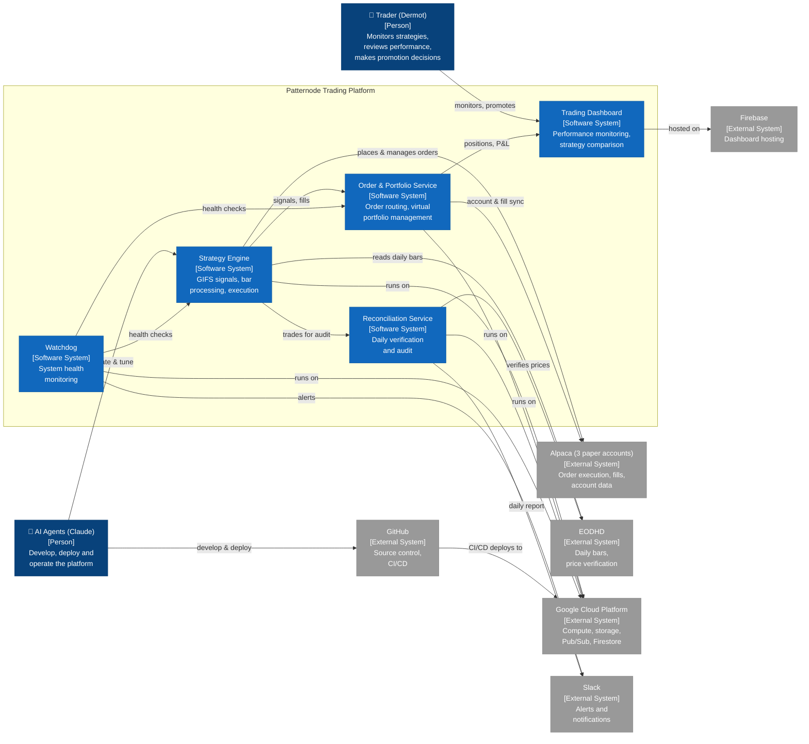

<!--
SPDX-FileCopyrightText: 2026 Dermot O'Brien
SPDX-License-Identifier: CC-BY-4.0
-->
---
$schema: ../../../schemas/v1.1.0/envelope.schema.json
id: ABB-009
kind: view
title: "Patternode Trading System — C4 System Context"
short_name: "Patternode Context"
description: "C4 Level 1 system-context view of the Patternode algorithmic trading platform: its actors, the systems inside the platform boundary, and the external systems it integrates with. The zoom-out companion to the SBB-301 composite diagram."

version: 0.1.0
status: draft
created: 2026-06-06
last_modified: 2026-06-06
last_modified_by: claude-opus-4-8

classification: internal

# This view sits above ABB-009 / SBB-301: the context diagram (outside)
# zooms in to the composite SBB diagram (inside).
view_of: ABB-009
related: [SBB-301]

tags: [trading, c4, context, example, patternode]
sidebar_label: "Patternode C4 Context"
sidebar_position: 300

provenance:
  origin: ai-generated
  authored_by: claude-opus-4-8
  review_state: ai-raw
---

# Patternode Trading System — C4 System Context

> **Worked example** — the canonical reference for a **C4 System Context** diagram (see the
> [C4 System Context standard](../../standard-c4-context-diagram.md)). It is the **zoom-out** companion to the
> [SBB-301 Strategy Engine composite](./index.md): this diagram shows the *outside* of the Patternode
> trading platform (who uses it and what it integrates with); the composite SBB shows the *inside*
> (parts, ports, connectors). Read them as a pair — elevator pitch first, then the wiring.

## 1  What this view shows

The Patternode trading system is a small, fully AI-operated algorithmic trading platform. At the context altitude it is **one boundary** with two kinds of neighbour: the **people who run it** and the **external systems it depends on**. The internal systems shown here are the top-level building blocks of the platform; one of them, the **Strategy Engine**, is realised by the [SBB-301 composite](./index.md), so this diagram is the natural entry point before zooming into that wiring.

In AAA terms the boundary is the **Patternode trading platform Capability**; the internal nodes are the **ABBs** that compose it (the Strategy Engine being [ABB-009](../../architecture-building-blocks/ABB-009/)); the external nodes are either ABB `requires`-style dependencies or out-of-scope third parties; and the two persons have **no AAA artefact** — they exist only on this view, which is exactly C4's unique contribution.

## 2  Context diagram

## 3  Actors

| Actor | Type | Role |
|-------|------|------|
| **Trader (Dermot)** | Person | Monitors strategies, reviews performance, and makes promotion decisions (paper → live). Human-in-the-loop for the irreversible step. |
| **AI Agents (Claude)** | Person | Develop, deploy, and operate the trading system end to end — the majority "workforce" for this platform. |

Neither actor is an AAA artefact. They appear only on this context view; the golden thread (Outcome → Platform → Bounded Context → ABB → SBB → Service) has no person entity.

## 4  Internal systems (the platform boundary)

| System | Type | Responsibility | AAA home |
|--------|------|----------------|----------|
| **Strategy Engine** | Software System | GIFS signal generation, bar processing, order execution. | [ABB-009](../../architecture-building-blocks/ABB-009/), realised by [SBB-301](./index.md) (composite). |
| **Order & Portfolio Service** | Software System | Order routing and virtual portfolio management across the paper accounts. | ABB (catalogue pending). |
| **Trading Dashboard** | Software System | Performance monitoring and strategy comparison. | ABB (catalogue pending). |
| **Reconciliation Service** | Software System | Daily verification and audit of trades against broker and price data. | ABB (catalogue pending). |
| **Watchdog** | Software System | System health monitoring across the platform. | ABB (catalogue pending). |

## 5  External systems

| External system | Why it is here | Reconciles with (zoom-in) |
|-----------------|----------------|---------------------------|
| **Alpaca** (3 paper accounts) | Order execution, fills, and account data. | The Strategy Engine's downstream **Execution Gateway** external node and `orders-out` flow in [SBB-301 §2.1](./index.md#21-component-diagram). |
| **EODHD** | Daily bar data and price verification. | The composite's `market-data-feed` **required** boundary port (the "Market Data Provider" external node). |
| **Google Cloud Platform** | Compute, storage, Pub/Sub, Firestore — the runtime substrate. | The deployment substrate of every part Service; not drawn inside the composite (it is the platform, not a part). |
| **Firebase** | Dashboard hosting. | Hosts the Trading Dashboard system; out of scope for SBB-301. |
| **Slack** | Alerts and notifications. | Observability/notification sink; corresponds to the cross-cutting Observability concern. |
| **GitHub** | Source control and CI/CD. | The build/deploy plane the AI agents act through; out of scope for SBB-301's runtime wiring. |

## 6  Zoom-in: from context to composite

Stepping one level in on the **Strategy Engine** box yields the [SBB-301 Strategy Engine composite](./index.md):

- The opaque Strategy Engine boundary becomes a **transparent** boundary with three parts (`bar-builder`, `signal-generator`, `order-router`).
- **EODHD** (external here) becomes the upstream of the `market-data-feed` **required** port.
- **Alpaca** (external here) becomes the downstream **Execution Gateway** the `order-router.orders-out` provided port feeds.
- The coarse `engine -->|places & manages orders| alpaca` edge here resolves, one zoom in, into the labelled `cloudevents/v1` assembly connectors carrying bars and signals through the part pipeline.

This is the C4 progression in miniature: **Level 1 (this view)** → **Level 2/3 (the composite)**. See the [C4 System Context standard §"Relationship to composite SBBs"](../../standard-c4-context-diagram.md#relationship-to-composite-sbbs-zoom-in).

## 7  Revision History

| Version | Date | Change Type | Description |
|---------|------|-------------|-------------|
| 0.1.0 | 2026-06-06 | Initial Draft | C4 System Context worked example created as the zoom-out companion to SBB-301. |
