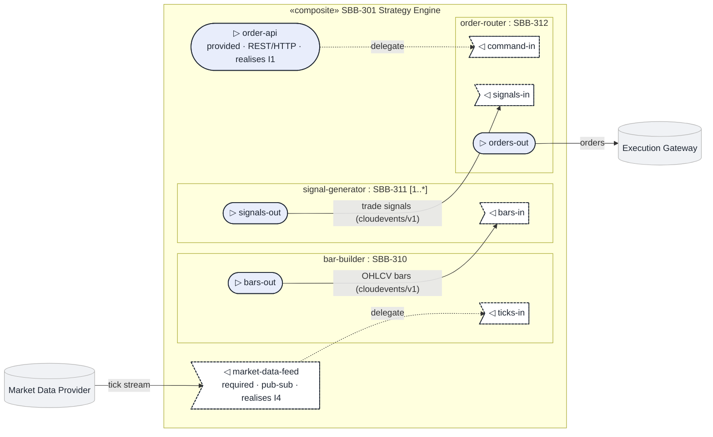

<!--
SPDX-FileCopyrightText: 2026 Dermot O'Brien
SPDX-License-Identifier: CC-BY-4.0
-->
---
$schema: ../../../schemas/v1.1.0/sbb.schema.json
id: SBB-301
kind: sbb
title: "SBB-301 Strategy Engine (Composite)"
short_name: "Strategy Engine"
description: "Composite SBB realising the Algorithmic Trading Strategy Engine ABB as an assembly of bar-building, signal-generation, and order-routing sub-SBBs behind a two-port boundary."

version: 0.1.0
status: draft
created: 2026-06-06
last_modified: 2026-06-06
last_modified_by: claude-opus-4-8

lifecycle_state: baseline
owner: "Trading Platform Team"
classification: internal
governance_zone: application

# --- Realisation (TOGAF SBB → ABB) ---
realises: [ABB-009]
realised_by_services: [strategy-engine-orchestrator]

# --- Composite structure (UML composite structure: parts + ports + connectors) ---
composite: true

ports:
  - name: order-api
    direction: provided
    protocol: REST/HTTP
    contract: openapi/v3
    abb_interface: I1
    description: "Submit/cancel strategy orders; query strategy state."
  - name: market-data-feed
    direction: required
    protocol: pub-sub
    contract: cloudevents/v1
    abb_interface: I4
    description: "Consumes the normalised market tick stream."

parts:
  - name: bar-builder
    sbb: SBB-310
    role: "Aggregates the raw tick stream into OHLCV bars on configured intervals."
    multiplicity: "1"
    ports:
      - { name: ticks-in, direction: required }
      - { name: bars-out, direction: provided }
  - name: signal-generator
    sbb: SBB-311
    role: "Evaluates strategy logic over bars and emits trade signals."
    multiplicity: "1..*"
    ports:
      - { name: bars-in,     direction: required }
      - { name: signals-out, direction: provided }
  - name: order-router
    sbb: SBB-312
    role: "Risk-checks signals and routes resulting orders to the execution gateway."
    multiplicity: "1"
    ports:
      - { name: command-in, direction: required }
      - { name: signals-in, direction: required }
      - { name: orders-out, direction: provided }

connectors:
  - from: market-data-feed
    to: bar-builder.ticks-in
    type: delegation
    description: "Boundary market-data port delegated to the bar builder."
  - from: order-api
    to: order-router.command-in
    type: delegation
    description: "Boundary order commands delegated to the order router."
  - from: bar-builder.bars-out
    to: signal-generator.bars-in
    type: assembly
    protocol: cloudevents/v1
    description: "OHLCV bars feed signal generation."
  - from: signal-generator.signals-out
    to: order-router.signals-in
    type: assembly
    protocol: cloudevents/v1
    description: "Trade signals feed the order router."

# --- Products realising each part / boundary concern ---
products:
  - { name: "Patternode Bar Service", vendor: "Patternode", licensing: "internal" }
  - { name: "Patternode Strategy Runtime", vendor: "Patternode", licensing: "internal" }
  - { name: "Patternode Order Router", vendor: "Patternode", licensing: "internal" }
  - { name: "Apache Kafka", vendor: "Apache", licensing: "Apache-2.0" }
  - { name: "Microsoft Entra Workload ID", vendor: "Microsoft" }
  - { name: "OpenTelemetry + Grafana", vendor: "CNCF / Grafana Labs" }
  - { name: "Open Policy Agent", vendor: "CNCF" }

product_mapping:
  - { abb_component: "Market Data Ingestion", sbb_product: "Patternode Bar Service (SBB-310)", notes: "Subscribes to the Kafka tick topic." }
  - { abb_component: "Bar Aggregation",       sbb_product: "Patternode Bar Service (SBB-310)" }
  - { abb_component: "Strategy Evaluation",   sbb_product: "Patternode Strategy Runtime (SBB-311)" }
  - { abb_component: "Signal Generation",     sbb_product: "Patternode Strategy Runtime (SBB-311)" }
  - { abb_component: "Pre-trade Risk Check",  sbb_product: "Patternode Order Router (SBB-312)" }
  - { abb_component: "Order Routing",         sbb_product: "Patternode Order Router (SBB-312)" }
  - { abb_component: "Identity & Access (cross-cutting)", sbb_product: "Microsoft Entra Workload ID" }
  - { abb_component: "Observability (cross-cutting)",     sbb_product: "OpenTelemetry + Grafana" }
  - { abb_component: "Governance & Policy (cross-cutting)", sbb_product: "Open Policy Agent" }

cloud_provider: azure
deployment_model: self-hosted

# --- Relations (Golden Thread) ---
contains: [SBB-310, SBB-311, SBB-312]

tags: [trading, composite, example, strategy-engine]
sidebar_label: "SBB-301 Strategy Engine (Composite)"
sidebar_position: 301

provenance:
  origin: ai-generated
  authored_by: claude-opus-4-8
  review_state: ai-raw
---

# SBB-301 Strategy Engine (Composite)

> **Worked example** — the canonical reference for a **composite SBB**. It demonstrates the
> UML composite-structure pattern (parts, ports, connectors) in frontmatter and the matching
> Mermaid composite diagram. The trading domain (Patternode) is illustrative; the *structure*
> is the point. For a simple SBB, see [`../example/`](../example/).
>
> **Zoom-out companion:** this composite shows the **inside** of the Strategy Engine. For the
> **outside** view — the actors and external systems of the wider Patternode platform — see the
> [C4 System Context diagram](./c4-context.md). Read the two as a pair: context (elevator pitch)
> first, then this composite (the wiring). See the [C4 System Context standard](../../standard-c4-context-diagram.md).

## 1  Purpose

This SBB realises the logical [ABB-009 Algorithmic Trading Strategy Engine](../../architecture-building-blocks/ABB-009/) as a **composite** assembly of three independently-deployed sub-SBBs:

- **[SBB-310](../SBB-310/) Bar Service** — turns the raw tick stream into OHLCV bars.
- **[SBB-311](../SBB-311/) Strategy Runtime** — evaluates strategy logic over bars and emits trade signals.
- **[SBB-312](../SBB-312/) Order Router** — risk-checks signals and routes orders to the execution gateway.

The composite exposes a deliberately small **two-port boundary**: a `provided` `order-api` (REST) for control and a `required` `market-data-feed` (pub-sub) for the tick stream. Everything else — bar windows, strategy plug-ins, routing rules — churns *inside* the boundary without changing the contract the rest of the platform depends on. This is why it is modelled as a composite rather than a flat SBB: each part has its own lifecycle, the wiring between parts is itself an architectural decision, and the parts are substitutable behind their port contracts.

## 2  Building block

### 2.1  Component Diagram

The composite-structure diagram below is the normative view. Parts are nested subgraphs labelled `role : SBB-NNN`; provided ports are filled circles (`▷`), required ports are dashed asymmetric nodes (`◁`); delegation connectors are dotted, assembly connectors are solid and labelled with the contract they carry. It is a 1:1 projection of the `ports`/`parts`/`connectors` frontmatter.

### 2.2  Product mapping (ABB → SBB)

| ABB Component | SBB Product / Service | Notes |
|---------------|----------------------|-------|
| Market Data Ingestion | Patternode Bar Service (SBB-310) | Subscribes to the Kafka tick topic. |
| Bar Aggregation | Patternode Bar Service (SBB-310) | OHLCV windows. |
| Strategy Evaluation | Patternode Strategy Runtime (SBB-311) | Strategy plug-ins. |
| Signal Generation | Patternode Strategy Runtime (SBB-311) | Emits trade signals. |
| Pre-trade Risk Check | Patternode Order Router (SBB-312) | Position and exposure limits. |
| Order Routing | Patternode Order Router (SBB-312) | Routes to the execution gateway. |
| **Identity & Access (cross-cutting)** | Microsoft Entra Workload ID | Federated workload identity per part. |
| **Observability (cross-cutting)** | OpenTelemetry + Grafana | Traces span the part pipeline. |
| **Governance & Policy (cross-cutting)** | Open Policy Agent | Pre-trade policy decisions. |

### 2.3  Key design decisions

- **Two-port boundary**. The composite hides three sub-SBBs behind exactly two ports, so consumers and the market-data plane integrate against a stable contract while the interior evolves.
- **Parts are sub-SBBs, not modules**. Each part (`SBB-310/311/312`) is independently versioned and deployed and has its own runtime Service, so a part can be replaced without redeploying the others.
- **Assembly via events**. Part-to-part connectors carry `cloudevents/v1` over Kafka, keeping the parts loosely coupled and the seams consumer-driven-contract testable.

### 2.4  Message Flow

1. The **Market Data Provider** publishes ticks to the boundary `market-data-feed` port.
2. A **delegation** forwards ticks to `bar-builder.ticks-in`; the Bar Service emits OHLCV bars on `bars-out`.
3. An **assembly** connector carries bars to `signal-generator.bars-in`; the Strategy Runtime emits signals on `signals-out`.
4. An **assembly** connector carries signals to `order-router.signals-in`.
5. Out-of-band control (submit/cancel) arrives on the boundary `order-api` port and is **delegated** to `order-router.command-in`.
6. The Order Router risk-checks and emits orders on `orders-out` to the **Execution Gateway**.

### 2.5  Identity & Access Management

- **Microsoft Entra Workload ID**. Each part runs under its own federated workload identity; no static secrets cross the part boundaries.

### 2.6  Observability

- **OpenTelemetry + Grafana**. A single trace follows a tick through bar-building, signal generation, and routing, so the assembly connectors are observable end-to-end.

### 2.7  Governance & Policy Enforcement

- **Open Policy Agent**. The Order Router calls OPA for pre-trade policy decisions (instrument allow-lists, exposure caps) before any order leaves the boundary.

### 2.10  Composite structure

This SBB is composite. It assembles three sub-SBBs behind a two-port boundary.

**Boundary ports**

| Port | Direction | Protocol | Contract | Realises ABB interface |
|------|-----------|----------|----------|------------------------|
| `order-api` | provided | REST/HTTP | openapi/v3 | I1 |
| `market-data-feed` | required | pub-sub | cloudevents/v1 | I4 |

**Parts**

| Part (role) | Sub-SBB | Responsibility | Multiplicity |
|-------------|---------|----------------|--------------|
| `bar-builder` | [SBB-310](../SBB-310/) | Aggregates ticks into OHLCV bars | 1 |
| `signal-generator` | [SBB-311](../SBB-311/) | Produces trade signals from bars | 1..* |
| `order-router` | [SBB-312](../SBB-312/) | Risk-checks signals and routes orders | 1 |

**Connectors**

| From | To | Type | Notes |
|------|----|------|-------|
| `market-data-feed` | `bar-builder.ticks-in` | delegation | Boundary tick stream → bar builder. |
| `order-api` | `order-router.command-in` | delegation | Boundary control → order router. |
| `bar-builder.bars-out` | `signal-generator.bars-in` | assembly | OHLCV bars → signal generation. |
| `signal-generator.signals-out` | `order-router.signals-in` | assembly | Trade signals → order router. |

## 3  Interfaces

### 3.1  Overview

| ID | Direction | Type | Description (SBB-specific) |
|----|-----------|------|---------------------------|
| **I1** | Consumer → `order-api` | REST/HTTP | Submit/cancel strategy orders; query state (openapi/v3). |
| **I4** | Market data → `market-data-feed` | pub-sub | Normalised tick stream (cloudevents/v1). |
| **I7** | `order-router.orders-out` → Execution Gateway | pub-sub | Routed orders. |

### 3.2  Dependent building blocks

| SBB Dependency | Product / Service | Interface |
|----------------|------------------|-----------|
| SBB-301 → SBB-310 | Patternode Bar Service | (delegation) market-data-feed |
| SBB-301 → SBB-312 | Patternode Order Router | (delegation) order-api |
| SBB-310 → SBB-311 | Bars assembly | bars-out → bars-in |
| SBB-311 → SBB-312 | Signals assembly | signals-out → signals-in |

## 4  Mapping

### 4.1  Entity mapping

- **Strategy Engine** → the composite SBB-301; a `strategy-engine-orchestrator` Service owns the boundary ports and the part wiring.
- **Bar / Signal / Order** → the three sub-SBBs, each a deployable Service.

### 4.2  Policy mapping

- **Pre-trade risk policy** → enforced by the Order Router (SBB-312) via Open Policy Agent before `orders-out`.

## 5  ABB Traceability

This SBB realises [ABB-009 Algorithmic Trading Strategy Engine](../../architecture-building-blocks/ABB-009/). Every ABB component is mapped in §2.2; the boundary ports trace to the ABB interfaces via `ports[].abb_interface` (I1, I4). The three parts each carry the inverse `part_of: SBB-301`, so the composition is bidirectionally traceable.

| ABB Capability | SBB Realisation |
|----------------|-----------------|
| Market Data Ingestion / Bar Aggregation | SBB-310 Bar Service (`bar-builder` part) |
| Strategy / Signal Generation | SBB-311 Strategy Runtime (`signal-generator` part) |
| Pre-trade Risk / Order Routing | SBB-312 Order Router (`order-router` part) |
| Identity & Access | Microsoft Entra Workload ID |
| Observability | OpenTelemetry + Grafana |
| Governance & Policy | Open Policy Agent |

## 6. Revision History

| Version | Date | Change Type | Description |
|---------|------|-------------|-------------|
| 0.1.0 | 2026-06-06 | Initial Draft | Composite SBB worked example created. |
