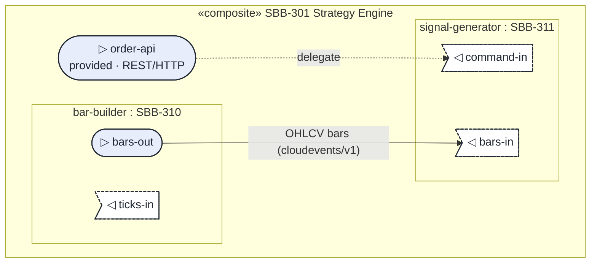
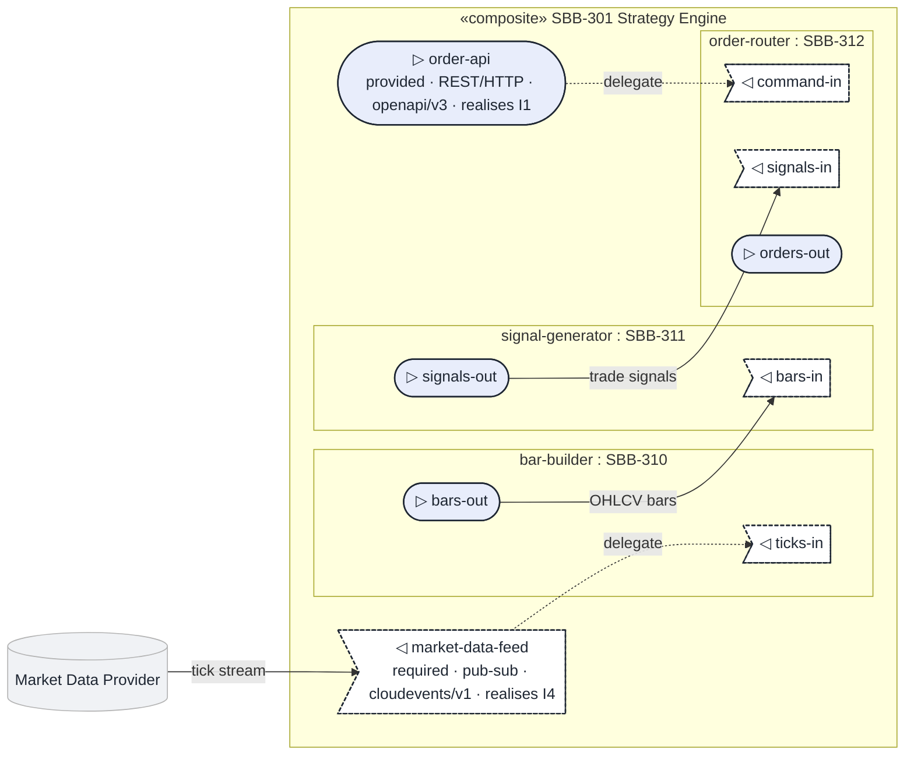
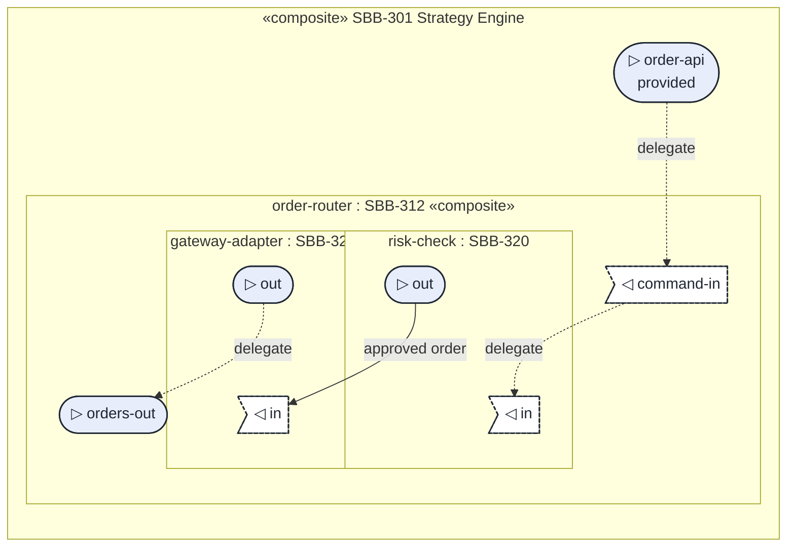

---
document_type: standards
title: "Solution Building Block (SBB) — Draw.io Diagram Standard"
classification: internal
version: 1.0
status: draft
created: 2024-10-01
last_modified: 2026-03-07
owner: "Architecture Team"
triggers:
  - "Designing or modifying SBB implementation diagrams"
  - "Mapping products / services to ABB capabilities"
  - "Reviewing vendor / platform solution boundaries"

# Solution Building Block (SBB) — Draw.io Diagram Standard

This standard defines the visual conventions for SBB diagrams and **extends** the [ABB Diagram Standard](../architecture-building-blocks/standard-abb-diagram.md). All ABB styles apply unless overridden here.


## Canvas

SBB diagrams use the same canvas dimensions as ABB diagrams: **960 x 1080**, background `1.3`, grid 10px, margins 40-50px. This half-slide format allows the diagram to sit alongside a summary panel in a standard 1920 x 1080 presentation.


## SBB-Specific Hierarchy

### Traceability (The ABB Ref Badge)

Every product/service component in an SBB diagram MUST feature an **ABB Reference Badge** in the top-right corner.
- **Badge Fill**: `1.1.3`
- **Badge Stroke**: `1.1`
- **Badge Text**: `1.1`, Size 8pt

### Vendor/Platform Containers

Group product components by their platform (e.g., AWS, Azure, On-Prem).
- **Primary Platform**: Stroke `1.1`, Label Fill `1.1`, Text `1.3`
- **Secondary Platform**: Stroke `2.3`, Label Fill `2.3`, Text `1.1`

### Mandatory Cross-Cutting Containers

Every SBB diagram MUST include containers for the three mandatory cross-cutting concerns, realising the parent ABB's mandatory sub-ABBs with specific products. These containers use the same stroke colours as their ABB counterparts to maintain visual traceability.

| Mandatory Container | Label Example | Stroke | Label Fill | Label Text |
|--------------------|---------------|--------|------------|------------|
| Identity & Access Management | `Microsoft Entra ID` or `AWS IAM` | `2.1` | `2.1` | `1.3` |
| Observability & Audit | `CloudWatch + Purview` or `Datadog` | `2.4` | `2.4` | `1.1` |
| Governance & Policy Enforcement | `Conditional Access + OPA` | `2.5` | `2.5` | `1.1` |

The container label names the **specific vendor/product**, not the abstract concern. The stroke colour identifies the cross-cutting category.

Components inside these containers follow standard Level 1 / Level 2 colour roles and MUST have ABB ref badges tracing to the parent ABB's cross-cutting components.


## SBB Colour Assignments (Tokens)

| Element Type | Fill | Stroke | Text |
|-------------|------|--------|------|
| SBB Boundary | none | `1.1` | `1.3` on `1.1` badge |
| Product Component (L1) | `1.1` | `3.1` | `1.3` |
| Product Component (L2) | `2.1.2` | `3.2` | `3.1` |
| Adapter / Boundary | `3.3` | `3.1` | `3.1` |
| External System | `1.2` | `1.1` | `1.1` |
| ABB Ref Badge | `1.1.3` | `1.1` | `1.1` |
| Observability — Primary | `2.4` | `3.1` | `1.1` |
| Observability — Secondary | `2.4.2` | `3.2` | `3.1` |
| IAM Container Background | `3.4` | `2.1` | — |
| Observability Container Background | `3.4` | `2.4` | — |
| Governance Container Background | `3.4` | `2.5` | — |
| Identity-linked stroke override | — | `2.1` | — |
| Policy-linked stroke override | — | `2.5` | — |


## Composite Structure Diagrams (Mermaid)

A **composite SBB** (`composite: true` in frontmatter — see [Frontmatter Standard §6.7.1](../../standard-frontmatter.md#671-composite-sbbs-uml-composite-structure)) is drawn as a **UML composite-structure diagram rendered in Mermaid**, not (or as well as) the Draw.io product diagram. Mermaid is the normative view for composites because it renders the `parts` / `ports` / `connectors` directly from frontmatter, lives inline in `index.md`, stays diffable in code review, and needs no Draw.io CLI export. The Draw.io `components.*` pair remains optional for composites.

### Why Mermaid has no native composite structure — and how we map onto it

Mermaid ships no composite-structure diagram type. We render one with a **`flowchart`** using subgraphs as parts, shaped nodes as ports, and styled edges as connectors. The mapping:

| UML composite element | Mermaid construct | Notation in this standard |
|---|---|---|
| Composite classifier (the SBB) | outermost `subgraph` | label `«composite» SBB-NNN Name` |
| Part (role played by a sub-SBB) | nested `subgraph` | label `role-name : SBB-NNN` |
| Provided port (ball / lollipop) | circle/stadium node | `(("▷ name"))` styled `:::provided` |
| Required port (socket) | asymmetric node | `>"◁ name"]` styled `:::required` |
| Delegation connector | dotted edge | `-. delegate .->` |
| Assembly connector | solid labelled edge | `-->|contract|` (provided → required, i.e. data-flow direction) |
| Multiplicity | text in the part label | `… : SBB-310 [1..*]` |
| External actor / system | node outside the outer subgraph | `:::external` |

### Mermaid limitations and the workarounds this standard mandates

| Limitation | Workaround (required) |
|---|---|
| No true **ball-and-socket** glyph. | Encode direction with node **shape + class + a Unicode marker**: provided ports are circular `(("▷ …"))` `:::provided`; required ports are asymmetric `>"◁ …"]` `:::required`. |
| Ports cannot be pinned **on** a subgraph border. | Declare boundary-port nodes **inside** the outer SBB subgraph, before the part subgraphs; the `:::provided` / `:::required` classes make them read as boundary ports. |
| Subgraphs are not first-class typed parts. | Put the **type in the label** (`role-name : SBB-NNN`) and the **role-name as the subgraph id** so connectors can address `part.port`. |
| No native **«stereotype»** rendering. | Write guillemets in label text: `"«composite» SBB-301 Strategy Engine"`. |
| Edge direction is the only built-in semantics; UML connector kinds are not distinguished. | Use the **line-style convention**: delegation = dotted (`-. delegate .->`), assembly = solid with a contract label (`-->|…|`). |
| Deep nesting gets visually noisy. | Cap at **three subgraph levels** (SBB → part → sub-part). Below that, link to the sub-SBB's own composite diagram instead of inlining. |

### Naming conventions (so frontmatter and diagram stay in lock-step)

- **Boundary-port node id = the `ports[].name`** verbatim (kebab-case): `order-api`, `market-data-feed`.
- **Part subgraph id = the `parts[].name`** verbatim (kebab-case): `bar-builder`, `signal-generator`.
- **Part-port node id = `partName_portName`** (underscore join) so it is unique, but the **connector endpoints in frontmatter use the dotted form** `bar-builder.bars-out`. The diagram's `bar-builder_bars-out` node corresponds 1:1 to the frontmatter `bar-builder.bars-out` endpoint.
- Every node and subgraph that appears in the diagram MUST exist in frontmatter, and vice-versa. The diagram is a projection of the frontmatter, never a superset.

### Port and connector styling

Place this `classDef` block at the foot of every composite diagram. Hex values are the framework default palette; in a workspace, substitute the equivalent visual-design tokens (provided ≈ token `2.1.2`, required ≈ `1.3`/white, boundary ≈ `1.1`, external ≈ `1.2`).

```
classDef provided fill:#E8EDFB,stroke:#1F2733,stroke-width:1.5px,color:#1F2733;
classDef required fill:#FFFFFF,stroke:#1F2733,stroke-width:1.5px,color:#1F2733,stroke-dasharray:4 2;
classDef part fill:#FFFFFF,stroke:#999999,color:#1F2733;
classDef external fill:#F0F2F5,stroke:#B3B3B3,color:#1F2733;
```

- **Provided port** — filled circle, solid stroke (`:::provided`).
- **Required port** — open asymmetric node, **dashed** stroke (`:::required`) to read as the "socket".
- **Delegation edge** — dotted, labelled `delegate`.
- **Assembly edge** — solid, labelled with the contract/protocol it carries; drawn in **data-flow direction**, from the **provided** ball (producer) to the **required** socket (consumer).

### Example 1 — Anatomy (minimal composite)

One provided boundary port delegated inward to a part input, two parts joined by one assembly connector. This is the smallest legal composite (1 delegation, 1 assembly). The `signal-generator` part carries two required inputs: bars (from the assembly) and commands (from the boundary delegation).



### Example 2 — Realistic (multi-part with required boundary port and an external system)

A provided `order-api` and a `required` `market-data-feed` on the boundary; three parts in a pipeline; one external system the SBB depends on.



### Example 3 — Nested (composite-of-composites)

A part may itself be composite. Show one extra level of nesting; stop there and link out below the third level. Here `order-router` is expanded to reveal its own `risk-check` and `gateway-adapter` sub-parts.



### Reading the three connector rules off the diagram

1. A **delegation** (dotted) always has exactly one boundary-port end and one part-port end, crossing the boundary. It runs **inward** (boundary port → inner part port) when an incoming request or stream is forwarded to the part that handles it, or **outward** (inner `provided` port → `provided` boundary port) when a result is surfaced on the boundary.
2. An **assembly** (solid, labelled) always joins **two part ports**, drawn in data-flow direction from the **provided** ball (producer) to the **required** socket (consumer).
3. No edge connects two boundary ports directly, and an assembly never joins two `provided` ports or two `required` ports (a producer feeds a consumer, not its own kind).


## AI Agent Self-Verification Checklist

Before finalising an SBB diagram, verify:

0. [ ] **Composite (if applicable)**: If `composite: true`, is there a Mermaid composite-structure diagram in §2.1, with one node/subgraph per frontmatter `ports`/`parts` entry and one edge per `connectors` entry (a faithful projection, no extras)? Do delegation edges cross the boundary and assembly edges join part ports (provided → required, data-flow direction)?
1. [ ] **ABB Traceability**: Does every product component have an `ABB: <Name>` reference badge?
2. [ ] **Platform Grouping**: Are components correctly grouped by Vendor/Platform containers?
3. [ ] **Mandatory Cross-Cutting**: Does the diagram include IAM (`2.1` stroke), Observability (`2.4` stroke), and Governance & Policy (`2.5` stroke) containers with specific products?
4. [ ] **Whimsy Check**: Are L1 product components and boundaries set to `arcSize=5`?
5. [ ] **External Systems**: Are non-SBB systems styled with `1.2` fill and `1.1` text?
6. [ ] **Token Accuracy**: Did you use the `.3` suffix for 20% tints (e.g. `1.1.3`)?
7. [ ] **Legend**: Does the legend include ABB Ref Badge, Platform container swatches, and all three cross-cutting container stroke colours?


## Quick Reference Style Snippet (Agent)

**ABB Ref Badge:**
`style="rounded=1;arcSize=2;fillColor=/*1.1.3*/;strokeColor=/*1.1*/;fontColor=/*1.1*/;fontSize=8;"`

**External System:**
`style="rounded=1;arcSize=8;fillColor=/*1.2*/;strokeColor=/*1.1*/;fontColor=/*1.1*/;align=center;"`

**IAM Container:**
`style="rounded=1;arcSize=5;fillColor=/*3.4*/;strokeColor=/*2.1*/;strokeWidth=2;"`

**Observability Container:**
`style="rounded=1;arcSize=5;fillColor=/*3.4*/;strokeColor=/*2.4*/;strokeWidth=2;"`

**Governance & Policy Container:**
`style="rounded=1;arcSize=5;fillColor=/*3.4*/;strokeColor=/*2.5*/;strokeWidth=2;"`

