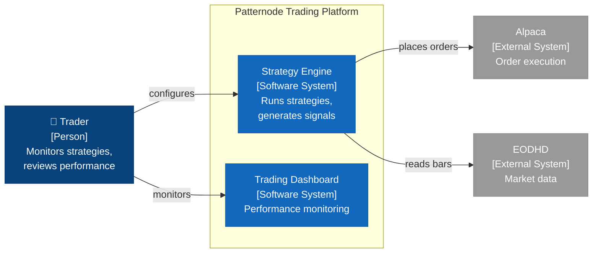

<!--
SPDX-FileCopyrightText: 2026 Dermot O'Brien
SPDX-License-Identifier: CC-BY-4.0
-->
---
document_type: standards
title: "C4 System Context — Diagram Standard"
classification: internal
version: 1.0
status: draft
created: 2026-06-06
last_modified: 2026-06-06
owner: "Architecture Team"
triggers:
  - "Producing a stakeholder-facing context view for a Capability or top-level ABB"
  - "Showing a system's actors and external-system integrations"
  - "Documenting the outside of a system before drilling into its internals"
---

# C4 System Context — Diagram Standard

This standard defines the convention for the **C4 Level 1 (System Context)** diagram in the AAA framework. A context diagram is the "elevator pitch" view of a system: it shows the **system boundary**, **who uses it** (actors / personas), and **what external systems it integrates with** — nothing about the internal structure. It is the most stakeholder-friendly view in the framework and is deliberately the zoom level *above* the composite SBB diagram (which shows the inside).

C4 Context complements, and does not replace, the ABB component diagram and the composite SBB diagram. It is rendered in **Mermaid** so it lives inline in markdown, stays diffable in code review, and needs no Draw.io CLI export.


## When to use

- Every **system-level Capability** or **top-level ABB** SHOULD have a C4 Context diagram. "Top-level" means an ABB that represents a whole system a stakeholder would name (e.g. a trading platform, a payments system), not a fine-grained internal building block.
- Use it as the **first** diagram a non-technical stakeholder sees — before the ABB component diagram or any SBB diagram.
- Use it to make the system's **integration surface** explicit: every external system it depends on, and every persona that interacts with it.
- Do **not** produce one for every ABB. Fine-grained ABBs that are only ever seen *inside* a larger system are covered by their component diagram; a context diagram at that altitude adds noise, not clarity.


## Why Mermaid `flowchart`, not `C4Context`

Mermaid ships an experimental `C4Context` diagram type. This standard does **not** use it: it is explicitly marked experimental, its layout engine is unstable across Mermaid versions, and it renders inconsistently in Docusaurus and GitHub. Instead we render a C4 Context view with a plain **`flowchart`** plus a fixed `classDef` palette. This is stable, portable, and gives us full control over styling — at the cost of writing the node tags (`[Person]`, `[Software System]`, `[External System]`) by hand, which this standard mandates.


## Convention

### Node taxonomy

| C4 element | Tag in label | Fill | Stroke | Text | `classDef` |
|---|---|---|---|---|---|
| Person / persona | `[Person]` | `#08427b` (dark blue) | `#073b6f` | white | `:::person` |
| Internal software system (inside the boundary) | `[Software System]` | `#1168bd` (medium blue) | `#0e5ca6` | white | `:::system` |
| External software system | `[External System]` | `#999999` (grey) | `#8a8a8a` | white | `:::external` |
| System boundary | — | none | `#444444`, dashed | — | `boundary` subgraph |

These four hex values are the canonical C4 model colours. In a workspace with its own visual-design palette, substitute the equivalent tokens: person ≈ a dark primary, internal system ≈ the mid primary (`1.1`), external system ≈ neutral grey (`1.2`), boundary stroke ≈ `1.1`. Keep person darker than internal system, and external system visibly neutral, so the three read apart at a glance.

### Node content

Every node carries three lines:

1. **Name** — the system or person's name (optionally prefixed with an emoji for persons, e.g. `🧑`).
2. **`[Type]` tag** — one of `[Person]`, `[Software System]`, `[External System]`.
3. **Brief description** — 2–4 words, what it does or why it is here. Use `<br/>` between lines.

### Boundary

The internal systems sit inside one **dashed subgraph** representing the platform / system boundary, labelled with the system name. Persons and external systems sit **outside** the boundary. Mirror the ABB diagram convention: persons on the **left**, external systems on the **right**, boundary in the middle.

### Relationships

Edges are directed and read **from the initiator to the recipient**. Add a short verb label where it sharpens meaning (`-->|places orders|`, `-->|reads market data|`); leave it bare where the direction alone is clear. Keep labels to a verb phrase — the context view is not the place for protocols or payloads (those belong on the composite SBB connectors).

### `classDef` block

Place this block at the foot of every C4 Context diagram verbatim:

```
classDef person fill:#08427b,color:#fff,stroke:#073b6f;
classDef system fill:#1168bd,color:#fff,stroke:#0e5ca6;
classDef external fill:#999999,color:#fff,stroke:#8a8a8a;
classDef boundary fill:none,stroke:#444444,stroke-dasharray:5 5,color:#444444;
```

### Minimal template




## How C4 Context maps onto AAA constructs

C4 is an external modelling notation; AAA is the framework. The mapping is explicit and must be documented wherever a context diagram is used:

| C4 Context element | AAA construct | Notes |
|---|---|---|
| The system (the boundary) | A **Capability** or a **top-level ABB** | The boundary names the thing the framework already catalogues; the diagram does not introduce a new artefact. |
| Internal software system (node inside the boundary) | An **ABB** within the capability, or a **realising SBB / Service** | At capability altitude these are usually ABBs; at platform altitude they may be the SBBs/Services that realise them. State which in the surrounding prose. |
| External software system | Often an ABB **`requires`** dependency, or an out-of-scope third party | Where an external system corresponds to a logical dependency the ABB declares, cite the `requires` entry so the context view and the gap-analysis data agree. Pure third-party SaaS with no AAA artefact is just an external node. |
| Person / persona / actor | **No AAA equivalent** | This is C4's unique addition. AAA's golden thread runs Outcome → Platform → Bounded Context → ABB → SBB → Service and has no first-class "person" entity. Persons appear *only* on the context diagram; do not invent an artefact for them. |
| Relationship (edge) | An interaction, not an `Interface` | Context edges are coarse ("places orders"); they are not the `I<N>` interfaces of the ABB document. An interface may underlie an edge, but the edge is the stakeholder-level summary. |

The single most important mapping rule: **the "system" in a context diagram is always an existing AAA Capability or top-level ABB.** If you find yourself drawing a context diagram for something with no catalogued home, create the Capability or ABB first.


## Relationship to composite SBBs (zoom-in)

A C4 Context diagram and a [composite SBB diagram](solution-building-blocks/standard-sbb-diagram.md#composite-structure-diagrams-mermaid) are **two views of the same system at adjacent zoom levels**:

- The **C4 Context** diagram shows the **outside**: who uses the system and which external systems it talks to. The system is a single opaque boundary.
- The **composite SBB** diagram shows the **inside**: the parts (sub-SBBs), the ports on the boundary, and the connectors wiring the parts together. The boundary is now transparent and its internals are exposed.

In C4 terms, a composite SBB diagram **is effectively a C4 Container / Component view** — it is the next level of zoom (Level 2/3) on the same boundary the context diagram drew at Level 1. The two are designed to be read as a pair:

| | C4 Context (this standard) | Composite SBB (SBB diagram standard) |
|---|---|---|
| C4 level | Level 1 — System Context | Level 2/3 — Container / Component |
| Shows | Actors + external systems | Parts + ports + connectors |
| Boundary | Opaque (one box) | Transparent (parts revealed) |
| Includes persons? | Yes | No |
| Includes protocols/contracts? | No (verb labels only) | Yes (on ports and connectors) |
| Source of truth | Authored for the view | Projected 1:1 from frontmatter `ports`/`parts`/`connectors` |

When both exist for the same system, the **external systems** on the context diagram should reconcile with the **required boundary ports** and external nodes on the composite diagram: a system the context view shows as an integration is, one zoom in, a `required` port (or an external node feeding one). Place the two diagrams next to each other so a reader can step from the elevator pitch straight into the wiring. The worked pair lives at [`solution-building-blocks/example-composite/`](solution-building-blocks/example-composite/) — `c4-context.md` (outside) alongside `index.md` (inside).


## AI Agent Self-Verification Checklist

Before finalising a C4 Context diagram, verify:

1. [ ] **Right altitude**: Is the system a Capability or a *top-level* ABB (something a stakeholder would name), not a fine-grained internal ABB?
2. [ ] **`flowchart`, not `C4Context`**: Did you render with a plain `flowchart` and the mandated `classDef` palette (not the experimental `C4Context` type)?
3. [ ] **Three node types**: Does every node carry a `[Person]` / `[Software System]` / `[External System]` tag and the matching `:::person` / `:::system` / `:::external` class?
4. [ ] **Node content**: Does every node have Name + `[Type]` + a 2–4 word description?
5. [ ] **Boundary**: Are internal systems inside one dashed boundary subgraph, with persons (left) and external systems (right) outside it?
6. [ ] **Edges**: Are edges directed initiator → recipient, with verb labels where they help?
7. [ ] **AAA mapping documented**: Does the surrounding prose state which AAA construct the boundary is (Capability or ABB), and reconcile external systems with `requires` dependencies where applicable?
8. [ ] **Zoom-in link**: If the system has a composite SBB, is the context diagram cross-linked to it as the zoom-in view (and do the external systems reconcile with the composite's required ports)?
