# Modernisation Ontology — Formal Specification

Version 1.0.0

> Part of the [ai-assisted-architecture](https://github.com/dermot-obrien/ai-assisted-architecture) framework.

## Purpose

This document specifies the Modernisation Ontology: its scope, design rationale, the choices made and the alternatives rejected, and the open considerations that future versions will need to address. It is written for readers familiar with ontology design, enterprise architecture frameworks, and the practical realities of governing technology change at enterprise scale.

This is not a user guide. For usage, see README.md. The schema itself (modernisation-ontology-schema.json) is the authoritative artefact; this document explains why it has the shape it does.

## 1. Scope and audiences

The ontology serves three audiences, each with distinct epistemic demands:

**Governance** — boards, executive committees, and regulators consuming periodic reporting on technology modernisation. Their epistemic need is *commitment integrity*: what was promised, what was delivered, what changed since last time, and what the implications of deviation are. Their cadence is quarterly to annual; their tolerance for granularity is low; their tolerance for unverified claims is also low.

**Architecture practice** — enterprise architects governing standards and patterns, and solution architects designing change within funded initiatives. Their epistemic need is *expressive modelling*: capturing current state, proposed change, design intent, and the rationale linking them. Their cadence is continuous; their tolerance for granularity is high; their tolerance for vague or imprecise modelling is low.

**External assessors** — regulators conducting thematic reviews, external auditors, and architecture review boards. Their epistemic need is *traceability and defensibility*: every claim should resolve to a typed, dated, sourced fact. Their cadence is occasional but high-stakes; their tolerance for narrative-only claims is essentially zero.

These three audiences are served by the same ontology rather than by parallel models. The motivating principle is that splitting governance from practice produces drift: the governance model becomes a fiction that the practice model contradicts, and the assessor's audit reconciles them at the worst possible moment. A single shared ontology, viewed differently by each audience, is the only architecture that scales.

## 2. Origin and the criticism it responds to

The ontology was developed in response to a specific assessor criticism of technology modernisation reporting at a large enterprise. The criticism identified that reporting was bimodal: either a single high-level index with "In Progress" status, or a thousand-plus pages of activity-level plan reporting. The assessor recommended progress against interim milestones and explicit implications of deviations from plan.

Diagnosis: the bimodal failure was structural, not presentational. The underlying architecture model lacked an *architecturally meaningful middle layer* between portfolio-level metrics and project-level activities. Reporting reflected the model. Without first-class intermediate states (interim milestones with defined criteria), bounded changes between states (transitions), governance events (slips and decisions), and versioned commitments, reporting could only roll up activities or report aggregates — neither of which serves Board-level oversight.

The ontology is therefore primarily a *reporting-shape* response: it makes the middle layer first-class so that reporting at the right grain becomes a query rather than a narrative. Architecture practice and external assessment ride on the same shape, gaining benefit from the same structural decisions.

## 3. Design principles

Seven principles shaped the model. Each is a deliberate choice with alternatives rejected.

**3.1 Platform-centric.** Platforms are the durable governance unit. They have named owners, funded roadmaps, and Board-level accountability. The model treats platforms as sovereign — they provide capabilities and are subject to drivers but are not owned by programmes or absorbed into portfolio hierarchies. The platform-of-platforms model is the substrate.

*Alternative rejected:* portfolio-centric or programme-centric models. Portfolio implies aggregation of platforms; programme implies temporary delivery wrappers. Both can be added as overlays but should not be the governance unit. Where they conflict with platform-centric thinking, platform wins.

**3.2 Capability-anchored.** Capabilities are what platforms provide to consumers. They optionally anchor to an industry reference taxonomy (BIAN for banking, eTOM for telecom, ACORD for insurance, NRF ARTS for retail, HL7/FHIR for healthcare, etc.) for cross-industry-peer comparability. The capability layer is the durable, recursively decomposable model of what the enterprise can do; the component layer is the volatile model of how it does it.

*Alternative rejected:* component-centric (BMC-style) models that treat components as primary. Components are too volatile — every implementation change forces model restructure. Capabilities are stable; components are volatile; this asymmetry should be preserved in the model's shape.

**3.3 Reference, don't duplicate.** Every entity that has a clear master in an external system is modelled as a reference, not a copy. The ontology stores `external_id` plus the role the entity plays in architectural reasoning. Names, descriptions, lifecycle states, owners — these stay in the source system (LeanIX, ServiceNow, GRC, risk register, strategy systems).

*Alternative rejected:* fully owned model where the ontology masters everything. This produces synchronisation problems, governance conflicts with system-of-record owners, and an unsustainable maintenance burden. The platform-centric thinking applied internally: the ontology is one platform among several; it provides services it uniquely offers and references the rest.

**3.4 Govern via typed events.** Slips and Decisions are first-class events, not status flags. Re-baselining produces a versioned Commitment rather than mutating the original. This makes the governance trail auditable and reportable.

*Alternative rejected:* status-tracking model where deviations are absorbed into RAG colour changes. This is the bimodal failure mode the criticism diagnosed. Status flags are not governance events; they are narrative summaries that can be quietly revised. Events leave a trail.

**3.5 Standards-aligned where standards exist.** Capabilities optionally reference an industry reference taxonomy. Views align with ArchiMate and TOGAF. View structure follows ISO/IEC/IEEE 42010. The benefit is external legibility: assessors and external auditors recognise the structure without learning a bespoke model.

*Alternative rejected:* bespoke taxonomy across the board. The cost is that every external engagement begins with vocabulary education. The tenant-specific elements that do remain (platform IDs in `^P\d{3}$` format, domain tags) are kept minimal and orthogonal to the standards-aligned core.

**3.6 ABB / SBB layering, made explicit on the entities that are building blocks.** TOGAF distinguishes Architecture Building Blocks (ABBs — technology-agnostic logical components) from Solution Building Blocks (SBBs — technology-specific implementations). The distinction is *technology-agnostic vs technology-specific* at the same conceptual level (both are logical components), not abstract-vs-concrete or capability-vs-component. The ontology surfaces this distinction by adding a `building_block_type` attribute to the entities that *are* building blocks in TOGAF's sense (Component and Interface) and explicitly noting that other entities (Capability, Pattern, Standard, Platform) are *not* building blocks — they sit around the building-block layer playing distinct roles (Capabilities are realised by ABBs; Patterns inform ABB design; Standards constrain ABB design; Platforms are composed of building blocks).

*Alternative rejected:* classifying every entity in the ontology as ABB, SBB, or neither. This would force a square-peg-round-hole classification on Capability and Standard, which are not building blocks in TOGAF's framing. The narrower approach — only Component and Interface carry `building_block_type` — is more honest to the standard.

The refinement edge from ABB Component to SBB Component is captured via `Component.realises_abb_ids` (only populated on SBBs). This is the canonical TOGAF Phase B→E refinement, where logical components are progressively refined into product-specific implementations.

**3.7 Minimise entity count.** Every entity earns its place by answering questions no other entity can answer. Derived views are not entities (Gap, ImpactPath, HealthSignal are computed, not stored). Aspects of other entities are not entities (ChangeAction collapses into Change; Architectural Milestone simplifies to Milestone).

*Alternative rejected:* maximal ontology with separate entities for every concept. The original ontology had this failure mode — 20 component subtypes, separate entities for Roadmap and Horizon, parallel structures for Baseline and Transitional architecture. The result was unclear scope per entity and difficulty querying. The refactored model has more entities than initially seems necessary, but each one is sharply scoped.

## 3.5 Visual overview

The diagrams in this section are conceptual orientation aids. They are not exhaustive (the entity-centric diagrams in §4 carry the precise relationships per entity). They are intended to make the four-layer shape, the governance flow, and the ABB/SBB refinement visible at a glance before reading the entity rationales.

### 3.5.1 The four layers, at a glance

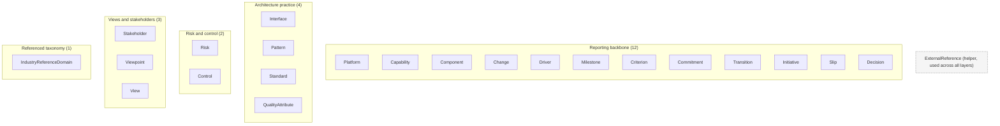
```mermaid
flowchart TB
  subgraph RB["Reporting backbone (12)"]
    direction TB
    PL[Platform]
    CAP[Capability]
    CMP[Component]
    CH[Change]
    DR[Driver]
    MS[Milestone]
    CR[Criterion]
    CMT[Commitment]
    TR[Transition]
    IN[Initiative]
    SL[Slip]
    DE[Decision]
  end
  subgraph AP["Architecture practice (4)"]
    IF[Interface]
    PT[Pattern]
    ST[Standard]
    QA[QualityAttribute]
  end
  subgraph RC["Risk and control (2)"]
    RK[Risk]
    CT[Control]
  end
  subgraph VS["Views and stakeholders (3)"]
    SH[Stakeholder]
    VP[Viewpoint]
    VW[View]
  end
  subgraph TX["Referenced taxonomy (1)"]
    IRD[IndustryReferenceDomain]
  end
  ER["ExternalReference (helper, used across all layers)"]:::helper
  classDef helper fill:#F5F5F5,stroke:#5A5A5A,stroke-dasharray:3 3
```

### 3.5.2 Reporting backbone — entity-relationship view

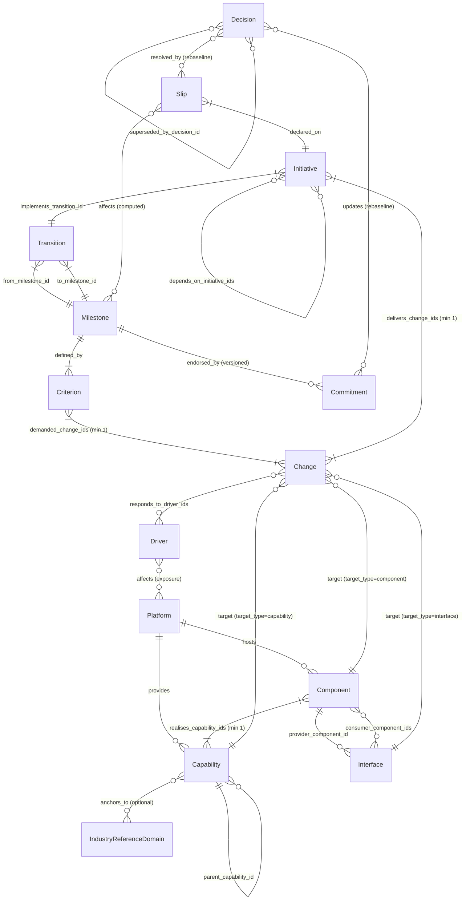
```mermaid
erDiagram
  Platform        ||--o{ Capability       : "provides"
  Platform        ||--o{ Component        : "hosts"
  Capability      }o--o{ IndustryReferenceDomain : "anchors_to (optional)"
  Capability      ||--o{ Capability       : "parent_capability_id"
  Component       }|--|{ Capability       : "realises_capability_ids (min 1)"
  Component       ||--o{ Interface        : "provider_component_id"
  Component       }o--o{ Interface        : "consumer_component_ids"
  Change          }o--|| Capability       : "target (target_type=capability)"
  Change          }o--|| Component        : "target (target_type=component)"
  Change          }o--|| Interface        : "target (target_type=interface)"
  Change          }o--o{ Driver           : "responds_to_driver_ids"
  Driver          }o--o{ Platform         : "affects (exposure)"
  Milestone       ||--|{ Criterion        : "defined_by"
  Criterion       }|--|{ Change           : "demanded_change_ids (min 1)"
  Milestone       ||--o{ Commitment       : "endorsed_by (versioned)"
  Transition      }|--|| Milestone        : "from_milestone_id"
  Transition      }|--|| Milestone        : "to_milestone_id"
  Initiative      }|--|| Transition       : "implements_transition_id"
  Initiative      }|--|{ Change           : "delivers_change_ids (min 1)"
  Initiative      }o--o{ Initiative       : "depends_on_initiative_ids"
  Slip            }|--|| Initiative       : "declared_on"
  Slip            }o--o{ Milestone        : "affects (computed)"
  Decision        }o--o{ Slip             : "resolved_by (rebaseline)"
  Decision        }o--o{ Commitment       : "updates (rebaseline)"
  Decision        }o--o{ Decision         : "superseded_by_decision_id"
```

### 3.5.3 Governance flow — from driver to delivery

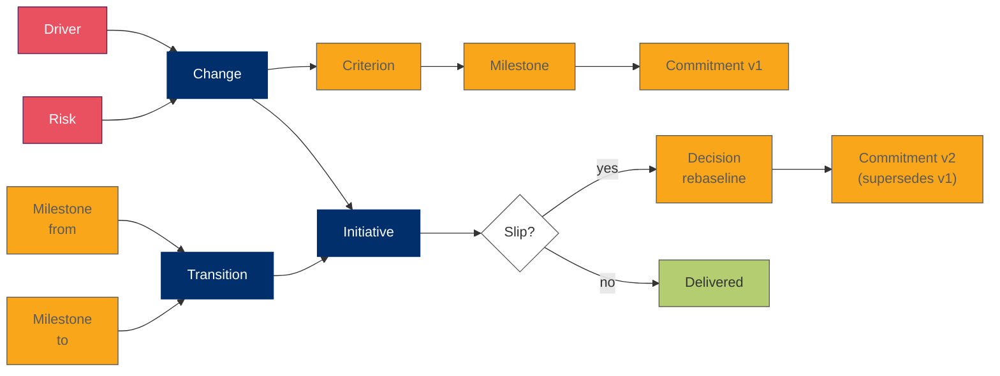
```mermaid
flowchart LR
  DR[Driver]:::motive --> CH[Change]:::primary
  RK[Risk]:::motive --> CH
  CH --> CR[Criterion]:::govern
  CR --> MS[Milestone]:::govern
  MS --> CMT["Commitment v1"]:::govern
  MS_from[Milestone<br/>from]:::govern --> TR[Transition]:::primary
  MS_to[Milestone<br/>to]:::govern --> TR
  TR --> IN[Initiative]:::primary
  CH --> IN
  IN --> SL{Slip?}:::decision
  SL -- yes --> DEC[Decision<br/>rebaseline]:::govern
  DEC --> CMT2["Commitment v2<br/>(supersedes v1)"]:::govern
  SL -- no --> DELIV[Delivered]:::success
  classDef motive fill:#E95160,stroke:#5A1E58,color:#fff
  classDef primary fill:#002F6B,stroke:#002F6B,color:#fff
  classDef govern fill:#FAA61A,stroke:#5A5A5A,color:#5A5A5A
  classDef decision fill:#FFFFFF,stroke:#5A5A5A
  classDef success fill:#B5CD71,stroke:#5A5A5A
```

### 3.5.4 End-to-end conceptual map

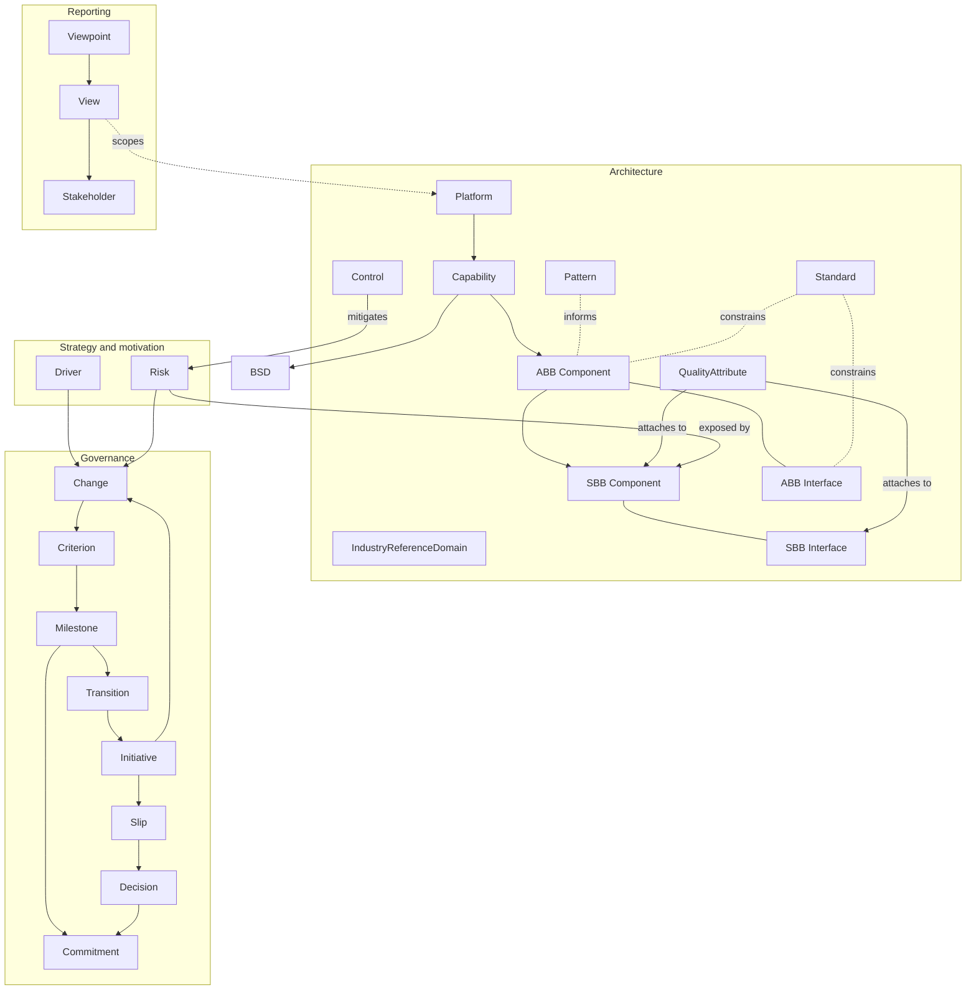
```mermaid
flowchart TB
  subgraph SM["Strategy and motivation"]
    DR[Driver]
    RK[Risk]
  end
  subgraph ARCH["Architecture"]
    PL[Platform]
    CAP[Capability]
    IRD[IndustryReferenceDomain]
    ABBC["ABB Component"]
    SBBC["SBB Component"]
    ABBI["ABB Interface"]
    SBBI["SBB Interface"]
    PT[Pattern]
    ST[Standard]
    QA[QualityAttribute]
    CT[Control]
  end
  subgraph GOV["Governance"]
    CH[Change]
    MS[Milestone]
    CR[Criterion]
    CMT[Commitment]
    TR[Transition]
    IN[Initiative]
    SL[Slip]
    DEC[Decision]
  end
  subgraph REP["Reporting"]
    SH[Stakeholder]
    VP[Viewpoint]
    VW[View]
  end

  PL --> CAP --> ABBC --> SBBC
  CAP --> BSD
  ABBC --- ABBI
  SBBC --- SBBI
  PT -. informs .- ABBC
  ST -. constrains .- ABBC
  ST -. constrains .- ABBI
  QA -- attaches to --> SBBC
  QA -- attaches to --> SBBI
  CT -- mitigates --> RK
  RK -- exposed by --> SBBC

  DR --> CH
  RK --> CH
  CH --> CR --> MS --> CMT
  MS --> TR --> IN
  IN --> CH
  IN --> SL --> DEC --> CMT

  VP --> VW
  VW --> SH
  VW -. scopes .-> PL
```

### 3.5.5 ABB to SBB refinement — the canonical TOGAF Phase B to E flow

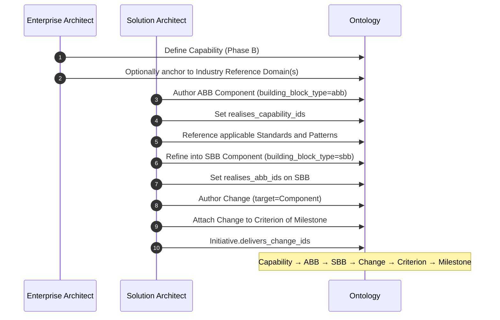
```mermaid
sequenceDiagram
  autonumber
  participant EA as Enterprise Architect
  participant SA as Solution Architect
  participant Mdl as Ontology
  EA->>Mdl: Define Capability (Phase B)
  EA->>Mdl: Optionally anchor to Industry Reference Domain(s)
  SA->>Mdl: Author ABB Component (building_block_type=abb)
  SA->>Mdl: Set realises_capability_ids
  SA->>Mdl: Reference applicable Standards and Patterns
  SA->>Mdl: Refine into SBB Component (building_block_type=sbb)
  SA->>Mdl: Set realises_abb_ids on SBB
  SA->>Mdl: Author Change (target=Component)
  SA->>Mdl: Attach Change to Criterion of Milestone
  SA->>Mdl: Initiative.delivers_change_ids
  Note over Mdl: Capability → ABB → SBB → Change → Criterion → Milestone
```

### 3.5.6 Commitment versioning — state view

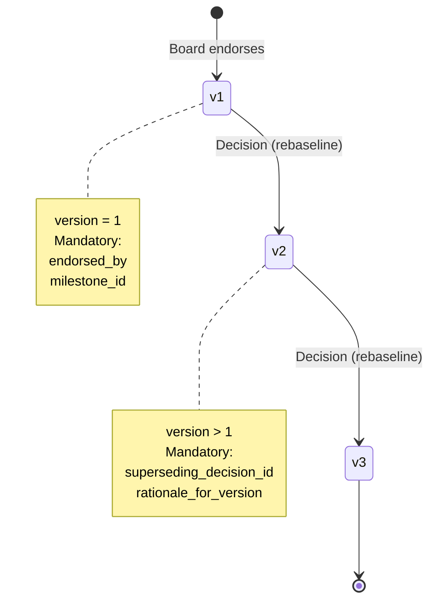
```mermaid
stateDiagram-v2
  [*] --> v1 : Board endorses
  v1 --> v2 : Decision (rebaseline)
  v2 --> v3 : Decision (rebaseline)
  v3 --> [*]
  note right of v1
    version = 1
    Mandatory:
      endorsed_by
      milestone_id
  end note
  note right of v2
    version > 1
    Mandatory:
      superseding_decision_id
      rationale_for_version
  end note
```

## 4. Entity model — design choices

Each entity reflects specific design decisions worth recording. This section presents the rationale for the choices in the order they appear in the schema, with cross-references where one decision constrains another.

### 4.0 Building block classification (ABB / SBB)

Before describing the individual entities, the model's ABB/SBB layering deserves explicit framing because it shapes how the entities relate to each other.

Per the TOGAF Standard, building blocks are *"packages of functionality defined to meet the business needs across an organization"*, and a building block has a type corresponding to the content metamodel (actor, business service, application, data entity, etc.). The ABB/SBB distinction is **technology-agnostic vs technology-specific** at the same conceptual level — both are logical components — not abstract-versus-concrete or capability-versus-component.

- **Architecture Building Blocks (ABBs)** are technology-agnostic logical components. They describe *what* functionality is required without committing to specific products, vendors, or protocols. They relate to the Architecture Continuum and are produced in TOGAF ADM Phases B, C, and D. Examples: "authentication service", "customer database", "event broker".
- **Solution Building Blocks (SBBs)** are technology-specific implementations. They are aware of products and vendors and may be procured or custom-developed. They relate to the Solutions Continuum and are produced in TOGAF ADM Phase E. Examples: "Okta SSO Gateway on AWS", "PostgreSQL 16 on AWS RDS", "Confluent Kafka cluster".

The same logical thing typically exists at both levels: an ABB Component "Authentication Service (logical)" is refined into one or more SBB Components like "Okta-based SSO Gateway". This refinement is the canonical TOGAF Phase B→E flow, captured in our model via `Component.realises_abb_ids`.

The ontology maps entities to TOGAF concepts as follows:

| Entity | TOGAF role | Notes |
|---|---|---|
| Component | Building block (ABB or SBB via `building_block_type`) | Primary building-block entity. ABB = logical; SBB = technology-specific |
| Interface | Building block aspect (ABB or SBB via `building_block_type`) | TOGAF lists interfaces as part of ABB content |
| Capability | Phase B concept (not a building block) | What the enterprise needs to do. Realised *by* ABBs |
| Pattern | Reference architecture (not a building block) | A reusable recipe from the Architecture Continuum. *Informs* ABB design |
| Standard | Prescriptive specification (not a building block) | Building blocks *conform to* standards. TOGAF lists standards-conformance as an ABB characteristic |
| Platform | Enterprise governance unit (not a building block) | Composed of building blocks; has board-level accountability |

All other entities (Change, Driver, Milestone, Criterion, Commitment, Transition, Initiative, Slip, Decision, QualityAttribute, Risk, Control, Stakeholder, Viewpoint, View, IndustryReferenceDomain) are governance, motivation, or representation entities that *operate on* the architecture; they are not building blocks in TOGAF's sense.

The realisation chain in TOGAF terms is: **Capability → realised by → ABB Components/Interfaces → refined into → SBB Components/Interfaces**. The first edge is captured by `Component.realises_capability_ids`. The second edge is captured by `Component.realises_abb_ids` on the SBB pointing to its ABB. Patterns and Standards apply across the chain: ABBs are designed against Patterns and conform to Standards; SBBs inherit those obligations.

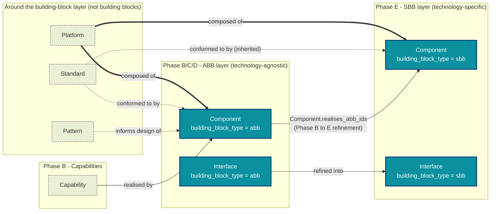
```mermaid
flowchart LR
  subgraph Phase_B["Phase B - Capabilities"]
    CAP[Capability]:::nb
  end
  subgraph Phase_BCD["Phase B/C/D - ABB layer (technology-agnostic)"]
    ABBC["Component<br/>building_block_type = abb"]:::bb
    ABBI["Interface<br/>building_block_type = abb"]:::bb
  end
  subgraph Phase_E["Phase E - SBB layer (technology-specific)"]
    SBBC["Component<br/>building_block_type = sbb"]:::bb
    SBBI["Interface<br/>building_block_type = sbb"]:::bb
  end
  subgraph Around["Around the building-block layer (not building blocks)"]
    PT[Pattern]:::nb
    ST[Standard]:::nb
    PL[Platform]:::nb
  end
  CAP -- "realised by" --> ABBC
  ABBC -- "Component.realises_abb_ids<br/>(Phase B to E refinement)" --> SBBC
  ABBI -- "refined into" --> SBBI
  PT -. "informs design of" .-> ABBC
  ST -. "conformed to by" .-> ABBC
  ST -. "conformed to by (inherited)" .-> SBBC
  PL == "composed of" ==> SBBC
  PL == "composed of" ==> ABBC
  classDef bb fill:#0B909F,stroke:#002F6B,stroke-width:2px,color:#fff
  classDef nb fill:#E9F0D4,stroke:#5A5A5A,stroke-dasharray:4 2
```

Colour coding. The cyan boxes (Component, Interface) are TOGAF building blocks and carry `building_block_type`. The four dashed boxes (Capability, Pattern, Standard, Platform) are not building blocks and do not carry `building_block_type`.

This explicit framing has two practical consequences:

**Review cadence aligns with where in the chain the change sits.** A new ABB Component (logical architecture decision) is reviewed by the Architecture Review Board on a slow cadence. An ABB→SBB refinement (product selection within an existing logical design) is reviewed at initiative delivery gates. The same model supports both review processes.

**Initiative scope becomes legible.** A solution architect can ask: *"For this initiative, which ABBs are being introduced or modified, and which SBBs realise them?"* The answer is a single typed query against Components filtered by `building_block_type` and joined via `realises_abb_ids`.

### 4.1 Platform

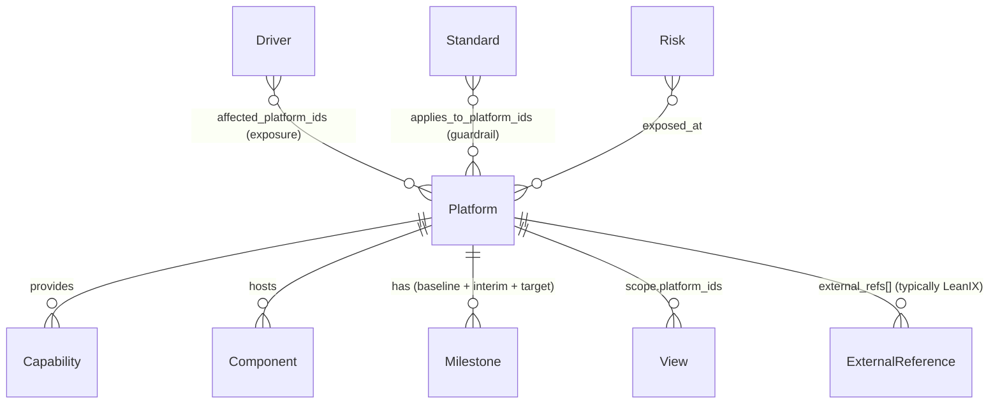
```mermaid
erDiagram
  Platform        ||--o{ Capability       : "provides"
  Platform        ||--o{ Component        : "hosts"
  Platform        ||--o{ Milestone        : "has (baseline + interim + target)"
  Platform        ||--o{ View             : "scope.platform_ids"
  Driver          }o--o{ Platform         : "affected_platform_ids (exposure)"
  Standard        }o--o{ Platform         : "applies_to_platform_ids (guardrail)"
  Risk            }o--o{ Platform         : "exposed_at"
  Platform        ||--o{ ExternalReference : "external_refs[] (typically LeanIX)"
```

The Platform entity carries the boundary attribute (with `inside` and `outside` sub-fields) preserved from the original ontology. The boundary is one of the few elements of the original that was unambiguously right — it forces explicit scope statement and prevents the two common platform failure modes (scope creep and coverage gaps).

`owner` is mandatory. A platform without a named owner is not a platform in this model's sense; it is an architectural fiction. The ontology enforces ownership at the schema level because most platform governance failures begin with diffuse ownership.

`domain_tag` is deliberately lightweight (a string, not an entity reference). Domain is for visual grouping in views, not for governance. Promoting domain to an entity would re-introduce the Portfolio-vs-Platform tension we deliberately avoided.

### 4.2 Capability

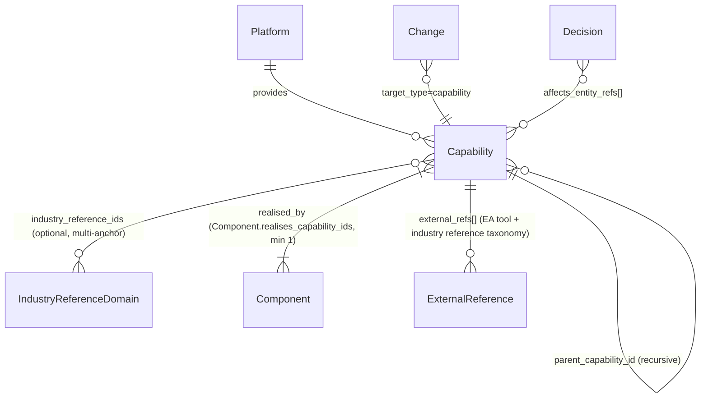
```mermaid
erDiagram
  Platform        ||--o{ Capability       : "provides"
  Capability      ||--o{ Capability       : "parent_capability_id (recursive)"
  Capability      }o--o{ IndustryReferenceDomain : "industry_reference_ids (optional, multi-anchor)"
  Capability      }|--|{ Component        : "realised_by (Component.realises_capability_ids, min 1)"
  Change          }o--|| Capability       : "target_type=capability"
  Decision        }o--o{ Capability       : "affects_entity_refs[]"
  Capability      ||--o{ ExternalReference : "external_refs[] (EA tool + industry reference taxonomy)"
```

Capability is a Phase B concept in TOGAF terms — it describes what the enterprise needs to be able to do. It is **not** a building block; ABB Components are *realisations* of Capabilities, but the Capability itself sits above the building-block layer.

Optionally anchored to an industry reference taxonomy domain via `industry_reference_ids` (array, allowing multi-anchor). The empty array is permitted and is the expected state for organisations in industries without an established reference taxonomy, or for capabilities that don't fit the chosen taxonomy.

Recursive via `parent_capability_id`. The original ontology had SubCapability as a separate type; we collapsed to recursive Capability because the typed distinction added no expressive power and prevented deeper decomposition.

`maturity` is a Capability attribute (crawl/walk/run/fly) but maturity *targets* are expressed through milestone criteria. This separation matters: current maturity is a fact about today; target maturity is a commitment about a future date and belongs in the governance layer.

### 4.3 Component

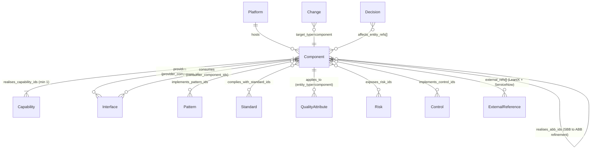
```mermaid
erDiagram
  Platform        ||--o{ Component        : "hosts"
  Component       }|--|{ Capability       : "realises_capability_ids (min 1)"
  Component       ||--o{ Component        : "realises_abb_ids (SBB to ABB refinement)"
  Component       ||--o{ Interface        : "provides (provider_component_id)"
  Component       }o--o{ Interface        : "consumes (consumer_component_ids)"
  Component       }o--o{ Pattern          : "implements_pattern_ids"
  Component       }o--o{ Standard         : "complies_with_standard_ids"
  Component       ||--o{ QualityAttribute : "applies_to (entity_type=component)"
  Component       }o--o{ Risk             : "exposes_risk_ids"
  Component       }o--o{ Control          : "implements_control_ids"
  Change          }o--|| Component        : "target_type=component"
  Decision        }o--o{ Component        : "affects_entity_refs[]"
  Component       ||--o{ ExternalReference : "external_refs[] (LeanIX + ServiceNow)"
```

Component carries three orthogonal classifiers (`component_type`, `building_block_type`, `architectural_style`). They combine freely:

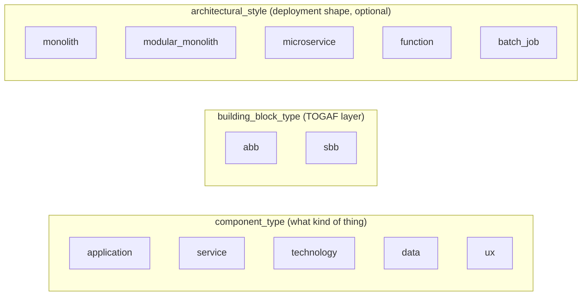
```mermaid
flowchart LR
  subgraph CT["component_type (what kind of thing)"]
    direction TB
    CT1[application]
    CT2[service]
    CT3[technology]
    CT4[data]
    CT5[ux]
  end
  subgraph BBT["building_block_type (TOGAF layer)"]
    direction TB
    BB1[abb]
    BB2[sbb]
  end
  subgraph AS["architectural_style (deployment shape, optional)"]
    direction TB
    A1[monolith]
    A2[modular_monolith]
    A3[microservice]
    A4[function]
    A5[batch_job]
  end
```

The two-by-component_type matrix below is the most common combination view (component_type × building_block_type). The architectural_style axis layers on top and is shown in the worked-examples table.

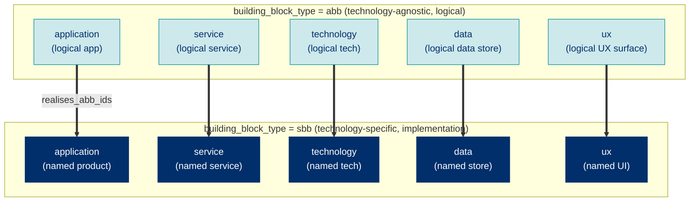
```mermaid
flowchart TB
  subgraph ABB["building_block_type = abb (technology-agnostic, logical)"]
    direction LR
    A1["application<br/>(logical app)"]:::abb
    A2["service<br/>(logical service)"]:::abb
    A3["technology<br/>(logical tech)"]:::abb
    A4["data<br/>(logical data store)"]:::abb
    A5["ux<br/>(logical UX surface)"]:::abb
  end
  subgraph SBB["building_block_type = sbb (technology-specific, implementation)"]
    direction LR
    S1["application<br/>(named product)"]:::sbb
    S2["service<br/>(named service)"]:::sbb
    S3["technology<br/>(named tech)"]:::sbb
    S4["data<br/>(named store)"]:::sbb
    S5["ux<br/>(named UI)"]:::sbb
  end
  A1 == "realises_abb_ids" ==> S1
  A2 ==> S2
  A3 ==> S3
  A4 ==> S4
  A5 ==> S5
  classDef abb fill:#CEE9EC,stroke:#0B909F,color:#002F6B
  classDef sbb fill:#002F6B,stroke:#002F6B,color:#fff
```

Worked examples for each cell, with the typical architectural_style:

| component_type | ABB example | SBB example | Typical architectural_style |
|---|---|---|---|
| application | "Customer self-service application (logical)" | "Self-service portal on Liferay 7.4" | monolith / modular_monolith |
| service | "Authentication service (logical)" | "Okta SSO Gateway on AWS" | microservice |
| service | "Order orchestrator (logical)" | "Order orchestrator on Kubernetes prod-eu-1" | microservice |
| service | "Nightly reconciliation processor (logical)" | "recon-batch-job on Argo Workflows" | batch_job |
| technology | "Event broker (logical)" | "Confluent Kafka cluster prod-eu-1" | (unset; infrastructure) |
| data | "Customer master (logical)" | "PostgreSQL 16 customer DB on AWS RDS" | (unset; data) |
| ux | "Customer mobile app (logical)" | "iOS Customer App v8.4 (Swift, App Store)" | (unset; client-side) |

Component is the primary building-block entity in the model, in TOGAF's sense. The `building_block_type` attribute classifies each Component as either an ABB (technology-agnostic logical) or an SBB (technology-specific implementation). The same logical concern typically exists as both: a logical "Authentication Service" ABB Component refined into a specific "Okta-based SSO Gateway" SBB Component, with the SBB pointing to its ABB via `realises_abb_ids`.

Five subtypes (application, service, technology, data, ux) reduced from the original ontology's 20. The reduction is the largest single simplification in the refactor and is justified in §6 (Migration Mapping). Each subtype can exist in both ABB and SBB form (e.g., an ABB Component of subtype `data` is a logical data store; an SBB Component of subtype `data` is a specific database product).

Component deployment shape (monolith, microservice, function, batch_job, etc.) is captured by the optional `architectural_style` field, **not** by `component_type`. The two classifiers are orthogonal: `component_type` answers "what kind of thing is it?" (with a LeanIX-mapping consequence), `architectural_style` answers "how is it deployed and structured?". Most service-type components will carry `architectural_style = microservice` or `monolith`; most application-type components will be `monolith` or `modular_monolith`; data and ux components typically leave it unset because deployment shape is not architecturally distinguishing for them.

`realises_capability_ids` is mandatory with minItems 1. The model does not admit orphan components — every component must realise at least one capability. This rule is what enforces the capability-centric discipline.

`realises_abb_ids` (optional) records the ABB-to-SBB refinement edge. An SBB Component should populate this to identify the ABB Component(s) it refines, supporting traceability from logical architecture to implementation.

`data_mastery` is conditionally required when `component_type = data`. The schema enforces this via `if/then`. This preserves the data-governance semantics of the original ontology's DataMastery entity without promoting it to a first-class entity.

The relationships `implements_pattern_ids`, `complies_with_standard_ids`, `quality_attribute_ids`, `exposes_risk_ids`, `implements_control_ids` connect Component to the architecture-practice and risk layers.

### 4.4 Interface

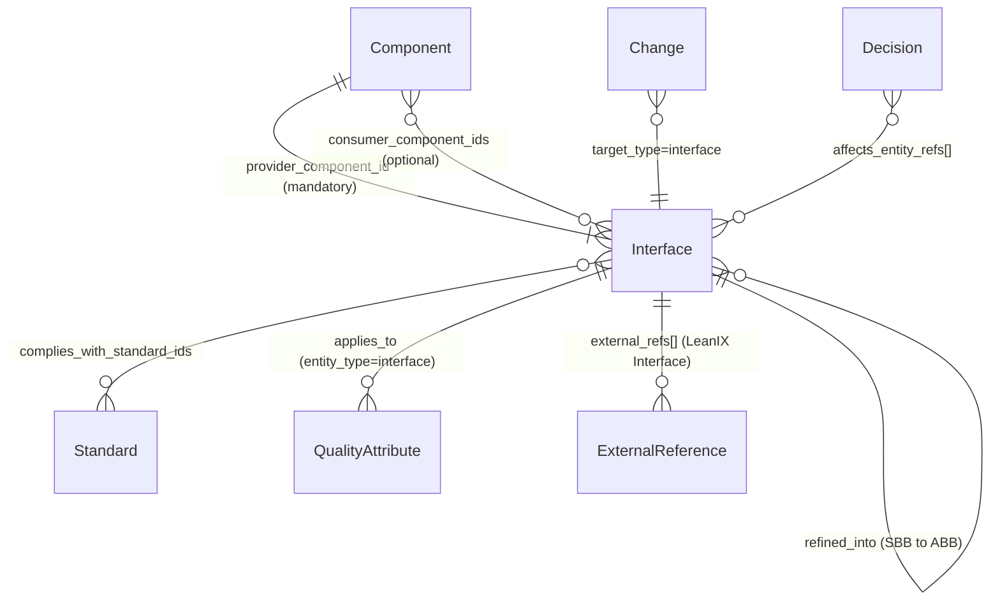
```mermaid
erDiagram
  Component       ||--|{ Interface        : "provider_component_id (mandatory)"
  Component       }o--o{ Interface        : "consumer_component_ids (optional)"
  Interface       ||--o{ Interface        : "refined_into (SBB to ABB)"
  Interface       }o--o{ Standard         : "complies_with_standard_ids"
  Interface       ||--o{ QualityAttribute : "applies_to (entity_type=interface)"
  Change          }o--|| Interface        : "target_type=interface"
  Decision        }o--o{ Interface        : "affects_entity_refs[]"
  Interface       ||--o{ ExternalReference : "external_refs[] (LeanIX Interface)"
```

Interface also carries two orthogonal classifiers. They combine freely:

```mermaid
flowchart TB
  subgraph ABBI["building_block_type = abb (technology-agnostic, contract)"]
    direction LR
    A1["api<br/>(contract)"]:::abb
    A2["event<br/>(schema)"]:::abb
    A3["file<br/>(layout)"]:::abb
    A4["database<br/>(shared schema)"]:::abb
    A5["ui<br/>(embed spec)"]:::abb
    A6["rpc<br/>(method signature)"]:::abb
  end
  subgraph SBBI["building_block_type = sbb (technology-specific, endpoint)"]
    direction LR
    S1["api<br/>(endpoint)"]:::sbb
    S2["event<br/>(topic)"]:::sbb
    S3["file<br/>(scheduled feed)"]:::sbb
    S4["database<br/>(replication link)"]:::sbb
    S5["ui<br/>(deployed embed)"]:::sbb
    S6["rpc<br/>(method endpoint)"]:::sbb
  end
  A1 -. "refined into<br/>(NOT modelled in schema)" .-> S1
  A2 -. .-> S2
  A3 -. .-> S3
  A4 -. .-> S4
  A5 -. .-> S5
  A6 -. .-> S6
  classDef abb fill:#CEE9EC,stroke:#0B909F,color:#002F6B
  classDef sbb fill:#002F6B,stroke:#002F6B,color:#fff
```

Note the asymmetry with Component. Interface has the `building_block_type` flag but no `realises_abb_ids` field. The refinement edge between an ABB Interface contract and the SBB Interface endpoint(s) that implement it is conceptual, not stored. See §7.21 for the related ABB-to-SBB traceability open consideration.

Worked examples for each cell:

| interface_type | ABB example | SBB example |
|---|---|---|
| api | "Customer Search API standard v1" | "GET /v3/customers on api.example.internal/v3" |
| event | "OrderSubmitted event schema (logical)" | "OrderSubmitted topic on Confluent prod-orders-01" |
| file | "Daily reconciliation file layout (logical)" | "recon_YYYYMMDD.csv on sftp://files.example.internal/" |
| database | "Customer read replica schema (logical)" | "customer_ro view on PostgreSQL replica db-cust-ro-1" |
| ui | "Embedded pricing widget spec" | "pricing-widget.js v2.3 on cdn.example.internal" |
| rpc | "Pricing RPC signature (logical)" | "PricingClient on grpc.example.internal:8443" |

Promoted from the original's component_type values (integration, api, event) to a first-class entity. Justification: connections between components are architecturally significant in their own right. Solution architects design interfaces; standards apply to interfaces (e.g., authentication standards on APIs); quality attributes attach to interfaces (latency, throughput).

`provider_component_id` is mandatory; `consumer_component_ids` is optional and often initially empty. This asymmetry reflects reality: an interface is published by its provider, and consumers are discovered or added over time.

`synchronous` and `criticality` are first-class attributes because they drive integration-pattern decisions. An asynchronous critical interface has different design implications from a synchronous low-criticality one.

References LeanIX Interface fact sheet (vanilla metamodel). Where ServiceNow CMDB has integration CIs, those can be additional references, but LeanIX is the typical primary.

Interface is the second building-block entity in the model. TOGAF explicitly lists interfaces as part of ABB specifications, with the same ABB/SBB distinction: an ABB Interface is a technology-agnostic chosen contract (the logical specification of a connection); an SBB Interface is a technology-specific implemented endpoint with a specific provider Component and operational properties. The `building_block_type` attribute classifies each Interface; either form can be modelled, and the same logical concern can exist as both.

### 4.5 Change

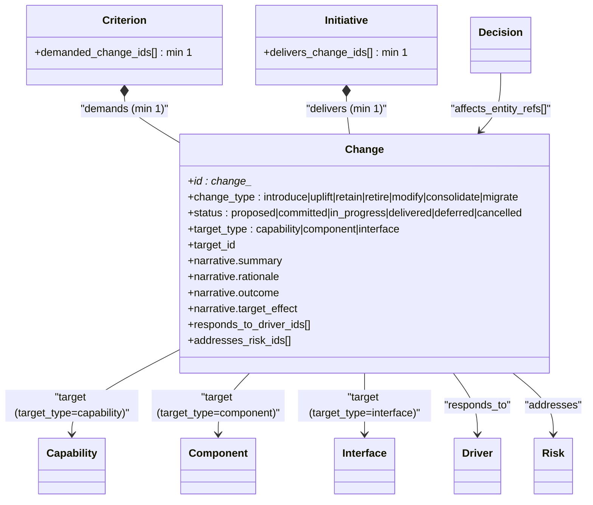
```mermaid
classDiagram
  class Change {
    +id : change_*
    +change_type : introduce|uplift|retain|retire|modify|consolidate|migrate
    +status : proposed|committed|in_progress|delivered|deferred|cancelled
    +target_type : capability|component|interface
    +target_id
    +narrative.summary
    +narrative.rationale
    +narrative.outcome
    +narrative.target_effect
    +responds_to_driver_ids[]
    +addresses_risk_ids[]
  }
  class Capability
  class Component
  class Interface
  class Criterion {
    +demanded_change_ids[] : min 1
  }
  class Initiative {
    +delivers_change_ids[] : min 1
  }
  class Driver
  class Risk
  class Decision
  Change --> Capability : "target (target_type=capability)"
  Change --> Component : "target (target_type=component)"
  Change --> Interface : "target (target_type=interface)"
  Criterion *-- Change : "demands (min 1)"
  Initiative *-- Change : "delivers (min 1)"
  Change --> Driver : "responds_to"
  Change --> Risk : "addresses"
  Decision --> Change : "affects_entity_refs[]"
```

The pivotal entity in the model. Change is *the atomic unit of architectural evolution* — what gets demanded by criteria, delivered by initiatives, motivated by drivers, recorded in decisions.

`change_type` enum: introduce, uplift, retain, retire, modify, consolidate, migrate. Seven values that cover the architectural-alteration verbs. `retain` is explicit non-change — sometimes important when a milestone needs to declare what stays unchanged (e.g., to forestall scope drift).

`target_type` + `target_id` is polymorphic — a change targets a Capability, Component, or Interface. The discriminator pattern is used here in preference to three separate target_* fields for cleaner traversal semantics.

The `narrative` sub-object is the most opinionated part of the schema. Four required fields (summary, rationale, outcome, target_effect) with minimum lengths force structured architectural reasoning rather than free-text descriptions. This is what makes Board-pack and regulator-pack assembly mechanical — each pack page selects specific narrative fields rather than parsing prose.

Alternative considered: free-text `description` field with optional structured fields. Rejected because optional structure devolves to no structure in practice. The mandatory four-field narrative is the discipline that produces useful reporting.

`status` lifecycle (proposed/committed/in_progress/delivered/deferred/cancelled) is separate from `change_type`. The original ontology's confusion of type and status (e.g., "introduced" as a single value) is explicitly avoided.

### 4.6 Driver

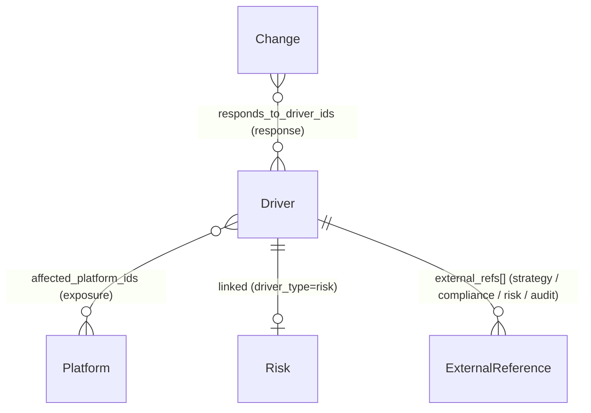
```mermaid
erDiagram
  Driver          }o--o{ Platform         : "affected_platform_ids (exposure)"
  Change          }o--o{ Driver           : "responds_to_driver_ids (response)"
  Driver          ||--o| Risk             : "linked (driver_type=risk)"
  Driver          ||--o{ ExternalReference : "external_refs[] (strategy / compliance / risk / audit)"
```

The exposure edge (`Driver.affected_platform_ids`) is intentionally distinct from the response edge (`Change.responds_to_driver_ids`). This separation is what makes the canonical regulator question answerable: which platforms are subject to driver D but have no Change responding to D?

Modelled as a first-class entity because *why* matters and free-text rationale on Change is insufficient for portfolio-level analysis. Drivers are durable, often external, and motivate multiple changes across multiple platforms.

`affected_platform_ids` (exposure) is distinct from the response relationship via `Change.responds_to_driver_ids`. This separation enables the gap query: *which platforms are subject to driver D but have no Change responding to D?* This is the canonical regulator question, and it is unanswerable without modelling exposure separately from response.

`binding_level` (binding / expected / advisory / informational) captures the variation in how forcing different drivers are. A regulatory driver is binding; a market driver is usually advisory.

References strategy, compliance, risk register, or audit systems via `external_refs`. The ontology does not master drivers — it masters the architectural connection between drivers and the changes that respond to them.

### 4.7 Milestone

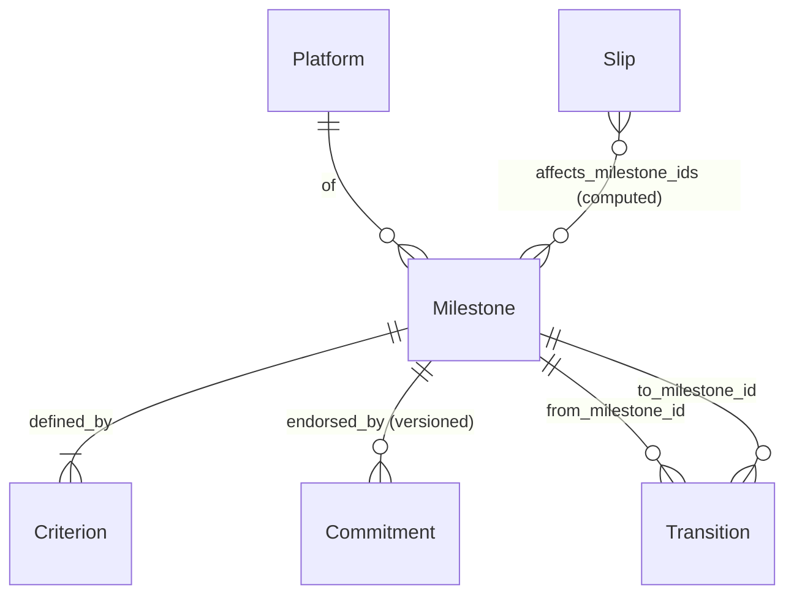
```mermaid
erDiagram
  Platform        ||--o{ Milestone        : "of"
  Milestone       ||--|{ Criterion        : "defined_by"
  Milestone       ||--o{ Commitment       : "endorsed_by (versioned)"
  Milestone       ||--o{ Transition       : "from_milestone_id"
  Milestone       ||--o{ Transition       : "to_milestone_id"
  Slip            }o--o{ Milestone        : "affects_milestone_ids (computed)"
```

The renaming from "Architectural Milestone" to "Milestone" was deliberate: the entity's place in the model carries the architectural meaning; the qualifier added no expressive power and made the name bureaucratic.

`role` enum (baseline / interim / target) replaces the original ontology's three separate entities (BaselineArchitecture, TransitionalArchitecture, and an implicit target). This collapse is the single largest simplification of the governance layer and clarifies that they are all states of the architecture, distinguished only by role.

Three date fields: `planned_date` (original commitment), `forecast_date` (current expectation), `actual_date` (when arrived). The triple is what enables variance reporting without losing the audit trail.

The "current state" is *not* a Milestone in this model. Current state is computed from active Capability and Component references at query time. The baseline Milestone is a separate frozen snapshot of state at programme inception. This distinction matters: current state drifts; baseline doesn't.

### 4.8 Criterion

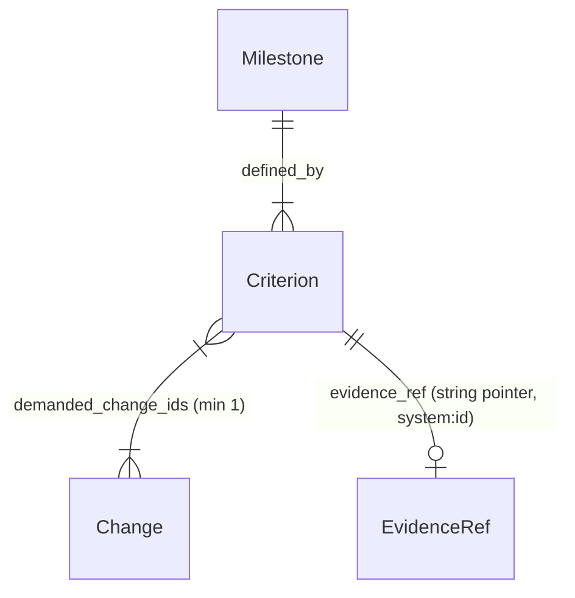
```mermaid
erDiagram
  Milestone       ||--|{ Criterion        : "defined_by"
  Criterion       }|--|{ Change           : "demanded_change_ids (min 1)"
  Criterion       ||--o| EvidenceRef      : "evidence_ref (string pointer, system:id)"
```

A milestone is defined by its criteria. `demanded_change_ids` is mandatory with minItems 1 — a criterion without changes is not actionable.

`satisfaction_status` enum (pending / met / not_met / partial / deferred / waived) provides the resolution states. "Partial" is included deliberately: a criterion can be partially satisfied (e.g., 4 of 5 changes delivered), and the model should not force a binary collapse.

`evidence_ref` is a string pointer (typically `system:id` format) rather than a sub-entity. Evidence usually lives in source systems (change tickets, audit attestations, deployment records). Promoting Evidence to a first-class entity is deferred to a future version when evidence catalogue becomes a query target in its own right.

### 4.9 Commitment

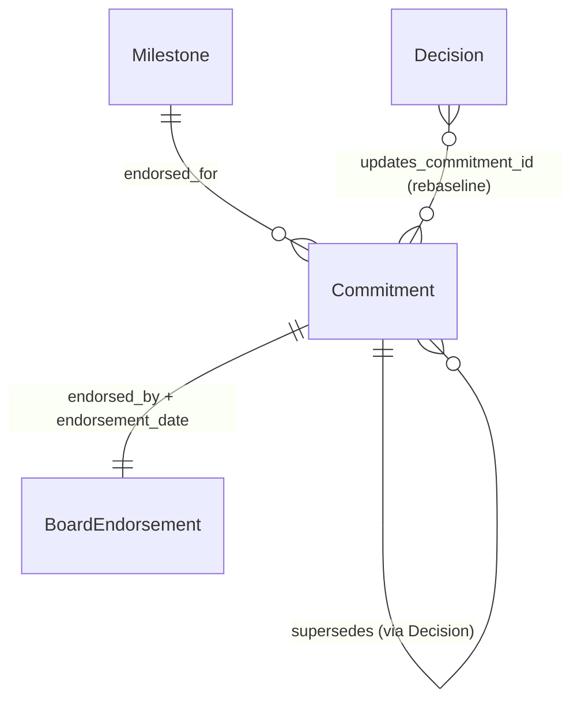
```mermaid
erDiagram
  Milestone       ||--o{ Commitment       : "endorsed_for"
  Commitment      ||--o{ Commitment       : "supersedes (via Decision)"
  Decision        }o--o{ Commitment       : "updates_commitment_id (rebaseline)"
  Commitment      ||--|| BoardEndorsement : "endorsed_by + endorsement_date"
```

Versioned. Every Commitment has a `version` integer (minimum 1). Re-baselining produces a new version via a Decision; the original is retained as historical. This is what enables commitment-integrity reporting over time.

`superseding_decision_id` and `rationale_for_version` are required for version > 1 (enforced at application level — the schema can mark them optional but the validator must check). The discipline is that every commitment change has a recorded reason and a named decision.

`endorsed_by` is a free-text field for the endorsing forum. We considered modelling forums as entities (Board, Technology Committee, etc.) but decided the variation across organisations was too high to standardise. A future version might add Forum as a referenced entity.

### 4.10 Transition

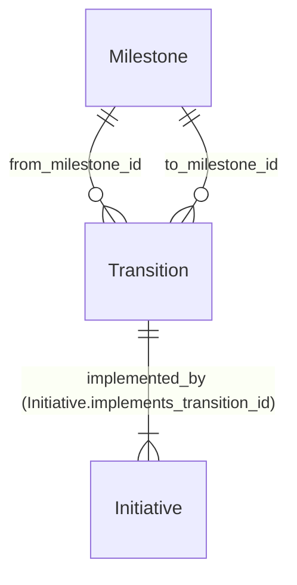
```mermaid
erDiagram
  Milestone       ||--o{ Transition       : "from_milestone_id"
  Milestone       ||--o{ Transition       : "to_milestone_id"
  Transition      ||--|{ Initiative       : "implemented_by (Initiative.implements_transition_id)"
```

The middle reporting grain. A Transition is between two specific Milestones (`from_milestone_id` and `to_milestone_id`) — never abstract. Initiatives implement transitions; this is the architectural traceability the original ontology entirely lacked.

`health` is a stored attribute (green/amber/red/unknown) with `health_basis` carrying the quantitative justification. We considered making health computed-only, but practical experience suggests architects need to override computed health periodically (e.g., to flag a concern not captured in the metric). The stored value plus narrative basis preserves both.

The "gap" of a Transition (the set of criteria still to satisfy) is *not* stored. It is computed from the to-milestone's criteria minus what's satisfied at the from-milestone. Adding Gap as a stored entity would create stale data and was rejected.

### 4.11 Initiative

```mermaid
erDiagram
  Transition      ||--|{ Initiative       : "implements_transition_id (mandatory)"
  Initiative      }|--|{ Change           : "delivers_change_ids (min 1)"
  Initiative      }o--o{ Initiative       : "depends_on_initiative_ids (acyclic)"
  Initiative      ||--o{ Slip             : "declared_on"
  Initiative      ||--o{ ExternalReference : "external_refs[] (LeanIX Project)"
```

`implements_transition_id` is mandatory. Every initiative must have an architectural purpose expressed as the transition it implements. This is the relationship that was missing from the original ontology and the absence of which made the original incapable of bottom-up impact analysis.

`delivers_change_ids` is mandatory with minItems 1. An initiative without deliveries is not yet an initiative.

`depends_on_initiative_ids` enables dependency-graph analysis. The schema does not enforce acyclicity; this must be a validator-level check (named in README §"Validation rules").

References LeanIX Project as primary master. The ontology adds `implements_transition_id` and the change-delivery relationships, which LeanIX does not natively model.

### 4.12 Slip

```mermaid
erDiagram
  Initiative      ||--o{ Slip             : "declared_on"
  Slip            }o--o{ Milestone        : "affects_milestone_ids (computed via Initiative to Transition to to_milestone)"
  Slip            ||--o| Decision         : "resolved_by_decision_id (decision_type=rebaseline)"
```

A typed governance event, not a status colour. The original ontology absorbed delays into RAG status; this model surfaces them as declared events with cause, magnitude, and materiality classification.

`is_material` is a boolean classification typically derived from a MaterialityThreshold policy. The schema does not encode the materiality policy itself (it varies by organisation); the boolean is the model's record of how the classifier was applied at slip-declaration time.

`affects_milestone_ids` is computed. Slip → Initiative → Transition → to_milestone gives the affected milestone; cascading effects on downstream milestones are also computed.

`resolved_by_decision_id` links to the Decision (with decision_type = rebaseline) that resolved the slip. Until resolved, the field is null.

### 4.13 Decision

```mermaid
erDiagram
  Decision        ||--o| Slip             : "resolves (decision_type=rebaseline)"
  Decision        ||--o| Commitment       : "updates_commitment_id (rebaseline)"
  Decision        ||--o| Decision         : "superseded_by_decision_id (ADR chain)"
  Decision        }o--o{ Capability       : "affects_entity_refs[] (polymorphic)"
  Decision        }o--o{ Component        : "affects_entity_refs[]"
  Decision        }o--o{ Interface        : "affects_entity_refs[]"
  Decision        }o--o{ Change           : "affects_entity_refs[]"
  Decision        }o--o{ Pattern          : "affects_entity_refs[]"
  Decision        }o--o{ Standard         : "affects_entity_refs[]"
```

The most polymorphic entity in the model, deliberately. Five decision types (architecture, rebaseline, waiver, standard_adoption, change_endorsement) cover the major recorded-choice scenarios.

Rationale for consolidation: all decisions share the same structural skeleton (rationale, options_considered, decision_date, decision_forum, status with ADR-style lifecycle). Splitting into five entities would create five parallel governance vocabularies for what is conceptually one concept.

ADR (Architecture Decision Record) integration: when `decision_type = architecture`, the entity is an ADR with `context`, `rationale`, `consequences`, and the ADR-style `status` (proposed / accepted / superseded / deprecated). `superseded_by_decision_id` enables the ADR chain pattern.

Conditional requirements (slip_id and updates_commitment_id required for decision_type = rebaseline) are enforced via `if/then` in the schema.

`affects_entity_refs` is polymorphic. Architecture decisions in particular often affect multiple entities of different types (e.g., "we will retire Component X and introduce Component Y for Capability Z"). The polymorphic array captures these references without inflating Decision into a god-object.

### 4.14 Pattern

```mermaid
erDiagram
  Component       }o--o{ Pattern          : "implements_pattern_ids"
  Control         }o--o{ Pattern          : "implementation.patterns"
  Decision        }o--o{ Pattern          : "affects_entity_refs[]"
  Pattern         ||--|| ContinuumRef     : "Architecture Continuum (reference)"
```

Pattern is a reference architecture from the Architecture Continuum — a reusable recipe for assembling building blocks to address a recurring problem. In TOGAF terms, a Pattern is **not** a building block itself; it informs ABB design without being one. Advisory by default (compare to Standard which is binding). Components implement patterns; decisions apply patterns; changes can propose patterns.

`status` lifecycle (proposed / current / deprecated) reflects that patterns evolve. Deprecation is significant — *"which components still implement deprecated pattern X?"* is a useful query.

### 4.15 Standard

```mermaid
erDiagram
  Standard        }o--o{ Platform         : "applies_to_platform_ids (when platform_guardrail)"
  Component       }o--o{ Standard         : "complies_with_standard_ids"
  Interface       }o--o{ Standard         : "complies_with_standard_ids"
  Decision        }o--o{ Standard         : "waiver or standard_adoption"
```

Standard is a prescriptive specification that building blocks conform to. In TOGAF terms, a Standard is **not** a building block; TOGAF explicitly lists *"conformance to standards"* as a characteristic of ABBs (and by extension SBBs that refine them). Compliance is asserted by Components and Interfaces via the `complies_with_standard_ids` relationship.

Absorbed the original ontology's PlatformGuardrail via `standard_type = platform_guardrail`. Six standard types (technical_standard, platform_guardrail, security_baseline, data_standard, integration_standard, operational_standard) and eight categories (security_access, safety, architecture_integration, evaluation_release, operations_observability, compliance_legal, data_governance, performance) cover the prescription space.

The Standard / Pattern boundary is binding force: a Standard violation requires a waiver Decision; a Pattern violation is merely non-conventional. This is documented in README §"Ambiguities" as a resolution rule.

`applies_to_platform_ids` is populated for `standard_type = platform_guardrail`. Other standard types are typically enterprise-wide (empty applies-to means "applies to everything").

### 4.16 QualityAttribute

```mermaid
erDiagram
  QualityAttribute }o--|| Component       : "applies_to (applies_to_entity_type=component)"
  QualityAttribute }o--|| Interface       : "applies_to (applies_to_entity_type=interface)"
```

NFR / quality property of a Component or Interface. Nine attribute types (availability, performance, scalability, security, reliability, maintainability, portability, usability, compliance) cover the ISO 25010 quality model.

`target_value` and `current_value` are strings to accommodate units (percentages, durations, throughput rates). Parsing is application-specific.

`applies_to_entity_type` + `applies_to_entity_id` is polymorphic — same pattern as Change.target_*.

### 4.17 Risk

```mermaid
erDiagram
  Component       }o--o{ Risk             : "exposes_risk_ids"
  Platform        }o--o{ Risk             : "exposed_at"
  Control         }|--|{ Risk             : "mitigates_risk_ids (min 1)"
  Change          }o--o{ Risk             : "addresses_risk_ids"
  Driver          ||--o| Risk             : "linked (driver_type=risk)"
  Risk            ||--o{ ExternalReference : "external_refs[] (risk register)"
```

Referenced from the enterprise risk register. The ontology captures the architecturally-relevant aspects: which components/platforms expose the risk, what its inherent and residual ratings are.

Likelihood and impact use the standard 5-point scales (rare/unlikely/possible/likely/almost_certain × insignificant/minor/moderate/major/catastrophic). The model does not aggregate these into a single rating because organisations differ on aggregation method.

Risk is distinct from Driver (driver_type = risk). The same underlying concern can appear as both: a Risk (architectural uncertainty) and a Driver (motivation to make changes addressing it). The two are linked via Change → addresses_risk_ids and Change → responds_to_driver_ids.

### 4.18 Control

```mermaid
erDiagram
  Control         }|--|{ Risk             : "mitigates_risk_ids (min 1)"
  Control         }o--o{ Component        : "implementation.components"
  Control         }o--o{ Pattern          : "implementation.patterns"
  Control         ||--o| ExternalProcess  : "implementation.external_process"
```

Mechanism that reduces a Risk's likelihood or impact. Four control types (preventive, detective, corrective, compensating) from the standard control taxonomy.

`implementation` is a sub-object with three options: components, patterns, or external_process. A control may be realised in any combination of these. The validator should check that at least one is populated.

Control is distinct from Standard (standard_type = platform_guardrail): a control is an *operational mechanism*; a standard is a *design constraint*. A monitoring system is a control; "all production systems must have monitoring" is a standard. Both can coexist for the same concern.

### 4.19 Stakeholder

```mermaid
erDiagram
  Stakeholder     ||--o{ Concern          : "concerns[] (string array, not entity)"
  View            }|--|{ Stakeholder      : "addresses_stakeholder_ids (min 1)"
```

Aligned with ISO/IEC/IEEE 42010. Has Concerns (modelled as a string array, not separate entities — the simplification holds unless you need to query concerns independently, in which case promote in v2.0).

Nine stakeholder types cover the typical audiences. The list is opinionated but extensible at the schema level by enum extension.

### 4.20 Viewpoint

```mermaid
erDiagram
  Viewpoint       ||--o{ View             : "instantiated_as"
  Viewpoint       ||--o| FrameworkRef     : "framework_source + framework_reference (ArchiMate / TOGAF / C4)"
```

Reusable template for view construction. Standards-aligned to ArchiMate, TOGAF, C4. `framework_source` and `framework_reference` provide the citation.

The README documents ten suggested viewpoints (Capability Map, Component Cooperation, Realization, Migration, Goal Realization, Standards Conformance, Stakeholder Map, Roadmap, Portfolio Status, Regulatory Status). These should be pre-populated in any implementation.

### 4.21 View

```mermaid
erDiagram
  Viewpoint       ||--o{ View             : "instance_of"
  View            }|--|{ Stakeholder      : "addresses_stakeholder_ids (min 1)"
  View            }o--o{ Platform         : "scope.platform_ids"
  View            ||--o| AsOfDate         : "scope.as_of (null = current state)"
```

Instance of a Viewpoint. *Not* a stored snapshot — a specification that resolves against current model state. `scope.as_of` enables historical rendering.

Three-entity (Stakeholder / Viewpoint / View) implementation rather than four (with Concern as a separate entity). Concern remains an attribute on Stakeholder. Justification: keeping Concern as a separate entity would require many-to-many relationships with both Stakeholder and View, which adds query complexity without proportional expressive gain.

### 4.22 IndustryReferenceDomain

```mermaid
erDiagram
  IndustryReferenceDomain }o--o{ Capability : "anchored_to (Capability.industry_reference_ids)"
```

Referenced taxonomy, not architecture. Loaded from whichever industry reference taxonomy applies to the organisation's industry — BIAN for banking, eTOM for telecom, ACORD for insurance, NRF ARTS for retail, HL7/FHIR for healthcare, and so on — typically via the EA tool's tag taxonomy. Optional: organisations in industries without an established reference taxonomy can omit the entity entirely.

Flat single-level model. Reference taxonomies typically organise their domains in multi-level hierarchies (BIAN has Business Area / Business Domain / Service Domain; eTOM has Process Levels 1–4); this ontology does not model those parent levels. Each IndustryReferenceDomain instance is a single anchor point, and `taxonomy` plus `taxonomy_version` identify which reference model and version it came from. The reasoning: queries from capabilities go directly to a leaf-level domain; the parent levels are navigation aids in the source taxonomy and rarely the unit of architectural reasoning.

### 4.23 Theme

```mermaid
erDiagram
  Driver       }o--|| Theme       : "Driver.theme references Theme.id"
  Theme        ||--o{ Driver      : "groups (cross-platform aggregation)"
```

Theme is the enterprise-wide motivation cluster a Driver belongs to. Reusable label that groups drivers by what is pushing modernisation (e.g., enterprise strategy alignment, regulatory compliance, cyber resilience, data and AI capability, cost efficiency). Themes are not platform-scoped; each theme spans every platform where it applies. Organisations that are part of a parent group commonly add a "group/parent target state alignment" theme; standalone organisations typically omit it.

The entity carries display metadata that downstream tooling consumes for reports and infographics (`title`, `icon`, `accent`, `tagline`, `description`, `priority`). The single required pair is `id` and `title`; everything else is optional.

Promotion rationale. Theme was originally a string attribute on Driver. Promoting it to a first-class entity was motivated by:

1. **Aggregation needs.** Board and regulator reports group drivers by theme. A theme is referenced from many platforms' drivers, exactly the shape of a cross-platform shared entity (alongside Stakeholder, Viewpoint, IndustryReferenceDomain).
2. **Display metadata.** Reports and infographics need theme name, abbreviation, accent colour, and tagline. Putting this on the Theme entity makes it data, not script configuration.
3. **Validation.** With Theme as an entity, the schema enforces id pattern and presence of required fields. Driver.theme references can be checked against the Theme entity collection at validation time (application-level rule in `check-integrity.cjs`, planned).
4. **Governance discipline.** Adding a theme is a governed change visible in the ontology, not a tweak to a config file.

The relationship to Driver stays a soft string reference (`Driver.theme = Theme.id`) rather than a typed relationship, because Driver.theme is optional and adding a typed FK would require a schema-level reference resolver. Application-level integrity checking covers the unresolved-reference case.

LeanIX mapping. Theme is a Tier 2 entity (see §8.6) — typically modelled in LeanIX as a tag taxonomy "Modernisation Theme" applied to relevant fact sheets. Some tenants may instead model themes as a custom fact sheet type; the ontology accommodates either.

## 5. Migration mapping from the original ontology

This ontology was developed via critique and refactor of an earlier ontology that had 17 entities serving similar purposes. The following mapping describes how each original entity translates to the new model.

| Original | Disposition | Notes |
|---|---|---|
| Platform | Kept; `boundary` attribute preserved | Same role, refined attributes |
| PlatformDefinition | Absorbed into Platform | Boundary becomes a Platform attribute |
| MarketModel | Dropped from ontology | Industry-specific; lives in EA tool tags if needed |
| BusinessContext | Drivers → Driver entity; outcomes → Milestone criteria | Strategic context now distributed |
| Capability | Kept and strengthened | Industry reference anchor (BIAN, eTOM, ACORD, ...) promoted to relationship |
| SubCapability | Folded into recursive Capability | Single recursive type cleaner |
| ArchitectureComponent | Refactored into Component (5 subtypes) + Interface + Standard + Driver + Risk + QualityAttribute + Decision | See §6 for component-type mapping |
| DataEntity | Absorbed into Component (component_type = data) with data_mastery attribute | Mastery semantics preserved |
| BusinessUseCase | Dropped | Was duplicate of Component; if needed, capture as Capability tag |
| PlatformGuardrail | Absorbed into Standard (standard_type = platform_guardrail) | Six original categories preserved |
| TransitionalArchitecture | Reframed as Milestone (role = interim) | Major simplification of governance layer |
| BaselineArchitecture | Reframed as Milestone (role = baseline) | Same |
| Roadmap | No longer an entity — now a View | Roadmap is a way of looking at the model |
| Horizon | No longer an entity — now a tag/attribute | Time and maturity horizons are lenses, not containers |
| Initiative | Kept and strengthened | `implements_transition_id` and `delivers_change_ids` added |
| Relationship | Folded into typed relationship arrays on entities | More graph-friendly |
| DataMastery | Absorbed into Component.data_mastery | Same semantics, attached to the right entity |

The original's 17 entities → 22 entities in the new model. The count increased but each entity is now sharply scoped. The expansion is concentrated in the architecture-practice and risk-and-control layers, which the original under-served.

## 6. Component subtype migration

The original ontology's `component_type` enum had 20 values. The disposition of each is recorded here because it is the largest single migration concern.

**Kept as Component subtypes (5):**
- `application` → Component.application
- `microservice` → Component.service with `architectural_style = microservice` (microservice subsumed at the type level; deployment shape preserved via the orthogonal `architectural_style` classifier added in v1.1)
- `data` → Component.data (with data_mastery)
- `user_experience` → Component.ux
- `security` (software realising security) → Component.service

**Promoted to Interface (3):**
- `integration` → Interface
- `api` → Interface.api
- `event` → Interface.event

**Absorbed into Standard (2):**
- `policy` → Standard (technical_standard or platform_guardrail)
- `guard_rail` → Standard (platform_guardrail)

**Absorbed into Driver (1):**
- `regulatory` → Driver (regulatory)
- (`compliance` may be Driver or Standard depending on direction)

**Absorbed into Risk (1):**
- `risk` → Risk

**Absorbed into Decision (1):**
- `trade_off` → Decision (architecture)

**Promoted to QualityAttribute (2):**
- `measure` → QualityAttribute
- `service_profile` → QualityAttribute (on Interface)

**Dropped (4):**
- `logical_architecture` (every Component has a logical view by default)
- `business_use_case` (was duplicate of BusinessUseCase entity, also dropped)
- `supplier` (deferred to Phase 2 Vendor entity)
- `operating_model` (too vague to model usefully)
- `diagram` (diagrams are View renderings, not entities)

This mapping is the recommended automated migration path for converting data populated under the original ontology. Records resolving to multiple targets (security, compliance) require human review.

## 7. Open considerations

This section lists known gaps, future extensions, and design decisions deferred for v2.0. Each item is documented with the threshold that should trigger its inclusion.

### 7.1 Programme as a first-class entity

Currently not modelled. Initiatives have a funding source but no explicit Programme entity. The case for promoting Programme in v2.0:

- When more than ~5 programmes exist and steering committee reporting requires programme-level aggregation.
- When initiatives need to be tagged by funding source for cross-programme dependency analysis.
- When budget tracking is integrated with the architecture model.

The case against: Programmes are temporary delivery wrappers. Adding them as governance entities risks re-introducing the project-centric thinking the platform-centric model deliberately avoids.

Resolution path: introduce Programme as an optional entity in v1.1 or v2.0; Initiatives gain `programme_id` (optional). Programme references budget and ownership data in external systems.

### 7.2 Portfolio as a first-class entity

Deliberately excluded from v1.0 in favour of Platform as the governance unit. Promote if:

- True portfolio-level investment governance exists (e.g., capital allocation decisions at portfolio level without yet knowing platform-level split).
- A meaningful organisational layer exists between platform and enterprise (e.g., BU-level technology portfolios).
- Regulators specifically require portfolio-level reporting.

Resolution path: introduce Portfolio as an optional entity. Platforms gain `portfolio_id` (optional). Portfolio carries governance attributes only if it earns them — otherwise it remains a tag.

### 7.3 RegulatoryObligation as a first-class entity

Currently absorbed into Driver (driver_type = regulatory). Promote when:

- Per-obligation reporting becomes a required deliverable.
- Obligation deadlines, status, and evidence need to be queryable independently of driver-level reasoning.
- Cross-jurisdictional obligation tracking (one obligation, multiple platforms, multiple jurisdictions) becomes a query.

Resolution path: introduce RegulatoryObligation as an entity. Driver gains an optional `realises_obligation_id`; obligations carry their own lifecycle, deadlines, and evidence references.

### 7.4 Vendor as a first-class entity

Currently absorbed into ExternalReference on Component. Promote when:

- Concentration-risk reporting across platforms by vendor becomes required.
- Vendor lifecycle and contract status need to be queryable as architectural facts.
- Vendor-related risk drivers become numerous enough to warrant a typed entity.

Resolution path: introduce Vendor. Components reference Vendor; Risks of type `concentration` or `vendor` reference Vendor; the regulator-pack concentration view is generatable from Vendor + Component + Risk traversal.

### 7.5 Evidence as a first-class entity

Currently a string pointer (`system:id` format) on Change, Criterion, and other entities. Promote when:

- Evidence catalogue queries become useful (e.g., "show all unverified evidence claims older than 6 months").
- Evidence reuse across multiple satisfactions becomes common.
- Evidence-quality scoring is needed.

Resolution path: introduce Evidence as an entity. Existing string fields become foreign keys. Evidence carries type, source, validity period, and quality rating.

### 7.6 AssuranceOpinion as a first-class entity

Not currently modelled. Add when independent assurance reporting becomes formalised:

- Second-line risk function provides written opinions on milestone arrival.
- Third-line audit produces formal opinions on commitment integrity.
- Regulator expects assurance opinions in submissions.

Resolution path: introduce AssuranceOpinion. References Milestone, Transition, or Commitment. Has author (assurance line), date, opinion, qualifications.

### 7.7 BusinessOutcome tracking

The original ontology had `business_outcomes` on BusinessContext. Currently this lives in Driver descriptions and Change narrative. Promote to first-class if:

- KPI-style business outcome tracking becomes a Board-pack requirement.
- Outcomes need to be reported separately from drivers.

Resolution path: introduce BusinessOutcome as an entity referenced from Driver and from Change.narrative.outcome.

### 7.8 MaterialityPolicy as a first-class entity

`Slip.is_material` is currently a boolean. The classifier (the materiality policy) is not modelled. Promote if:

- Multiple materiality policies coexist (e.g., per-domain, per-platform).
- Materiality policy itself needs to be versioned and Board-endorsed.
- Audit needs to trace materiality decisions to specific policy versions.

Resolution path: introduce MaterialityPolicy. Each Slip's materiality classification references the policy version applied.

### 7.9 BoardCycle as a first-class entity

`Decision.decision_forum` and `Commitment.endorsed_by` are free-text fields. Promote BoardCycle if:

- Cross-cycle reporting becomes important (e.g., commitment integrity tracked by cycle).
- Specific cycle dates and outcomes need to be queryable.

Resolution path: introduce BoardCycle. Decisions and Commitments reference the BoardCycle at which they were taken.

### 7.10 Identity resolution between LeanIX and ServiceNow

A known integration challenge: LeanIX Application.name and ServiceNow `cmdb_ci_business_app.name` are not guaranteed to match. Most enterprises maintain a manual or semi-automated mapping table.

Resolution path: the ontology itself does not solve this. An IdentityMapping entity could be added in a future version to make the mapping queryable; alternatively, this can remain a deployment-specific integration artefact.

### 7.11 Stakeholder Concerns as first-class entities

Currently a string array on Stakeholder. Promote to first-class entity if:

- Concerns need to be cross-referenced between stakeholders (multiple stakeholders sharing a concern).
- Concerns are versioned and changing concerns is a governance event.
- Views are organised by concern rather than by stakeholder.

Resolution path: introduce Concern. Stakeholder has Concerns; Viewpoint addresses Concerns. This is the full ISO/IEC/IEEE 42010 structure.

### 7.12 Programme dependencies and shared resources

When Programme is added (§7.1), the dependencies between programmes and the sharing of resources (people, vendors, platforms) becomes a query target. Currently invisible.

Resolution path: in v2.0, model ProgrammeDependency or treat as a derived view from Initiative dependencies.

### 7.13 Capability decomposition depth

The recursive Capability allows arbitrary depth. In practice, decomposition beyond 3-4 levels rarely produces useful architectural distinctions. Convention: limit decomposition to 4 levels; deeper structures should probably be Components, not Capabilities.

This is a soft convention, not a schema constraint. v2.0 may add a `decomposition_level` attribute.

### 7.14 Quality attribute aggregation across decomposition

When a Capability decomposes, the quality attributes of the realising Components may need aggregation (e.g., availability of a composite capability is computed from its components). This is not currently modelled.

Resolution path: deferred. Aggregation rules are use-case specific.

### 7.15 Pattern composition

Patterns can compose (e.g., a "Customer-Facing Platform" pattern composes "API Gateway", "Auth Service", "Observability Stack" sub-patterns). Currently Patterns do not reference each other.

Resolution path: add `composes_pattern_ids` to Pattern in v2.0.

### 7.16 Versioning of Patterns and Standards

Patterns and Standards have `status` (proposed/current/deprecated) but no version number. In practice, both evolve in versioned forms. v2.0 should add version attributes.

### 7.17 View rendering format

A View is a specification, not a rendering. The rendering format (SVG diagram, table, markdown, etc.) is not modelled. v2.0 might add `rendering_format` and `rendering_template` to Viewpoint.

### 7.18 Time series of QualityAttribute values

`QualityAttribute.current_value` is a single value. For tracking trends (P99 latency over time, availability over months), a time series is needed. This is deferred — typical monitoring systems master time-series quality data and the architecture ontology references rather than duplicates.

### 7.19 ChangeAction granularity

We collapsed ChangeAction into Change. If granular change tracking is needed (e.g., one Change broken into 5 atomic ChangeActions delivered separately), restoring ChangeAction is straightforward. The current model handles this by allowing one Change to be delivered by multiple Initiatives — multiplicity gives most of the same expressiveness.

### 7.20 Architecture review board workflow

Decisions are recorded but the workflow that produces them (proposal, review, approval) is not modelled. This is deliberate — workflow is best managed in specialised tools (Jira, ServiceNow, custom approval systems) and the ontology stores the outcome.

If workflow integration becomes important, add `DecisionProposal` as an entity that precedes Decision and tracks the approval pipeline.

### 7.21 ABB-to-SBB realisation traceability

The current model captures the ABB-to-SBB refinement via `Component.realises_abb_ids` on SBB Components (and similarly on Interfaces). It does *not* model the reverse relationship in a queryable form (e.g., "for this ABB Component, list every SBB across all platforms that refines it"). The reverse is computable by inverse traversal, but not stored.

Resolution path: deferred. If an ABB Component reaches a deprecation decision and needs to enumerate every refining SBB, the inverse query is sufficient. Storing the inverse relationship would risk drift between the canonical and inverse forms.

### 7.22 ABB versioning and SBB compliance inheritance

ABB Components have a `lifecycle_status` (planned/active/deprecated/retired). When an ABB is deprecated, SBBs that refine it become structurally orphaned (their `realises_abb_ids` points at a deprecated entity). The model does not currently surface this automatically — there is no compliance flag inherited from ABB lifecycle to SBB compliance status.

Similarly, when a Pattern or Standard is deprecated, Components implementing or complying with it become non-conformant by inheritance, but the model does not flag this automatically.

Resolution path: in v2.0, add a conformance-evaluation mechanism that surfaces pairs like (SBB Component, deprecated ABB Component), (Component, deprecated Pattern), and (Component, deprecated Standard) as governance-attention items. This is part of the broader gap between durable-artefact lifecycle (ABBs, Patterns, Standards) and dependent-entity compliance.

## 8. Implementation guidance

This section is for teams implementing systems that consume or produce data conforming to this ontology.

### 8.1 Validation discipline

JSON Schema validation catches structural errors. Application-level validation must additionally enforce:

- Referential integrity (every foreign key resolves to an existing entity).
- Polymorphic type consistency (target_id resolves to entity of declared target_type).
- Cardinality minimums (Component must realise ≥1 Capability, etc.).
- Lifecycle ordering (Commitment.version 2 must reference a superseding Decision, etc.).
- Acyclicity (Initiative dependency graph, Pattern composition, etc.).
- Soft-reference resolution: every `Driver.theme` that is set must resolve to an existing `Theme.id` somewhere in the aggregate. The schema permits Driver.theme as an unconstrained string so authoring is non-blocking, but the integrity check catches typos and drift from the canonical theme list.
- Cross-platform consistency for per-platform entities: when an entity id contains a `_P\d{3}_` fragment, the digits should match the entity's `platform_id` (where present) or the platform of its parent entity (Criterion's milestone, Initiative's transition, etc.). Mismatches indicate copy-paste authoring errors.

Reject invalid records at write time. Reading invalid records is a data-quality incident requiring manual intervention.

### 8.2 Population sequencing

When populating a new platform from scratch, the recommended order is:

1. Platform (with boundary)
2. Capabilities (with industry reference taxonomy anchors, if applicable)
3. Components (with realisation relationships)
4. Interfaces (with provider/consumer)
5. Standards and Patterns (typically pre-populated enterprise-wide)
6. Baseline Milestone (with its Criteria and the Changes those criteria demand)
7. Target Milestone (with its Criteria and Changes)
8. Interim Milestones (between baseline and target)
9. Commitments (initial version per milestone)
10. Transitions (between consecutive milestones)
11. Initiatives (implementing transitions, delivering changes)
12. Drivers (motivating changes; can be added earlier if known)
13. Risks and Controls (added as risk identification progresses)
14. Stakeholders and Views (added as reporting needs crystallise)

This order respects the dependency structure of the model.

### 8.3 Reference resolution policies

For external references (LeanIX, ServiceNow, etc.), establish:

- Sync cadence (real-time, daily, weekly).
- Cache invalidation policy.
- Conflict resolution when source-system data and ontology data diverge.
- Fallback behaviour when source systems are unavailable.

These are deployment-specific decisions but should be documented per integration.

### 8.4 Query patterns

The ontology supports several canonical query patterns:

- **Platform health roll-up**: Platform → Milestones → status, Transitions → health, Slips on Initiatives.
- **Impact analysis on slip**: Slip → Initiative → Changes → Criteria → Milestones → downstream Transitions → downstream Milestones.
- **Driver coverage**: For each Driver, query affected Platforms; for each, check whether a Change responds to that Driver.
- **Standards conformance**: Components and Interfaces filtered by Standards they comply with vs. should comply with.
- **Capability map by industry reference taxonomy**: Capabilities grouped by their `industry_reference_ids` anchor (where set). Available for organisations whose industry has an adopted reference taxonomy.
- **ABB inventory**: Filter Component (where `building_block_type = abb`) and Interface (where `building_block_type = abb`) to enumerate the enterprise's Architecture Building Block library — the logical, technology-agnostic component design that initiatives refine into specific products.
- **SBB realisation report for an ABB**: For a given ABB Component, find all SBB Components where `realises_abb_ids` contains its ID. Useful when an ABB is deprecated and refining SBBs need to be enumerated.
- **Pattern usage**: For a given Pattern, find all Components where `implements_pattern_ids` contains it. Returns both ABB and SBB Components.
- **Standards conformance**: For a given Standard, find all Components and Interfaces where `complies_with_standard_ids` contains it. Cross-check against Components and Interfaces that *should* comply but don't (gap analysis).
- **Initiative building-block scope**: For an Initiative, traverse `delivers_change_ids` → Changes → target Components/Interfaces → distinguish ABB-level vs SBB-level changes. Initiatives that touch only SBBs (product refinements within an existing logical design) are lower governance bar than initiatives that introduce or modify ABBs (logical architecture changes).

Each query is implementable in standard graph traversal or SQL.

### 8.5 Reporting integration

Board packs and regulator packs are *Views* in this model. Implementing pack generation:

1. Define a Viewpoint (Portfolio Status, Regulatory Status, etc.).
2. Define the Views that instantiate that Viewpoint, with their stakeholder audiences and scope.
3. Implement renderers that resolve View scope against current model state and produce the pack output.
4. Store the rendered pack as an artefact separate from the View specification.

This separation (specification stored, rendering archived) preserves Board pack history while keeping the View specifications usable for future cycles.

### 8.6 LeanIX metamodel mapping

This section maps every ontology entity to its LeanIX equivalent. The mapping is structured in four tiers:

1. **Direct vanilla map.** A LeanIX fact sheet type exists in the standard metamodel that carries the same semantics.
2. **Tag or custom fact sheet.** LeanIX does not have a native type, but the concept is conventionally modelled via a tag taxonomy or a tenant-defined custom fact sheet.
3. **Ontology-owned.** No LeanIX equivalent. The ontology is the master and source of record.
4. **LeanIX Report.** Realised via LeanIX's reporting/dashboard feature rather than a fact sheet.

```mermaid
flowchart LR
  subgraph T1["Tier 1: Direct vanilla map"]
    direction TB
    CAP[Capability]:::ont --> BC[BusinessCapability FS]:::lix
    CMP_APP["Component<br/>(application)"]:::ont --> APP[Application FS]:::lix
    CMP_SVC["Component<br/>(service, business-facing)"]:::ont --> APP
    CMP_SVC2["Component<br/>(service, backend)"]:::ont --> ITC[IT Component FS]:::lix
    CMP_MICRO["Component<br/>(service, architectural_style=microservice)"]:::ont --> ITC
    CMP_TECH["Component<br/>(technology)"]:::ont --> ITC
    CMP_DATA["Component<br/>(data)"]:::ont --> DO[Data Object FS]:::lix
    CMP_UX["Component<br/>(ux)"]:::ont --> ITC
    IF[Interface]:::ont --> IFS[Interface FS]:::lix
    IN[Initiative]:::ont --> PRJ[Project FS<br/>aka Initiative FS]:::lix
    SH[Stakeholder]:::ont --> UG[User Group FS<br/>or Subscription]:::lix
  end
  subgraph T2["Tier 2: Tag taxonomy or custom fact sheet"]
    direction TB
    PL[Platform]:::ont --> CFS_PL[Custom FS 'Platform'<br/>or Tag group]:::lix2
    DR[Driver]:::ont --> CFS_DR[Tag 'Driver'<br/>or Custom FS]:::lix2
    PT[Pattern]:::ont --> CFS_PT[Custom FS 'Pattern'<br/>or Tag]:::lix2
    ST[Standard]:::ont --> CFS_ST[Custom FS 'Standard'<br/>or IT Standards tag]:::lix2
    IRD[IndustryReferenceDomain]:::ont --> TAG_IRT[Tag taxonomy for the chosen<br/>industry reference taxonomy]:::lix2
    RK[Risk]:::ont --> CFS_RK[Tag or GRC integration]:::lix2
    QA[QualityAttribute]:::ont --> METRIC[Metric or<br/>custom field]:::lix2
  end
  subgraph T3["Tier 3: Ontology-owned (no LeanIX equivalent)"]
    direction TB
    CH[Change]:::ont
    MS[Milestone]:::ont
    CR[Criterion]:::ont
    CMT[Commitment]:::ont
    TR[Transition]:::ont
    SL[Slip]:::ont
    DE[Decision]:::ont
    CT[Control]:::ont
  end
  subgraph T4["Tier 4: LeanIX Report"]
    direction TB
    VP[Viewpoint]:::ont --> RPT_T[Report template]:::lix3
    VW[View]:::ont --> RPT_I[Configured report instance]:::lix3
  end
  classDef ont fill:#002F6B,stroke:#002F6B,color:#fff
  classDef lix fill:#0B909F,stroke:#002F6B,color:#fff
  classDef lix2 fill:#99CAD2,stroke:#0B909F,color:#002F6B
  classDef lix3 fill:#B5CD71,stroke:#5A5A5A,color:#002F6B
```

#### Complete mapping table

| Ontology entity | LeanIX primary | Mechanism | Notes |
|---|---|---|---|
| Platform | Custom fact sheet `Platform` (recommended) | Tier 2 — tag or custom FS | No native LeanIX type. Owner becomes a Subscription role |
| Capability | Business Capability | Tier 1 — direct | Industry reference anchor (BIAN, eTOM, ACORD, ...) via tag taxonomy, when applicable |
| Component (application) | Application | Tier 1 — direct | Use when LeanIX portfolio tracks it as Application |
| Component (service, business-facing) | Application | Tier 1 — direct | LeanIX has no separate "service" type; classify business-facing as Application |
| Component (service, backend) | IT Component | Tier 1 — direct | Any backend service regardless of architectural_style (monolith, modular_monolith, microservice, function, batch_job) maps to IT Component |
| Component (service, architectural_style=microservice) | IT Component | Tier 1 — direct | Same fact sheet type as any other backend service; architectural_style is a tenant-side custom field or tag |
| Component (technology) | IT Component | Tier 1 — direct | Databases, brokers, runtimes |
| Component (data) | Data Object | Tier 1 — direct | `data_mastery` becomes a Data Object custom field |
| Component (ux) | IT Component | Tier 1 — direct | Channel apps, mobile apps, embedded widgets. Some tenants treat UX surfaces as IT Component rather than Application — choose per your LeanIX convention |
| Component (ABB vs SBB) | Same FS, distinguished by tag `building_block_type` | Tier 1 + tag | LeanIX has no ABB/SBB distinction natively |
| Interface | Interface | Tier 1 — direct | Vanilla LeanIX Interface fact sheet |
| Change | (no LeanIX equivalent) | Tier 3 — ontology-owned | Could be a custom FS if cross-system Change reporting is wanted |
| Driver | Tag taxonomy `Driver` (or custom FS) | Tier 2 | LeanIX has no native Driver type |
| Milestone | (no LeanIX equivalent) | Tier 3 — ontology-owned | LeanIX Lifecycle phases are per-fact-sheet, not portfolio milestones |
| Criterion | (no LeanIX equivalent) | Tier 3 — ontology-owned | |
| Commitment | (no LeanIX equivalent) | Tier 3 — ontology-owned | Versioned governance record |
| Transition | (no LeanIX equivalent) | Tier 3 — ontology-owned | |
| Initiative | Project (or Initiative in newer LeanIX tenants) | Tier 1 — direct | `implements_transition_id` is ontology-only |
| Slip | (no LeanIX equivalent) | Tier 3 — ontology-owned | Governance event |
| Decision | (no LeanIX equivalent) | Tier 3 — ontology-owned | ADR-style record |
| Pattern | Custom fact sheet `Pattern` (or Tag) | Tier 2 | LeanIX has no native Pattern type |
| Standard | Custom fact sheet `Standard` (or IT Standards tag group) | Tier 2 | Includes platform_guardrail subtype |
| QualityAttribute | LeanIX Metric or custom field on Application / Interface | Tier 2 | LeanIX Metrics cover availability and performance; rest are custom fields |
| Risk | Tag, custom FS, or GRC integration | Tier 2 | Risks are usually externally mastered in the risk register |
| Control | (no LeanIX equivalent) | Tier 3 — ontology-owned | |
| Stakeholder | User Group fact sheet, or Subscription on related FS | Tier 1 — direct | ISO/IEC/IEEE 42010 Stakeholder ≈ LeanIX User Group |
| Viewpoint | LeanIX Report template | Tier 4 | LeanIX Reports are reusable view templates |
| View | LeanIX Report configured instance | Tier 4 | Each saved report configuration ≈ a View |
| IndustryReferenceDomain | Tag taxonomy for the chosen industry reference taxonomy (e.g., BIAN for banking, eTOM for telecom, ACORD for insurance) | Tier 2 | Referenced taxonomy, loaded from whichever industry standard applies. Single-level in the ontology even if the source taxonomy is multi-level |

#### Mapping rules to apply

1. **Tier 1 entities are sync-bidirectional candidates.** Names, lifecycle states, owners, and contact people for Tier 1 entities should round-trip with LeanIX. The ontology stores only the architectural-reasoning attributes (e.g., `realises_capability_ids`, `building_block_type`) that LeanIX does not master.
2. **Tier 2 entities require a tenant decision.** Each enterprise must decide whether to model Platform, Driver, Pattern, and Standard as tags or as custom fact sheets. Custom fact sheets give better LeanIX-side query power but cost configuration effort. Tag groups are cheaper but flatter.
3. **Tier 3 entities never sync to LeanIX.** They live only in the ontology. Reporting that combines Tier 3 entities with LeanIX data must be assembled at the ontology layer (or in a downstream BI tool), not in LeanIX itself.
4. **Tier 4 entities (Viewpoint / View) are not data — they are queries.** They can be implemented as LeanIX Reports, as ontology-layer renderers, or in a separate BI tool. The ontology specifies the View; the rendering tool implements it.
5. **The `ExternalReference.system` field uses `"leanix"` as the literal string.** External IDs should be the LeanIX fact sheet ID (a stable UUID), not the human-readable name.

#### ServiceNow CMDB as the secondary master for Components

For Component entities, LeanIX is the typical primary master but ServiceNow CMDB is often the secondary master, especially for technology and infrastructure subtypes. The mapping is:

| Component subtype | ServiceNow CMDB class |
|---|---|
| application | `cmdb_ci_business_app` |
| service (backend) | `cmdb_ci_service` (any architectural_style) |
| service (architectural_style=microservice) | `cmdb_ci_service` with `subcategory = microservice` |
| service (architectural_style=function) | `cmdb_ci_service` with `subcategory = serverless` or `cmdb_ci_appl_function` |
| service (architectural_style=batch_job) | `cmdb_ci_scheduled_job` or `cmdb_ci_service` with `subcategory = batch` |
| technology (database) | `cmdb_ci_db_instance`, `cmdb_ci_database` |
| technology (server / runtime) | `cmdb_ci_server`, `cmdb_ci_appl` |
| technology (broker / queue) | `cmdb_ci_app_server` or vendor-specific |
| data | `cmdb_ci_database` or data-product custom CI |
| ux | `cmdb_ci_appl` (client-side app) or `cmdb_ci_business_app` for full channel apps |

Treat external references as a set: a Component can carry both a LeanIX reference and a ServiceNow reference. The identity-resolution challenge between the two (§7.10) is a deployment-specific integration concern.

## 9. Governance of the ontology itself

The ontology needs its own governance — meta-governance for the governance ontology.

**Owner.** The ontology should have a named owner (typically the Enterprise Architecture function or a specific Chief Architect). The owner is accountable for the schema and for change management.

**Change types.** Three classes of change:
- *Documentation only* (this README, the specification). Patch version bump.
- *Additive* (new entity, new attribute, new enum value, looser constraint). Minor version bump.
- *Breaking* (entity rename, attribute removal, enum value removal, tighter constraint). Major version bump.

**Change board.** Schema changes should be reviewed by a small board representing the three primary audiences (governance reporting, architecture practice, external assessment). Approval for breaking changes should require consensus.

**Deprecation policy.** Breaking changes deprecate the prior version, with a sunset date typically 6-12 months out. Consumers must migrate before sunset.

**Backward compatibility for additive changes.** New attributes should be optional or have defaults. New entities should be at the top level of the schema and not required initially.

## 10. Acknowledgements and references

This ontology was developed through critique and iteration of an earlier enterprise architecture ontology. The refactoring conversation explored each design decision against the original assessor criticism, the practical needs of working architects, and the standards landscape. Key references:

- **Industry reference taxonomies** for capability anchoring, where one applies to the organisation's industry. Examples: **BIAN** (Banking Industry Architecture Network) Service Domain Reference for banking; **TM Forum eTOM** for telecommunications; **ACORD** Capability Model for insurance; **NRF ARTS** for retail; **HL7/FHIR** resource groupings for healthcare. The ontology models these uniformly as `IndustryReferenceDomain`, regardless of which taxonomy is in use.
- **ArchiMate 3.2** (The Open Group). Provides the viewpoint catalogue and the structure of architecture description.
- **TOGAF 10** (The Open Group). Provides the migration architecture, transition architecture, gap analysis, and Architecture/Solution Building Block (ABB/SBB) layering concepts.
- **ISO/IEC/IEEE 42010:2022** (Architecture description). Provides the Stakeholder / Concern / Viewpoint / View structure.
- **ITIL CSDM** (Common Service Data Model). Provides the ServiceNow CMDB class taxonomy that Component subtypes reference.

This ontology is intended as a living specification. v1.0 represents a stable foundation; v1.x will refine; v2.0 will incorporate the open considerations in §7 as they become justified.

---

End of specification.
