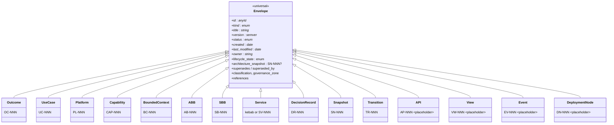
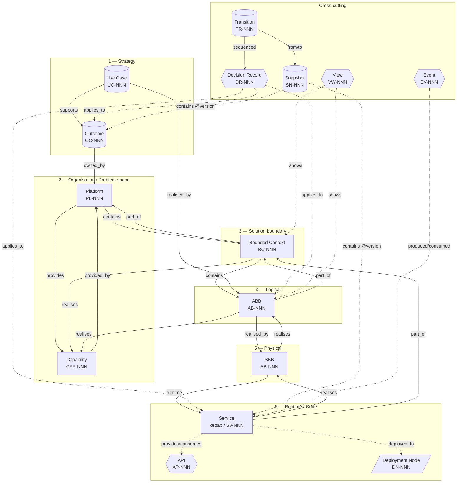
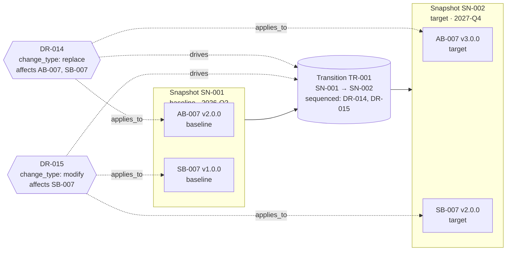

# Frontmatter Standard

This standard defines the **YAML frontmatter** every catalog artefact carries. It introduces a universal envelope, per-kind extensions, a unified relationship vocabulary, and lifecycle / change / transition fields. Together these turn the framework's documentation into a queryable, machine-validatable catalog.

This standard is the prose form. The machine-validatable form lives at [`schemas/v1.1.0/`](./schemas/v1.1.0/).

> **Cross-references:**
> - [Traceability & Hierarchy Standard](./standard-traceability.md) — the relationship semantics this standard implements.
> - [Architectural Framework](../docs/architectural-framework.md) — the conceptual hierarchy this standard formalises.
> - [`schemas/v1.1.0/`](./schemas/v1.1.0/) — JSON Schemas (machine validators).
> - [`agents/FRAMEWORK_AGENTS.md`](../agents/FRAMEWORK_AGENTS.md) — discovery and precedence.

---

## 1. Position in the Framework

Two distinct frontmatter shapes coexist:

- **Standards documents** (the `standards/.../*.md` files themselves) keep their existing shape: `document_type: standards`, `title`, `classification`, `version`, `status`, `created`, `last_modified`, `owner`, `triggers`. **This file follows that convention.**
- **Catalog artefacts** (every `index.md` under `outcomes/`, `use-cases/`, `platforms/`, `capabilities/`, `contexts/`, `building-blocks/architecture-building-blocks/`, `building-blocks/solution-building-blocks/`, `apis/`, `events/`, `snapshots/`, `transitions/`, `views/`, `decisions/`, `runtime/services/`, `deployment-nodes/`) **adopt the envelope defined below**.

This standard concerns the *artefact* shape. Standards documents are unaffected.

---

## 2. The Universal Envelope

Every catalog artefact's `index.md` begins with a YAML frontmatter block carrying the following fields. The `*` marker indicates a field required for new artefacts in v1.1.0+; existing v1.0.0 artefacts are migrated additively (see §7).

### 2.1 Identity

| Field | Type | Required | Description |
|---|---|---|---|
| `id` | string | * | Canonical ID. Format: `<TYPE>-NNN` (zero-padded 3 digits) for every kind except `service` (kebab-case slug). MUST match the folder name. Immutable. |
| `kind` | enum | * | One of: `outcome`, `use-case`, `platform`, `capability`, `bounded-context`, `abb`, `sbb`, `api`, `service`, `view`, `decision-record`, `event`, `deployment-node`, `snapshot`, `transition`. |
| `title` | string | * | Human-readable title. Convention: `"<ID> <Name>"` for visual artefacts. |
| `short_name` | string | recommended | Acronym used in diagrams (e.g. `"IAM"` for AB-001). |
| `description` | string | recommended | One- to two-sentence summary. Used by the agent retrieval index (`llms.txt`). |

### 2.2 Versioning and lifecycle

| Field | Type | Required | Description |
|---|---|---|---|
| `version` | semver | * | Semantic version of *this* artefact. Initial: `0.1.0` for drafts; `1.0.0` on first acceptance. |
| `status` | enum | * | One of: `draft`, `proposed`, `accepted`, `active`, `deprecated`, `superseded`, `retired`. See §3 for the lifecycle. |
| `created` | ISO-8601 date | * | `YYYY-MM-DD`. Date the artefact was first created. Immutable. |
| `last_modified` | ISO-8601 date | * | `YYYY-MM-DD`. Updated on every meaningful change. |
| `last_modified_by` | string | recommended | Worker or person ID. |

### 2.3 Change and transition fields

| Field | Type | Required | Description |
|---|---|---|---|
| `lifecycle_state` | enum | recommended (default `baseline`) | One of: `baseline`, `in-flight`, `target`, `retired`. Allows multiple coexistent versions of the same `id` to live in the workspace, each declaring its standing. See §4. |
| `architecture_snapshot` | `SN-NNN` \| null | optional | The Snapshot this artefact-version belongs to, if any. |
| `valid_from` | ISO-8601 date | optional | Date this state took effect. |
| `valid_until` | ISO-8601 date \| null | optional | Date this state ceased to be current. `null` means "still current". |
| `supersedes` | array of IDs | optional | IDs of artefacts this one replaces. |
| `superseded_by` | array of IDs | conditional | Required when `status: superseded`. |

### 2.4 Ownership and governance

| Field | Type | Required | Description |
|---|---|---|---|
| `owner` | string | * | Team or person responsible. For Platforms, the **Owner Team**. |
| `strategic_owner` | string \| null | * for Platforms | Executive role accountable (e.g. CISO). Required only for `kind: platform`. |
| `classification` | enum | recommended (default `internal`) | One of: `public`, `internal`, `confidential`, `restricted`. |
| `governance_zone` | enum | recommended (default `application`) | One of: `foundation`, `core`, `extension`, `application`. Distinguishes framework-shipped seed (`foundation`) from workspace-specific artefacts (`application`). |

### 2.5 Relations

The relations a kind carries depends on its position in the metamodel. The full vocabulary is in §5. Per-kind extensions in §6 specify which relations are required, recommended, or optional for each kind.

### 2.6 References to external systems

| Field | Type | Description |
|---|---|---|
| `references` | array of objects | Each object has `type` (e.g. `jira`, `linear`, `github-pr`, `source`, `doc`, `runbook`) plus type-specific fields (`id`, `url`, `repo`, `path`, `ref`). |

Example:
```yaml
references:
  - { type: jira, id: "PAT-1234" }
  - { type: source, repo: "patternode-platform", path: "bounded-contexts/trading-signals/", ref: "main" }
  - { type: doc, url: "https://docs.example.com/runbook" }
```

### 2.7 Indexing

| Field | Type | Description |
|---|---|---|
| `tags` | array of strings | Free-form tags. |
| `sidebar_label` | string | Docusaurus rendering hint. |
| `sidebar_position` | integer | Docusaurus rendering hint. |

### 2.8 Schema declaration

| Field | Type | Description |
|---|---|---|
| `$schema` | URI | Path or URI to the JSON Schema this artefact conforms to. Recommended: `"../../standards/schemas/v1.1.0/<kind>.schema.json"` (workspace-relative) or the framework's published schema URL. |

---

## 3. Status Lifecycle

```
                    ┌─────────────┐
                    │    draft    │
                    └──────┬──────┘
                           │ ready for review
                           v
                    ┌─────────────┐
                    │  proposed   │
                    └──────┬──────┘
                           │ approved
                           v
                    ┌─────────────┐
            ┌─────► │  accepted   │ ◄────┐
            │       └──────┬──────┘      │
            │              │ in service  │ ratification
            │              v             │
            │       ┌─────────────┐      │
            │       │   active    │      │
            │       └──────┬──────┘      │
            │              │             │
   amended  │              │ replaced    │
            │              v             │
            │       ┌─────────────┐      │
            │       │ deprecated  │      │
            │       └──────┬──────┘      │
            │              │ replacement │
            │              v             │
            │       ┌─────────────┐      │
            └────── │ superseded  │ ─────┘
                    └──────┬──────┘
                           │ no longer relevant
                           v
                    ┌─────────────┐
                    │   retired   │
                    └─────────────┘
```

- `draft` — author still working on it; not yet for review.
- `proposed` — review-ready; under consideration.
- `accepted` — reviewed and approved; not yet in production.
- `active` — in production / in use.
- `deprecated` — discouraged for new use; still works.
- `superseded` — explicitly replaced by another artefact (`superseded_by` required).
- `retired` — no longer in use; kept for historical reference.

`accepted` and `active` are the two "live" states. The distinction matters for governance: an `accepted` Decision Record is approved but the change may not yet be deployed; `active` means the change is reflected in running systems.

---

## 4. Lifecycle State Semantics

`status` describes *the artefact's lifecycle*. `lifecycle_state` describes *which architecture state the artefact belongs to*. The two are orthogonal.

| `lifecycle_state` | Meaning | Typical use |
|---|---|---|
| `baseline` | Part of the current as-is architecture | Default for live artefacts |
| `in-flight` | Part of an active transition; neither pure baseline nor target | Temporary states during migration |
| `target` | Part of a future / aspirational architecture; not yet realised | Documents the Target Architecture per TOGAF Phase B |
| `retired` | Was once in the baseline; no longer is | Historical artefacts kept for audit |

**Multiple coexistent artefact-versions for the same `id`** are permitted when they have different `lifecycle_state` values. For example, the workspace may simultaneously hold:

- `AB-007/index.md` with `version: 2.0.0`, `lifecycle_state: baseline`
- `AB-007-target/index.md` with `version: 3.0.0`, `lifecycle_state: target`

The directory layout convention for coexistent versions is:

```
building-blocks/architecture-building-blocks/
  AB-007/                        # default (baseline)
    index.md
  AB-007-target/                 # explicit target
    index.md
  AB-007-v2.0.0/                 # historical retired
    index.md
```

Folder name pattern: `<ID>` for the canonical (baseline) version; `<ID>-target` for the target version; `<ID>-v<semver>` for explicit historical versions. The `id` frontmatter remains `AB-007` for all of them; the validator checks that exactly one folder per `id` carries `lifecycle_state: baseline` (or omits the field, defaulting to baseline).

See [Snapshot](#) and [Transition](#) artefact types (forthcoming as separate standards) for how named architecture states are assembled and how multi-step migrations are described.

---

## 5. Relationship Vocabulary

The framework's "Golden Thread" is expressed via frontmatter relations. Universal relations apply to many kinds; per-kind specialisations are defined in §6.

**Inverse-consistency rule:** every directional relation has an inverse. The validator and the audit skill enforce inverse consistency: if A `realises` B, then B's frontmatter must include A under `realised_by`. CI fails on inconsistency in `strict` profile; warns in `lenient` profile.

### 5.1 Universal relations

| Relation | Inverse | Cardinality | Description |
|---|---|---|---|
| `part_of` | `contains` | single | DDD-style strict containment: a BC `part_of` a Platform; an ABB `part_of` a BC. |
| `contains` | `part_of` | multi | Inverse of `part_of`. |
| `realises` | `realised_by` | multi | Concretises an abstract concept. SBB `realises` ABB; BC `realises` Capability. |
| `realised_by` | `realises` | multi | Inverse. |
| `depends_on` | `depended_on_by` | multi | Runtime or contract dependency. |
| `depended_on_by` | `depends_on` | multi | Inverse. |
| `applies_to` | `governed_by` | multi | Used by Decision Records and cross-cutting artefacts. |
| `governed_by` | `applies_to` | multi | Inverse. |
| `references` | (none) | multi | External-system references (see §2.6). Not bidirectional. |

### 5.2 Strategic-DDD relationship vocabulary (Bounded Context ↔ Bounded Context)

A Bounded Context may declare named relationships with peer BCs:

```yaml
relationships:
  - { with: BC-005, pattern: anti-corruption-layer, role: downstream }
  - { with: BC-007, pattern: customer-supplier, role: customer }
```

**Patterns:** `anti-corruption-layer`, `open-host-service`, `published-language`, `conformist`, `customer-supplier`, `partnership`, `shared-kernel`, `separate-ways`.

**Roles:** `upstream`, `downstream`, `peer`, `customer`, `supplier`.

### 5.3 Per-kind specialised relations

Defined within each per-kind section in §6.

---

## 6. Per-Kind Extensions

For each `kind`, this section specifies additional required and optional frontmatter fields that supplement the universal envelope. Existing v1.0.0 fields from the corresponding standard are *promoted* from body tables to frontmatter.

### 6.1 Outcome (`OC-NNN`)

```yaml
kind: outcome
id: OC-001
title: "OC-001 Zero Trust Workload Posture"
kpi: "Reduce credential-related incidents to zero"
kpi_target: { value: 0, unit: "incidents/quarter", measurement: "security-incident-tracker" }
target_date: 2027-03-31
business_rationale: "Eliminate standing credentials per zero-trust mandate."
time_horizon: short | medium | long  # short ≤ 1y; medium 1–3y; long > 3y

owned_by_platform: PL-001            # required
requires_capabilities: [CAP-004, CAP-005]
realised_by_use_cases: [UC-001, UC-002]
```

**Schema:** [`schemas/v1.1.0/outcome.schema.json`](./schemas/v1.1.0/outcome.schema.json).

### 6.2 Use Case (`UC-NNN`)

```yaml
kind: use-case
id: UC-001
title: "UC-001 Real-Time Policy Enforcement"
primary_actor: "Authenticated workload"
secondary_actors: ["Policy Decision Point", "Audit Sink"]
scenario: "..."
preconditions: ["Workload has valid SPIFFE identity"]
success_criteria: ["Policy decision returned in < 50ms p99"]
frequency: low | medium | high
volume: "≥ 10k decisions/sec"

supports_outcome: OC-001             # required
realised_by_abbs: [AB-001, AB-003]   # required, ≥1
```

**Schema:** [`schemas/v1.1.0/use-case.schema.json`](./schemas/v1.1.0/use-case.schema.json).

### 6.3 Platform (`PL-NNN`)

```yaml
kind: platform
id: PL-001
title: "Identity & Access Platform"
strategic_owner: "CISO"              # required for Platform
owner: "Identity Platform Team"

owns_outcomes: [OC-001, OC-002]
provides_capabilities: [CAP-004, CAP-005]   # required, ≥1
contains_bounded_contexts: [BC-001]          # required, ≥1

slos:
  - { name: "Token issuance latency p99", target: "< 100ms" }
  - { name: "Availability", target: "99.95%" }
self_service_interfaces: ["REST API at /v1/identity", "CLI: idp-cli"]
consuming_teams: ["Trading Platform Team", "Market Data Team"]
tier: solo | growth | scale | null   # optional cost-tier classifier
```

**Schema:** [`schemas/v1.1.0/platform.schema.json`](./schemas/v1.1.0/platform.schema.json).

### 6.4 Capability (`CAP-NNN`)

```yaml
kind: capability
id: CAP-004
title: "CAP-004 Identity Lifecycle Management"
level: L1 | L2 | L3                  # required
parent: CAP-003 | null               # required for L2/L3; null for L1

components:                          # TOGAF G189 four-component definition
  organisation: "Identity Governance Steering Committee"
  people: ["IAM engineers", "Compliance analysts"]
  processes: ["Provisioning workflow", "Credential rotation policy"]
  technology: "Identity directory, token issuance, policy evaluation"
maturity:
  current: 3                         # 0-5: None / Initial / Developing / Defined / Managed / Optimising
  target: 5
  assessment_date: 2026-04-15
  assessor: "Identity Platform Team"
subdomain_kind: core | supporting | generic   # optional DDD classifier

provided_by_platform: PL-001         # required
required_by_outcomes: [OC-001, OC-002]
realised_by_abbs: [AB-001, AB-003]   # required for L3 capabilities
gaps: ["Continuous Access Evaluation not yet implemented"]
```

**Schema:** [`schemas/v1.1.0/capability.schema.json`](./schemas/v1.1.0/capability.schema.json).

### 6.5 Bounded Context (`BC-NNN`)

```yaml
kind: bounded-context
id: BC-001
title: "BC-001 Identity & Access"
owner: "Identity Platform Team"

part_of: PL-001                      # required: parent Platform
contains: [AB-001]                   # required: contained ABBs, ≥1
realises_capabilities: [CAP-004]     # required, ≥1

ubiquitous_language:                 # required, 5-50 entries
  - { term: "Principal", definition: "Any actor authenticated by the system" }
  - { term: "Claim", definition: "A statement issued by an IdP about a Principal" }

relationships:                       # strategic-DDD; see §5.2
  - { with: BC-005, pattern: anti-corruption-layer, role: downstream }

subdomain_kind: core | supporting | generic
c4_levels: [container] | [component] | [container, component]
```

**Schema:** [`schemas/v1.1.0/bounded-context.schema.json`](./schemas/v1.1.0/bounded-context.schema.json).

### 6.6 Architecture Building Block (`AB-NNN`)

```yaml
kind: abb
id: AB-001
title: "AB-001 Identity & Access Management"
short_name: "IAM"
category: "Security"

part_of: BC-001                      # required: parent BC
realises_capabilities: [CAP-004]     # required, ≥1
realised_by: [SB-001]                # multi: SBBs

domains: [business, application]     # required, ≥1; multi-valued TOGAF metamodel domains
interfaces:                          # required, ≥1
  - { id: "I1", direction: "in", type: "request", description: "Token request (OIDC)" }
  - { id: "I2", direction: "out", type: "event", description: "Sign-in event" }
mandatory_subabbs: [iam, observability, governance]   # required; exactly these three
cross_cutting: false                 # true for ABBs that are themselves cross-cutting (IAM, Obs, Gov)
```

**Schema:** [`schemas/v1.1.0/abb.schema.json`](./schemas/v1.1.0/abb.schema.json).

### 6.7 Solution Building Block (`SB-NNN`)

```yaml
kind: sbb
id: SB-001
title: "SB-001 Identity Lifecycle Service (Entra)"

realises: [AB-001]                   # required, ≥1
realised_by_services: [identity-lifecycle-svc]

products:                            # required, ≥1
  - { name: "Microsoft Entra ID", vendor: "Microsoft", licensing: "P2" }
product_mapping:                     # required, ≥1; ABB component → SBB product
  - { abb_component: "Identity Provisioning", sbb_product: "Entra ID Provisioning" }
  - { abb_component: "Token Issuance", sbb_product: "Entra STS (v2.0)" }
cloud_provider: azure | aws | gcp | onprem | multi | none
variants: ["Entra-only", "Entra+Okta hybrid"]
deployment_model: managed | self-hosted | hybrid
```

**Schema:** [`schemas/v1.1.0/sbb.schema.json`](./schemas/v1.1.0/sbb.schema.json).

### 6.8 API (`AP-NNN`)

Reserved in v1.1.0; full per-kind extensions forthcoming. Schema placeholder: [`schemas/v1.1.0/_placeholders/api.schema.json`](./schemas/v1.1.0/_placeholders/api.schema.json).

### 6.9 Service (kebab-case slug, optional `numeric_id: SV-NNN`)

```yaml
kind: service
id: identity-lifecycle-svc           # kebab-case slug (preserves v1.0.0 convention)
numeric_id: SV-001                   # optional secondary ID for cross-kind queries
title: "Identity Lifecycle Service"

realises: [SB-001]                   # required, ≥1
part_of: BC-001                      # required: parent BC
runtime_type: container | serverless | jvm | native | managed-service   # required

provides_apis: [AP-001]              # multi
consumes_apis: [AP-005]

# Source-code linkage (forthcoming)
repo: { url: "https://github.com/example/repo", path: "patternode-platform" }
module_path: "bounded-contexts/identity/identity-service"
packages: ["com.patternode.identity.service"]
key_classes: ["IdentityServiceApplication", "TokenEndpoint"]

deployed_to: [DN-001, DN-002]
```

Service is the **one kind that uses kebab-case slugs as the canonical `id`** to preserve v1.0.0 backward compatibility. New services may optionally declare a `numeric_id: SV-NNN` for governance queries that prefer numeric IDs across kinds.

**Schema:** [`schemas/v1.1.0/service.schema.json`](./schemas/v1.1.0/service.schema.json).

### 6.10 View (`VW-NNN`)

Reserved in v1.1.0; full per-kind extensions forthcoming. Schema placeholder: [`schemas/v1.1.0/_placeholders/view.schema.json`](./schemas/v1.1.0/_placeholders/view.schema.json).

### 6.11 Decision Record (`DR-NNN`)

```yaml
kind: decision-record
id: DR-001
title: "DR-001 Adopt Platform-replaces-Domain"
status: accepted

y_statement: "In the context of EA-IT alignment, facing the gap between DDD/TOGAF/Platform Engineering vocabularies, we decided for unifying Domain + BC + Platform into a single Platform concept and against keeping them distinct, to achieve audience clarity and industry alignment, accepting some loss of strict DDD orthogonality."

decision_drivers: ["Industry alignment", "Audience clarity", "Completeness"]
considered_options:
  - "Keep TOGAF Domain + BC + Platform separate"
  - "Unify under Platform"
  - "Unify under DDD Domain"
decision_outcome: "Option 2 (unify under Platform)"
consequences:
  positive: ["Single vocabulary for execs and engineers", "Aligns with Team Topologies"]
  negative: ["Loss of strict DDD problem/solution-space distinction at top level"]

change_type: introduce | modify | retire | replace | principle   # required
affects_artefacts: [PL-NNN, BC-NNN]    # required unless change_type=principle
contributes_to_transition: TR-NNN | null

applies_to: []                       # universal relation
supersedes: []
superseded_by: []
```

**Schema:** [`schemas/v1.1.0/decision-record.schema.json`](./schemas/v1.1.0/decision-record.schema.json) (full body-section structure forthcoming as a separate Decision Record standard).

### 6.12 Event (`EV-NNN`)

Reserved in v1.1.0; full per-kind extensions forthcoming. Schema placeholder: [`schemas/v1.1.0/_placeholders/event.schema.json`](./schemas/v1.1.0/_placeholders/event.schema.json).

### 6.13 Deployment Node (`DN-NNN`)

Reserved in v1.1.0; full per-kind extensions forthcoming. Schema placeholder: [`schemas/v1.1.0/_placeholders/deployment-node.schema.json`](./schemas/v1.1.0/_placeholders/deployment-node.schema.json).

### 6.14 Snapshot (`SN-NNN`)

```yaml
kind: snapshot
id: SN-001
title: "Patternode Baseline 2026-Q2"
snapshot_kind: baseline | target | transition   # required
effective_date: 2026-06-30                       # required for baseline
target_date: null                                # required for target
supersedes_snapshot: null                        # for transition snapshots

artefacts:                                       # required, ≥1; the manifest
  - { id: PL-001, version: 1.0.0 }
  - { id: PL-002, version: 1.0.0 }
  - { id: AB-001, version: 1.5.0 }
```

**Schema:** [`schemas/v1.1.0/snapshot.schema.json`](./schemas/v1.1.0/snapshot.schema.json) (full body structure forthcoming as a separate Snapshot standard).

### 6.15 Transition (`TR-NNN`)

```yaml
kind: transition
id: TR-001
title: "Migrate to Multi-Region Deployment"
from_snapshot: SN-001                # required
to_snapshot: SN-002                  # required
status: planned | in-progress | completed | abandoned

sequenced_decisions: [DR-014, DR-015, DR-016]    # required, ≥1
sequenced_steps:                                  # required, ≥1
  - { step: 1, summary: "Provision multi-region infra", target_date: 2027-Q1, owner: "Platform Team" }
  - { step: 2, summary: "Dual-write data layer", target_date: 2027-Q2, owner: "Data Team" }
affected_artefacts: [PL-100, BC-105, AB-110]      # required, ≥1
```

**Schema:** [`schemas/v1.1.0/transition.schema.json`](./schemas/v1.1.0/transition.schema.json) (full body structure forthcoming as a separate Transition standard).

---

## 7. Backward Compatibility with v1.0.0

### 7.1 Required vs migrated

For v1.1.0:

- **New artefacts** (created after v1.1.0 ships) MUST have all required envelope fields (§2.1, §2.2, §2.4) and the per-kind required fields (§6).
- **Existing v1.0.0 artefacts** retain their existing frontmatter and continue to validate. The new required fields are *recommended* for them, not required.
- A migration script walks an existing workspace and **promotes** values from Document Control body tables into the frontmatter, leaving body tables intact.

The JSON Schemas implement this distinction via two profiles:

- **`strict-v1.1.0`** — enforces all new required fields. Default for new artefacts.
- **`lenient-v1.0.0-compat`** — relaxes new fields to optional. Default during migration.

A workspace declares its profile in `<workspace>/governance.yaml`:

```yaml
schema_profile: strict-v1.1.0   # or: lenient-v1.0.0-compat
```

### 7.2 Migration script behaviour

For each existing artefact `index.md`, the migration script:

1. Parses the existing frontmatter.
2. Parses the "Document Control" Markdown table (the structure is consistent across kinds — first table after the H1).
3. For each table row, maps the field name to the frontmatter field name (e.g. `Capability ID` → `id`; `Status` → `status`; `Version` → `version`; `Platform` → `provided_by_platform`).
4. Adds missing fields to the frontmatter.
5. Leaves the body table in place (humans still read it).
6. Reports any field it could not map for manual review.

### 7.3 Standards documents are unchanged

The `standards/.../*.md` files keep their existing frontmatter (`document_type: standards`, `triggers`, etc.). They are *definitions*, not catalog artefacts. This standard formalises that distinction: a file with `document_type: standards` is governed by the v1.0.0 standards-document convention, not the v1.1.0 artefact envelope.

---

## 8. Schema Diagrams

### 8.1 Composition (envelope + 15 kinds)



### 8.2 Relations and Golden Thread



### 8.3 Lifecycle, Snapshots, and Transitions



The same artefact `id` (e.g. `AB-007`) coexists in two states — `lifecycle_state: baseline` at v2.0.0 and `lifecycle_state: target` at v3.0.0 — under different folder names. A Snapshot is a manifest pointing at specific `id@version` pairs. A Transition is the journey from one Snapshot to another, sequenced by Decision Records.

---

## 9. Worked Example

A complete Capability frontmatter under v1.1.0:

```yaml
---
$schema: ../../standards/schemas/v1.1.0/capability.schema.json
id: CAP-004
kind: capability
title: "CAP-004 Identity Lifecycle Management"
short_name: "ILM"
description: "Manage the lifecycle of identities — provisioning, credential management, deprovisioning — across human and workload principals."

version: 1.0.0
status: active
created: 2026-03-07
last_modified: 2026-05-08
last_modified_by: claude-opus-4-7

lifecycle_state: baseline
architecture_snapshot: SN-001

owner: "Identity Platform Team"
classification: internal
governance_zone: foundation

# Per-kind
level: L3
parent: CAP-003
components:
  organisation: "Identity Governance Steering Committee"
  people: ["IAM engineers", "Compliance analysts"]
  processes: ["Provisioning workflow", "Credential rotation"]
  technology: "Identity directory, token issuance, policy evaluation"
maturity:
  current: 3
  target: 5
  assessment_date: 2026-04-15
  assessor: "Identity Platform Team"
subdomain_kind: generic

# Relations
provided_by_platform: PL-001
required_by_outcomes: [OC-001, OC-002]
realised_by_abbs: [AB-001, AB-003]
applies_to: []
references:
  - { type: doc, url: "https://www.opengroup.org/togaf-series-guide-business-capabilities" }

# Indexing
sidebar_label: "CAP-004 Identity Lifecycle Management"
sidebar_position: 4
tags: [identity, security, foundation]
---
```

---

## 10. AI Agent Self-Verification Checklist

Before finalising any catalog artefact, verify:

1. [ ] **Frontmatter complete**: All required envelope fields present (`id`, `kind`, `title`, `version`, `status`, `created`, `last_modified`, `owner`).
2. [ ] **Per-kind required fields**: All required fields for the artefact's `kind` (per §6) are populated.
3. [ ] **ID matches folder**: `id` frontmatter field matches the folder name exactly.
4. [ ] **`kind` matches schema**: `kind` matches the schema referenced in `$schema`.
5. [ ] **Inverse relations**: For every relation declared (`realises`, `part_of`, `applies_to`, etc.), the inverse relation exists on the target artefact's frontmatter.
6. [ ] **Status lifecycle**: If `status: superseded`, then `superseded_by` is populated and points at a valid artefact.
7. [ ] **Lifecycle-state coexistence**: If multiple folders carry the same `id`, exactly one has `lifecycle_state: baseline` (or omits the field).
8. [ ] **Date validity**: `last_modified ≥ created`; `valid_until ≥ valid_from` when both set.
9. [ ] **Schema validation**: The artefact validates against `schemas/v1.1.0/<kind>.schema.json` (run the validator).
10. [ ] **Docusaurus hints**: `sidebar_label` and `sidebar_position` set if the workspace renders to Docusaurus.

---

## 11. References

- TOGAF Standard, 10th Edition — Architecture Building Blocks, Solution Building Blocks.
- TOGAF Series Guide G189 — Business Capabilities (the four-component model: organisation, people, processes, technology).
- BIZBOK Guide v10 — capability mapping foundations.
- Domain-Driven Design (Eric Evans) — Bounded Contexts, ubiquitous language, strategic design patterns.
- *Implementing Domain-Driven Design* (Vaughn Vernon) — context mapping vocabulary.
- C4 Model (Simon Brown) — zoom-level grammar for architecture views.
- MADR (Markdown Any Decision Records) — Decision Record body template.
- Y-statements (Olaf Zimmermann) — one-sentence decision summary form.
- llms.txt specification — agent retrieval index conventions.
- Keep a Changelog — versioning convention for the framework itself.
