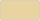
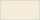
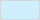
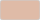
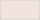
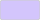
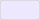
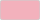
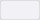

# Visual Design Standards for AI Agents

## Summary

This document defines mandatory visual design rules for AI-generated artefacts.
All agents MUST use these standards when generating:

- Draw.io diagrams
- Web UI mockups and dashboard visuals
- Charts and graphs
- Presentations and document visuals

These standards are mandatory and are intended to be machine-consumable.

---

## Table of Contents

1. [Colour Identifier System](#colour-identifier-system)
2. [Colour Standards](#colour-standards)
3. [Colour Usage Rules](#colour-usage-rules)
4. [Web UI State Tokens](#web-ui-state-tokens)
5. [Component Colour Mappings](#component-colour-mappings)
6. [Data Visualization Palettes](#data-visualization-palettes)
7. [Colour-Blind-Safe Chart Rules](#colour-blind-safe-chart-rules)
8. [Exemplar Principle Check](#exemplar-principle-check)
9. [Typography Standards](#typography-standards)
10. [Diagram Standards](#diagram-standards)
11. [AI Agent Self-Verification Checklist](#ai-agent-self-verification-checklist)
12. [Quick Reference](#quick-reference)

---

## Colour Identifier System

### Identifier Structure

All colour references in dependent standards use numeric IDs, not hardcoded hex values.

Format:

```text
category.colour[.tint]
```

| Category | Prefix | Range | Description |
|----------|--------|-------|-------------|
| Primary | `1.` | `1.1` - `1.4` | Core brand colours |
| Secondary | `2.` | `2.1` - `2.6` | Data-viz and accent colours |
| Supporting | `3.` | `3.1` - `3.4` | Neutral text/border/background colours |
| Semantic | `4.` | `4.1` - `4.4` | Status colours |

### Tint Notation

For colours with tints:

- Base colour: `x.y`
- 50% tint: `x.y.2`
- 20% tint: `x.y.3`

Examples:

- `1.1` = Deep Purple base
- `1.1.2` = Deep Purple 50%
- `1.1.3` = Deep Purple 20%

Use only explicitly defined identifiers. Do not use implicit aliases such as 2.1.1.

---

## Colour Standards

### Primary Colours (1.x)

| ID | Swatch | Colour Name | Hex | RGB | Contrast on White | Usage |
|----|--------|-------------|-----|-----|-------------------|-------|
| `1.1` |  | Deep Purple | `#4C1D95` | `RGB(76, 29, 149)` | `10.95:1` | Primary headers, key elements |
| `1.2` |  | Void | `#0F0A1E` | `RGB(15, 10, 30)` | `19.40:1` | Dark surfaces, premium sections |
| `1.3` |  | Signal Gold | `#D4A843` | `RGB(212, 168, 67)` | `2.21:1` (`8.76:1` on `1.2`) | Highlights, CTAs, accents |
| `1.4` |  | White | `#FFFFFF` | `RGB(255, 255, 255)` | N/A | Light surfaces, inverse text |

### Secondary Colours (2.x)

| ID | Swatch | Colour Name | Hex | RGB | Usage |
|----|--------|-------------|-----|-----|-------|
| `2.1` |  | Olive Sage | `#6B8F3A` | `RGB(107, 143, 58)` | Growth metaphors, secondary accents |
| `2.2` |  | Signal Cyan | `#0EA5E9` | `RGB(14, 165, 233)` | Data streams, connectivity |
| `2.3` |  | Copper | `#C07850` | `RGB(192, 120, 80)` | Warm accents, industrial context |
| `2.4` |  | Lavender | `#A78BFA` | `RGB(167, 139, 250)` | AI and soft highlights |
| `2.5` |  | Guava | `#E8637A` | `RGB(232, 99, 122)` | Attention accents |
| `2.6` |  | Slate | `#64748B` | `RGB(100, 116, 139)` | Neutral secondary |

### Tints (Primary and Secondary)

| ID | Swatch | Colour | Hex | RGB |
|----|--------|--------|-----|-----|
| `1.1.2` |  | Deep Purple 50% | `#A58ECA` | `RGB(165, 142, 202)` |
| `1.1.3` |  | Deep Purple 20% | `#DBD2EA` | `RGB(219, 210, 234)` |
| `1.3.2` |  | Signal Gold 50% | `#E9D3A1` | `RGB(233, 211, 161)` |
| `1.3.3` |  | Signal Gold 20% | `#F6EDD9` | `RGB(246, 237, 217)` |
| `2.1.2` |  | Olive Sage 50% | `#B5C79C` | `RGB(181, 199, 156)` |
| `2.1.3` |  | Olive Sage 20% | `#E1E9D8` | `RGB(225, 233, 216)` |
| `2.2.2` |  | Signal Cyan 50% | `#86D2F4` | `RGB(134, 210, 244)` |
| `2.2.3` |  | Signal Cyan 20% | `#CFEDFB` | `RGB(207, 237, 251)` |
| `2.3.2` |  | Copper 50% | `#DFBBA7` | `RGB(223, 187, 167)` |
| `2.3.3` |  | Copper 20% | `#F2E4DC` | `RGB(242, 228, 220)` |
| `2.4.2` |  | Lavender 50% | `#D3C5FC` | `RGB(211, 197, 252)` |
| `2.4.3` |  | Lavender 20% | `#EDE8FE` | `RGB(237, 232, 254)` |
| `2.5.2` |  | Guava 50% | `#F3B1BC` | `RGB(243, 177, 188)` |
| `2.5.3` |  | Guava 20% | `#FAE0E4` | `RGB(250, 224, 228)` |
| `2.6.2` |  | Slate 50% | `#B1B9C5` | `RGB(177, 185, 197)` |
| `2.6.3` |  | Slate 20% | `#E0E3E8` | `RGB(224, 227, 232)` |

### Supporting Colours (3.x)

| ID | Swatch | Colour Name | Hex | RGB | Usage |
|----|--------|-------------|-----|-----|-------|
| `3.1` |  | Graphite | `#2D2B3A` | `RGB(45, 43, 58)` | Primary body text |
| `3.2` |  | Iron | `#6E6B7B` | `RGB(110, 107, 123)` | Secondary text |
| `3.3` |  | Silver | `#C4C2CC` | `RGB(196, 194, 204)` | Borders and dividers |
| `3.4` |  | Mist | `#F2F1F5` | `RGB(242, 241, 245)` | Subtle backgrounds |

### Semantic Colours (4.x)

| ID | Swatch | Purpose | Hex | RGB | Usage |
|----|--------|---------|-----|-----|-------|
| `4.1` |  | Success | `#22C55E` | `RGB(34, 197, 94)` | Positive status |
| `4.2` |  | Warning | `#EAB308` | `RGB(234, 179, 8)` | Caution status |
| `4.3` |  | Error | `#EF4444` | `RGB(239, 68, 68)` | Error status |
| `4.4` |  | Info | `#38BDF8` | `RGB(56, 189, 248)` | Informational status |

### Draw.io Colour Map

```xml
<!-- Primary -->
<add as="Colour_1.1" value="#4C1D95"/>
<add as="Colour_1.2" value="#0F0A1E"/>
<add as="Colour_1.3" value="#D4A843"/>
<add as="Colour_1.4" value="#FFFFFF"/>

<!-- Secondary -->
<add as="Colour_2.1" value="#6B8F3A"/>
<add as="Colour_2.2" value="#0EA5E9"/>
<add as="Colour_2.3" value="#C07850"/>
<add as="Colour_2.4" value="#A78BFA"/>
<add as="Colour_2.5" value="#E8637A"/>
<add as="Colour_2.6" value="#64748B"/>

<!-- Tints -->
<add as="Colour_1.1.2" value="#A58ECA"/>
<add as="Colour_1.1.3" value="#DBD2EA"/>
<add as="Colour_1.3.2" value="#E9D3A1"/>
<add as="Colour_1.3.3" value="#F6EDD9"/>
<add as="Colour_2.1.2" value="#B5C79C"/>
<add as="Colour_2.1.3" value="#E1E9D8"/>
<add as="Colour_2.2.2" value="#86D2F4"/>
<add as="Colour_2.2.3" value="#CFEDFB"/>
<add as="Colour_2.3.2" value="#DFBBA7"/>
<add as="Colour_2.3.3" value="#F2E4DC"/>
<add as="Colour_2.4.2" value="#D3C5FC"/>
<add as="Colour_2.4.3" value="#EDE8FE"/>
<add as="Colour_2.5.2" value="#F3B1BC"/>
<add as="Colour_2.5.3" value="#FAE0E4"/>
<add as="Colour_2.6.2" value="#B1B9C5"/>
<add as="Colour_2.6.3" value="#E0E3E8"/>

<!-- Supporting -->
<add as="Colour_3.1" value="#2D2B3A"/>
<add as="Colour_3.2" value="#6E6B7B"/>
<add as="Colour_3.3" value="#C4C2CC"/>
<add as="Colour_3.4" value="#F2F1F5"/>

<!-- Semantic -->
<add as="Colour_4.1" value="#22C55E"/>
<add as="Colour_4.2" value="#EAB308"/>
<add as="Colour_4.3" value="#EF4444"/>
<add as="Colour_4.4" value="#38BDF8"/>
```

---

## Colour Usage Rules

### DO

- Use `1.1` for primary headers and key elements.
- Use `1.2` for dark backgrounds and high-contrast sections.
- Use `1.3` for highlights and accents on dark backgrounds.
- Use `1.4` for light surfaces and inverse text.
- Ensure at least `4.5:1` contrast for text.
- Ensure at least `3:1` contrast for essential non-text graphics.
- Use `1.2` as default text on bright accent and semantic fills.
- Use semantic colours (`4.1`-`4.4`) only for status meaning.
- Use supporting colours (`3.1`-`3.4`) for text hierarchy and chrome.

### DONT

- Do not use colours outside the approved palette without explicit justification.
- Do not use white text on semantic fills (`4.1`-`4.4`).
- Do not use `1.3`, `2.2`, `4.1`, `4.2`, `4.4`, or `2.4` as standalone 1px indicators on `1.4`/`3.4`.
- Do not use `2.5` as an error status colour; use `4.3`.
- Do not rely on colour alone to encode meaning.

---

## Web UI State Tokens

| Token | Value | Usage |
|-------|-------|-------|
| `ui.surface.default` | `1.4` | Main page surface |
| `ui.surface.subtle` | `3.4` | Secondary surface |
| `ui.surface.inverse` | `1.2` | Inverse dark surface |
| `ui.text.default` | `3.1` | Main text on light surfaces |
| `ui.text.muted` | `3.2` | Secondary text |
| `ui.text.inverse` | `1.4` | Text on dark surfaces |
| `ui.text.on-accent` | `1.2` | Text on bright fills |
| `ui.link.default` | `1.1` | Default link state |
| `ui.link.hover` | `1.2` | Hover link state |
| `ui.link.visited` | `2.6` | Visited link state |
| `ui.border.default` | `3.3` | Default border |
| `ui.border.strong` | `3.2` | Strong border |
| `ui.focus.light-surface` | `1.2` | Focus ring on light surfaces |
| `ui.focus.dark-surface` | `1.3` | Focus ring on dark surfaces |
| `ui.disabled.text` | `3.2` | Disabled text |
| `ui.disabled.surface` | `3.4` | Disabled surface |
| `ui.disabled.border` | `3.3` | Disabled border |

State rules:

- Hover and active states must be visually distinct from default.
- Focus style must include a visible 2px ring.
- Body links remain underlined in default and hover.

---

## Component Colour Mappings

| Component | Default | Hover | Active | Disabled |
|-----------|---------|-------|--------|----------|
| Primary button | BG `1.1`, Text `1.4`, Border `1.1` | BG `1.2`, Text `1.4` | BG `1.2`, Text `1.3` | BG `3.4`, Text `3.2`, Border `3.3` |
| Secondary button | BG `1.4`, Text `1.1`, Border `1.1` | BG `1.1.3`, Text `1.1` | BG `1.1.2`, Text `1.2` | BG `3.4`, Text `3.2`, Border `3.3` |
| Tertiary button | BG transparent, Text `1.1` | BG `1.1.3`, Text `1.1` | BG `1.1.2`, Text `1.2` | Text `3.2` |
| Danger button | BG `4.3`, Text `1.2`, Border `4.3` | BG `2.5`, Text `1.2` | BG `4.3`, Text `1.2`, Border `1.2` | BG `3.4`, Text `3.2`, Border `3.3` |
| Input field | BG `1.4`, Text `3.1`, Border `3.3` | Border `3.2` | Border `1.1` | BG `3.4`, Text `3.2`, Border `3.3` |
| Table header | BG `1.1`, Text `1.4` | N/A | N/A | N/A |
| Alternating row | BG `3.4`, Text `3.1` | N/A | N/A | N/A |

Rules:

- Long alert text should use neutral surfaces (`1.4`/`3.4`) with semantic border/icon.
- Full semantic fills are for compact badges/chips/short labels.

---

## Data Visualization Palettes

### Categorical Palette

Default order (up to 8 series):

1. `1.1`
2. `2.2`
3. `2.1`
4. `2.3`
5. `2.4`
6. `2.5`
7. `2.6`
8. `1.3`

If semantic statuses are shown in the same chart, reserve `4.1`-`4.4` for statuses and use:

1. `1.1`
2. `2.4`
3. `2.3`
4. `2.6`
5. `2.5`
6. `2.1`

### Sequential Palette

- Purple ramp: `1.1.3` -> `1.1.2` -> `1.1` -> `1.2`
- Slate ramp: `2.6.3` -> `2.6.2` -> `2.6` -> `3.1`

### Diverging Palette

- Negative extreme: `4.3`
- Negative mid: `2.5.2`
- Midpoint: `3.4`
- Positive mid: `2.1.2`
- Positive extreme: `4.1`

Rules:

- Do not use rainbow scales.
- Do not use semantic colours as normal categories in the same chart.
- On light backgrounds, use 2px+ lines and/or outlines for low-contrast hues.

---

## Colour-Blind-Safe Chart Rules

- Never rely on colour alone for category/status/threshold meaning.
- For line charts, combine colour with line style and marker shape.
- For scatter charts, combine colour with symbol shape.
- For grouped bars with many categories, use direct labels and pattern support where needed.
- Avoid red-vs-green as the only critical distinction.
- For more than 6 series, prefer direct labeling, grouping, or small multiples.
- Validate readability in grayscale and at least one red-green simulation before release.

---

## Exemplar Principle Check

This standard aligns with common high-quality visual journalism and design-system principles:

- Limited and intentional palette usage.
- Strong contrast and readability before decoration.
- Emphasis by hierarchy, not colour noise.
- Explicit separation of status semantics from category colours.
- Reusable interaction-state tokens for web UI consistency.
- Dedicated chart palette strategies: categorical, sequential, diverging.

This is principle-level alignment only. It is not intended to mimic another organisation's exact brand colours.

---

## Typography Standards

### Font Families

| Context | Primary | Fallback | Usage |
|---------|---------|----------|-------|
| Documents | Calibri | Arial, sans-serif | Narrative and headings |
| Presentations | Calibri | Arial, sans-serif | Slide content |
| Diagrams | Helvetica | Arial, sans-serif | Labels and annotations |
| Code blocks | Consolas | Courier New, monospace | Technical snippets |

### Sizes

- Document H1: 28-32pt, Bold, `1.1`
- Document H2: 22-24pt, Bold, `1.1`
- Document H3: 18-20pt, Bold, `3.1`
- Body text: 11-12pt, Regular, `3.1`
- Diagram title: 24-28pt, Bold, `1.1`
- Diagram labels: 12-14pt, Bold, `3.1`
- Annotation text: 10-11pt, Regular, `3.2`

---

## Diagram Standards

### Canvas and Hierarchy

- Canvas: 1920x1080
- Background: `1.4` or `3.4`
- Grid: 10px, snap enabled
- Margin: 40-50px

Visual hierarchy:

- Level 1: Fill `1.1` or `1.2`, text `1.4`, stroke `3.1`
- Level 2: Fill `1.3.2` or `3.3`, text `3.1`, stroke `3.2`
- Level 3: Fill `3.4` or `1.4`, text `3.1`, stroke `3.3`

Connectors:

- Primary flow: `1.1`, solid, 2px
- Inbound/return: `2.3`, solid, 2px
- Optional/internal: `3.1`, dashed or solid, 2px

Accessibility:

- Text contrast minimum 4.5:1
- Non-text contrast minimum 3:1
- Do not use colour-only status coding; include labels/symbols

---

## AI Agent Self-Verification Checklist

Before finalising visual output:

1. Confirm all colours used are defined IDs from this standard.
2. Confirm no undefined IDs are used (for example 2.1.1).
3. Confirm all text/background pairs meet 4.5:1.
4. Confirm essential non-text graphics meet 3:1.
5. Confirm status meaning is not colour-only (labels/symbols included).
6. Confirm web states/components follow this standard when applicable.
7. Confirm chart palette type matches chart purpose (categorical/sequential/diverging).

---

## Quick Reference

```text
Primary
  1.1 Deep Purple        #4C1D95
  1.2 Void               #0F0A1E
  1.3 Signal Gold        #D4A843
  1.4 White              #FFFFFF

Secondary
  2.1 Olive Sage         #6B8F3A
  2.2 Signal Cyan        #0EA5E9
  2.3 Copper             #C07850
  2.4 Lavender           #A78BFA
  2.5 Guava              #E8637A
  2.6 Slate              #64748B

Supporting
  3.1 Graphite           #2D2B3A
  3.2 Iron               #6E6B7B
  3.3 Silver             #C4C2CC
  3.4 Mist               #F2F1F5

Semantic
  4.1 Success            #22C55E
  4.2 Warning            #EAB308
  4.3 Error              #EF4444
  4.4 Info               #38BDF8
```
